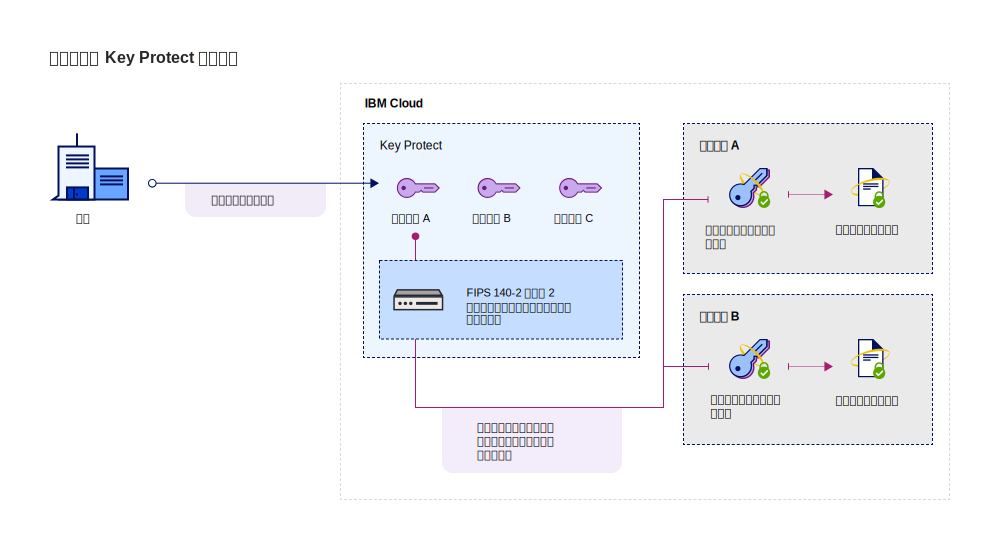

---

copyright:
  years: 2017, 2019
lastupdated: "2019-01-03"

---

{:shortdesc: .shortdesc}
{:codeblock: .codeblock}
{:screen: .screen}
{:new_window: target="_blank"}
{:pre: .pre}
{:tip: .tip}
{:note: .note}
{:important: .important}

# サービスの統合
{: #integrate-services}

{{site.data.keyword.keymanagementservicefull}} は、データおよびストレージのソリューションと統合されて、ユーザー独自の暗号化をクラウドに取り込んで管理するのを支援します。
{: shortdesc}

[サービスのインスタンスを作成した後](/docs/services/key-protect/provision.html)、{{site.data.keyword.keymanagementserviceshort}} を以下のサポートされているサービスと統合できます。

<table>
    <tr>
        <th>サービス</th>
        <th>説明</th>
    </tr>
    <tr>
        <td>
          
{{site.data.keyword.cos_full_notm}}

        </td>
        <td>
          
{{site.data.keyword.keymanagementserviceshort}} を使用して、[エンベロープ暗号化](/docs/services/key-protect/concepts/envelope-encryption.html)をストレージ・バケットに追加します。 {{site.data.keyword.keymanagementserviceshort}} で管理するルート鍵を使用して、保存中データを暗号化するデータ暗号鍵を保護します。

          
詳しくは、[{{site.data.keyword.cos_full_notm}} との統合](/docs/services/key-protect/integrations/integrate-cos.html)を確認してください。

        </td>
    </tr>
    <tr>
        <td>
          
{{site.data.keyword.containerlong}}

        </td>
        <td>
          
[エンベロープ暗号化](/docs/services/key-protect/concepts/envelope-encryption.html)を使用して、{{site.data.keyword.containershort_notm}} クラスター内の機密事項を保護します。

          
詳しくは、[{{site.data.keyword.keymanagementserviceshort}} を使用した Kubernetes シークレットの暗号化](/docs/containers/cs_encrypt.html#keyprotect)を確認してください。

        </td>
    </tr>
   <caption style="caption-side:bottom;">表 1. {{site.data.keyword.keymanagementserviceshort}} で使用可能な統合についての説明</caption>
</table>

## 統合について 
{: #understand-integration}

サポートされているサービスを {{site.data.keyword.keymanagementserviceshort}} と統合する際、そのサービスに対して [エンベロープ暗号化](/docs/services/key-protect/concepts/envelope-encryption.html)を使用可能にします。 この統合によって、{{site.data.keyword.keymanagementserviceshort}} で保管するルート鍵を使用して、保存中データを暗号化するデータ暗号鍵をラップすることが可能になります。 

例えば、ルート鍵を作成し、それを {{site.data.keyword.keymanagementserviceshort}} で管理し、そのルート鍵を使用して、複数のクラウド・サービスで保管されているデータを保護することができます。

### {{site.data.keyword.keymanagementserviceshort}} API メソッド
{: #api-methods}

背景では、エンベロープ暗号化プロセスが {{site.data.keyword.keymanagementserviceshort}} API によって駆動されます。  

次の表に、リソースに対するエンベロープ暗号化の追加または削除を行う API メソッドをリストします。

<table>
  <tr>
    <th>メソッド</th>
    <th>説明</th>
  </tr>
  <tr>
    <td><code>POST /keys/{root_key_ID}?action=wrap</code></td>
    <td><a href="/docs/services/key-protect/wrap-keys.html">データ暗号鍵をラップ (暗号化) します</a></td>
  </tr>
  <tr>
    <td><code>POST /keys/{root_key_ID}?action=unwrap</code></td>
    <td><a href="/docs/services/key-protect/unwrap-keys.html">データ暗号鍵をアンラップ (暗号化解除) します</a></td>
  </tr>
  <caption style="caption-side:bottom;">表 2. {{site.data.keyword.keymanagementserviceshort}} API メソッドについての説明</caption>
</table>

{{site.data.keyword.keymanagementserviceshort}} のプログラムでの鍵の管理について詳しくは、[{{site.data.keyword.keymanagementserviceshort}} API リファレンス資料](https://{DomainName}/apidocs/key-protect){: new_window} を確認してください。
{: tip}

## サポートされるサービスの統合
{: #grant-access}

統合を追加するには、{{site.data.keyword.iamlong}} ダッシュボードを使用してサービス間の許可を作成します。 許可によってサービス間のアクセス・ポリシーが有効になるため、クラウド・データ・サービス内のリソースを、{{site.data.keyword.keymanagementserviceshort}} で管理する[ルート鍵](/docs/services/key-protect/concepts/envelope-encryption.html#key-types)と関連付けることが可能になります。

許可を作成する前に、必ず同じ地域に両方のサービスをプロビジョンしてください。 サービスの許可について詳しくは、[サービス間のアクセスの認可 ](/docs/iam/authorizations.html){: new_window} を参照してください。
{: note}

サービスを統合する準備ができたら、以下の手順で許可を作成します。

1. [{{site.data.keyword.cloud_notm}} コンソール  にログインします](https://{DomainName}){: new_window}。
2. メニュー・バーで、**「管理」** &gt; **「セキュリティー」** &gt; **「アクセス (IAM)」**をクリックして、**「許可」**を選択します。 
3. **「作成」**をクリックします。
4. 許可のソースとターゲットを選択します。
 
  - **「ソース・サービス」**に、{{site.data.keyword.keymanagementserviceshort}} と統合するクラウド・データ・サービスを選択します。 例えば、**Cloud Object Storage** です。
  - **「ターゲット・サービス」**に、**「{{site.data.keyword.keymanagementservicelong_notm}}」**を選択します。 
4. サービス間に読み取り専用アクセス権限を付与するには、**「読者」**チェック・ボックスを選択します。

    _読者_ の許可がある場合、ソース・サービスは、{{site.data.keyword.keymanagementserviceshort}} の指定のインスタンス内でプロビジョンされたルート鍵を参照できます。
5. **「許可」**をクリックします。

### 次に行うこと

{{site.data.keyword.keymanagementserviceshort}} でルート鍵を作成することによって、拡張暗号化をクラウド・リソースに追加します。 サポートされるクラウド・データ・サービスに新規リソースを追加し、次に、拡張暗号化に使用するルート鍵を選択します。

- {{site.data.keyword.keymanagementserviceshort}} サービスでのルート鍵の作成について詳しくは、[ルート鍵の作成](/docs/services/key-protect/create-root-keys.html)を参照してください。
- {{site.data.keyword.keymanagementserviceshort}} サービスへの独自のルート鍵の取り込みについて詳しくは、[ルート鍵のインポート](/docs/services/key-protect/import-root-keys.html)を参照してください。

