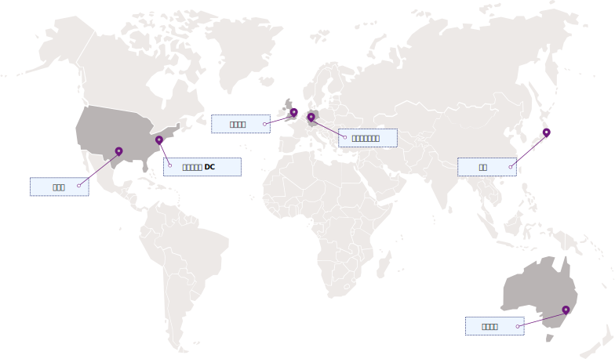

---

copyright:
  years: 2017, 2018
lastupdated: "2018-08-24"

---

{:shortdesc: .shortdesc}
{:codeblock: .codeblock}
{:screen: .screen}
{:new_window: target="_blank"}
{:pre: .pre}
{:tip: .tip}

# 地域とロケーション
{: #regions}

地域のサービス・エンドポイントを指定することによって、アプリケーションを {{site.data.keyword.keymanagementservicelong_notm}} サービスに接続できます。
{: shortdesc}

## 使用可能な地域
{: #regions}

{{site.data.keyword.keymanagementserviceshort}} は、次の地域およびロケーションで使用可能です。

## サービス・エンドポイント
{: #endpoints}

{{site.data.keyword.keymanagementserviceshort}} リソースをプログラムで管理している場合は、次の表を参照して、[{{site.data.keyword.keymanagementserviceshort}} API](https://console.bluemix.net/apidocs/kms) への接続時に使用する API エンドポイントを判断してください。 

<table>
    <tr>
        <th>地域名</th>
        <th>地理的位置</th>
        <th>サービス API エンドポイント</th>
    </tr>
    <tr>
        <td>ドイツ</td>
        <td>ドイツのフランクフルト</td>
        <td>
            <code>keyprotect.eu-de.bluemix.net</code>
        </td>
    </tr>
    <tr>
        <td>シドニー</td>
        <td>オーストラリアのシドニー</td>
        <td>
            <code>keyprotect.au-syd.bluemix.net</code>
        </td>
    </tr>
    <tr>
        <td>英国</td>
        <td>イングランドのロンドン</td>
        <td>
            <code>keyprotect.eu-gb.bluemix.net</code>
        </td>
    </tr>
    <tr>
        <td>米国南部</td>
        <td>米国のダラス</td>
        <td>
            <code>keyprotect.us-south.bluemix.net</code>
        </td>
    </tr>
    <caption style="caption-side:bottom;">表 1. {{site.data.keyword.keymanagementserviceshort}} API の使用可能なエンドポイント</caption>
</table>

Cloud Foundry 組織またはスペース内に存在する {{site.data.keyword.keymanagementserviceshort}} サービス・インスタンスの場合は、既存の `https://ibm-key-protect.edge.bluemix.net` エンドポイントを使用して、{{site.data.keyword.keymanagementserviceshort}} API と相互作用します。
{: tip}

{{site.data.keyword.keymanagementserviceshort}} での認証について詳しくは、[API へのアクセス](/docs/services/key-protect/access-api.html)を参照してください。
