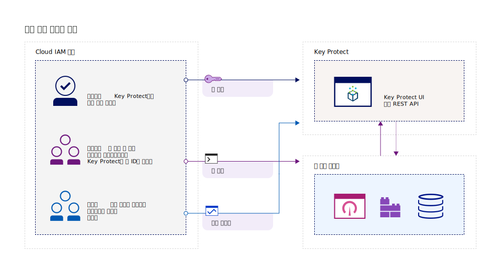
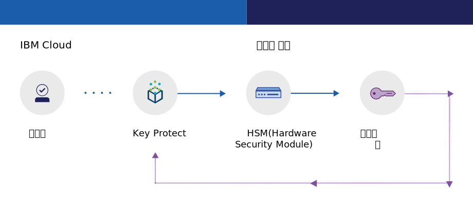
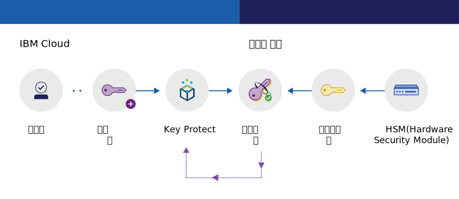

---

copyright:
  years: 2017, 2019
lastupdated: "2019-04-03"

keywords: key management service, KMS, about Key Protect, about KMS, Key Protect use cases, KMS use cases

subcollection: key-protect

---

{:shortdesc: .shortdesc}
{:codeblock: .codeblock}
{:screen: .screen}
{:new_window: target="_blank"}
{:pre: .pre}
{:tip: .tip}
{:note: .note}
{:important: .important}

# {{site.data.keyword.keymanagementserviceshort}} 정보
{: #about}

{{site.data.keyword.keymanagementservicefull}}를 사용하면 {{site.data.keyword.cloud_notm}} 서비스 간에 앱에 대한 암호화된 키를 프로비저닝하는 데 도움이 됩니다. 키의 라이프사이클을 관리할 때, 정보 도난을 방지하는 FIPS 140-2 레벨 2 공인 클라우드 기반 HSM(Hardware Security Module)에 의해 키가 보안된다는 사실을 알고 있으면 도움이 될 수 있습니다.
{: shortdesc}

## {{site.data.keyword.keymanagementserviceshort}} 사용 이유
{: #use-cases}

다음 시나리오에서 키를 관리해야 할 수 있습니다.

| 시나리오 |이유|
| --- | ---- |
|대기업의 IT 관리자로서, 다양한 서비스 오퍼링에 대해 암호화 키를 통합하고 추적하며 순환해야 합니다.|{{site.data.keyword.keymanagementserviceshort}} 인터페이스는 여러 암호화 서비스의 관리를 간소화합니다. 이 서비스를 사용하면 하나의 중앙 집중식 위치에서 암호화 키를 관리하고 정렬할 수 있습니다. 또는 프로젝트별로 키를 분리하고 이를 서로 다른 {{site.data.keyword.cloud_notm}} 영역에 보관할 수 있습니다.|
|개발자로서 셀프 암호화 스토리지와 같은 기존 애플리케이션을 {{site.data.keyword.keymanagementserviceshort}}에 통합하려고 합니다. |{{site.data.keyword.cloud_notm}}의 앱이나 외부 앱을 {{site.data.keyword.keymanagementserviceshort}} API와 통합할 수 있습니다. 사용자의 앱을 위한 기존의 자체 키를 사용할 수 있습니다. |
|개발 팀에게 엄격한 정책이 적용되어 30일마다 키를 생성하고 순환하는 방법이 필요합니다.|{{site.data.keyword.keymanagementserviceshort}}를 사용하면 {{site.data.keyword.cloud_notm}} HSM(Hardware Security Module)에서 신속하게 키를 생성할 수 있습니다. 키 대체 시기가 되면 [요청 시 키를 순환](/docs/services/key-protect?topic=key-protect-rotate-keys)하거나 키에 대한 [순환 정책을 설정](/docs/services/key-protect?topic=key-protect-set-rotation-policy)하여 지속적인 보안 요구사항을 충족시킬 수 있습니다.|
|금융 또는 법률과 같은 업계의 보안 관리자로 데이터 보호 방법에 대해 거버넌스를 준수해야 합니다. 보안을 유지하려는 데이터를 취약하게 만들지 않으면서 제어되는 키 액세스를 부여해야 합니다. |서비스를 사용하면 [서로 다른 Identity and Access Management 역할을 지정](/docs/services/key-protect?topic=key-protect-manage-access#roles)하여 키를 관리할 수 있도록 사용자 액세스를 제어할 수 있습니다. 예를 들어, 키 자료를 보지 않은 채 키 작성 정보를 봐야 하는 사용자에게 읽기 전용 액세스 권한을 부여할 수 있습니다. |
|클라우드로 데이터를 이동할 때 엔벨로프 암호화를 수행하려고 합니다. 고유 마스터 암호화 키를 가져와야 저장 데이터를 암호화하는 다른 키를 관리하고 보호할 수 있습니다.|{{site.data.keyword.keymanagementserviceshort}}를 사용하면 [보안성이 높은 루트 키로 데이터 암호화 키를 랩핑(암호화)](/docs/services/key-protect?topic=key-protect-envelope-encryption)할 수 있습니다. 고유 루트 키를 가져오거나 서비스에서 이 키를 작성할 수 있습니다.|

고객이 제어하는 클라우드 기반 HSM(Hardware Security Module)을 지원하는 전용 키 관리 솔루션을 찾고 있습니까? [{{site.data.keyword.cloud_notm}} {{site.data.keyword.hscrypto}}](/docs/services/hs-crypto?topic=hs-crypto-get-started)는 {{site.data.keyword.keymanagementserviceshort}}에 통합되어 {{site.data.keyword.cloud_notm}}에 KYOK(Keep Your Own Keys)를 사용하므로, 데이터에 대한 조직의 제어와 권한이 강화됩니다. 자세한 내용은 [{{site.data.keyword.hscrypto}} 오퍼링 세부사항 페이지 ](https://{DomainName}/catalog/services/hyper-protect-crypto-services)를 참조하십시오.
{: tip}

## {{site.data.keyword.keymanagementserviceshort}}의 작동 방식
{: #kp-how}

{{site.data.keyword.keymanagementservicelong_notm}}는 {{site.data.keyword.cloud_notm}} Identity and Access Management 역할에 따라 조직 전체에서 암호화 키를 관리하는 데 도움을 줍니다.

감사자에게 필요하지 않은 고급 권한이
IT 또는 보안 관리자에게는 필요할 수 있습니다. 액세스를 간소화하기 위해 {{site.data.keyword.keymanagementserviceshort}}는 각 역할이 서로 다른 서비스 보기를 가질 수 있도록 {{site.data.keyword.cloud_notm}} Identity and Access Management 역할을 맵핑합니다. 사용자의 요구사항에 최적인 액세스 레벨 및 보기에 대한 안내를 받으려면 [사용자 및 액세스 관리](/docs/services/key-protect?topic=key-protect-manage-access#roles)를 참조하십시오.

다음 다이어그램은 관리자, 독자 및 작성자가 서비스에서 관리되는 키와 상호 작용할 수 있는 방법을 표시합니다.

<dl>
  <dt>서비스 통합</dt>
    <dd>{{site.data.keyword.keymanagementserviceshort}} 서비스 인스턴스의 관리자는
암호화를 위한 키를 관리합니다.</dd>
  <dt>감사</dt>
    <dd>독자는 키의 상위 레벨 보기에 액세스하고 의심스러운 활동을 식별합니다.</dd>
  <dt>앱</dt>
    <dd>작성자는 앱으로 코딩한 암호화를 위한 키를 관리합니다.</dd>
</dl>

## {{site.data.keyword.keymanagementserviceshort}}
아키텍처
{: #kp_architecture}

{{site.data.keyword.keymanagementservicelong_notm}}는 업계에서 채택한 기술로 구성되어 있습니다.

<dl>
  <dt>{{site.data.keyword.cloud_notm}} 서버</dt>
    <dd>{{site.data.keyword.cloud_notm}} 서버의 ID, 프로젝트 및 해당 토큰을 사용하면 {{site.data.keyword.keymanagementserviceshort}} 서비스가 리소스를 키에 맵핑할 수 있습니다.</dd>
  <dt>{{site.data.keyword.keymanagementserviceshort}}용 API</dt>
    <dd>{{site.data.keyword.keymanagementserviceshort}} REST API는
키 작성 및 관리를 구동합니다. 이 서비스는 암호화된 멀티 테넌시를 제공합니다.</dd>
  <dt>{{site.data.keyword.cloud_notm}}의 사용자 인터페이스</dt>
    <dd>{{site.data.keyword.keymanagementserviceshort}} 사용자 인터페이스(UI)를 사용하면 키와 관련하여 안전하게 작업할 수 있습니다.</dd>
  <dt>HSM(Hardware Security Module)</dt>
    <dd>한편 {{site.data.keyword.cloud_notm}} 데이터 센터는 키를 보호하기 위한 하드웨어를 제공합니다.</dd>
  <dt>데이터베이스 클러스터</dt>
    <dd>클러스터된 데이터베이스에서 키의 중복 및 보안 스토리지에 대해 신뢰할 수 있습니다.</dd>
</dl>

다음 다이어그램은 서비스가 키를 저장하는 방식과 비교하여,
{{site.data.keyword.keymanagementserviceshort}}가
HSM(Hardware Security Module)과 함께 작동하여 어떻게 키를 생성하는지 표시합니다.

