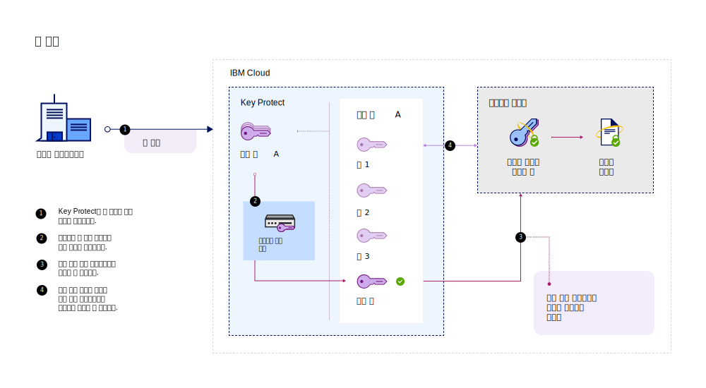
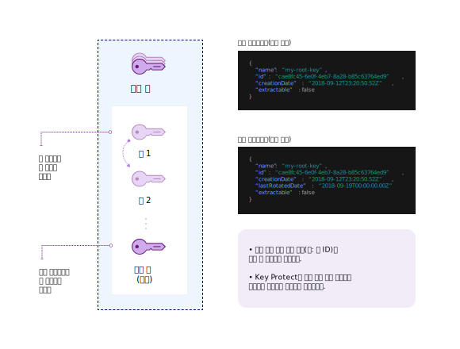

---

copyright:
  years: 2017, 2019
lastupdated: "2019-07-09"

keywords: rotate encryption keys, rotate keys automatically, key rotation

subcollection: key-protect

---

{:shortdesc: .shortdesc}
{:screen: .screen}
{:pre: .pre}
{:table: .aria-labeledby="caption"}
{:external: target="_blank" .external}
{:codeblock: .codeblock}
{:tip: .tip}
{:note: .note}
{:important: .important}

# 암호화 키 순환
{: #key-rotation}

키 순환은 루트 키의 원래 키 자료를 폐기하고, 새 암호화 키 자료를 생성하여 키를 재설정하는 경우에 발생합니다.

정기적으로 키를 순환하면 산업 표준 및 암호화 우수 사례를 충족시키는 데 도움이 됩니다. 다음 표는 키 순환의 기본 이점에 대해 설명합니다.

|이점 |설명 |
| --- | --- |
|키를 위한 암호 사용 기간 관리 |키 순환은 정보를 단일 키로 보호하는 기간을 제한합니다. 정기적으로 루트 키를 순환하여 키의 암호 사용 기간을 줄일 수도 있습니다. 암호화 키의 수명이 길어 질수록 보안 위반의 가능성이 높아집니다. |
|인시던트 완화 |조직에서 보안 문제를 발견하는 경우 키 손상과 연관되는 비용을 줄이기 위해 키를 즉시 순환할 수 있습니다. |
{: caption="표 1. 키 순환의 이점에 대한 설명" caption-side="top"}

키 순환은 NIST Special Publication 800-57, Recommendation for Key Management에서 다뤄집니다. 자세한 내용은 다음을 참조하십시오. [NIST SP 800-57 Pt. 1 Rev. 4.](https://www.nist.gov/publications/recommendation-key-management-part-1-general-0){: external}
{: tip}

## {{site.data.keyword.keymanagementserviceshort}}에서 키 순환 옵션 비교
{: #compare-key-rotation-options}

{{site.data.keyword.keymanagementserviceshort}}에서는 폐기된 루트 키 자료를 추적하지 않고도 [키에 대한 순환 정책을 설정](/docs/services/key-protect?topic=key-protect-set-rotation-policy)하거나 [요청 시 키를 순환](/docs/services/key-protect?topic=key-protect-rotate-keys)할 수 있습니다. 

순환 옵션은 루트 키에만 사용 가능합니다.
{: note}

<dl>
  <dt>키에 대한 순환 정책 설정</dt>
    <dd>{{site.data.keyword.keymanagementserviceshort}}는 서비스에서 생성한 키에 순환 정책을 사용하여 암호화 키의 순환을 단순화하는 데 도움이 됩니다. 루트 키를 작성하면 {{site.data.keyword.keymanagementserviceshort}} GUI에서 또는 API를 사용하여 키에 대한 순환 정책을 관리할 수 있습니다. 지속적인 보안 요구에 따라 <a href="/docs/services/key-protect?topic=key-protect-key-rotation#rotation-frequency">키에 대한 자동 순환 간격을 1 - 12개월 중에서 선택</a>하십시오. 지정한 순환 간격에 따라 키를 순환할 때가 되면 {{site.data.keyword.keymanagementserviceshort}}가 키를 새 키 자료로 자동으로 바꿉니다.</dd>
  <dt>요청 시 키 순환</dt>
    <dd>보안 관리자로서 키에 대한 순환 빈도 제어를 강화할 수 있습니다. 키에 대한 자동 순환 정책을 설정하지 않으려는 경우, 새 키를 수동으로 작성하여 기존 키를 바꾼 다음, 새 키를 참조하도록 애플리케이션을 업데이트할 수 있습니다. 이 프로세스를 단순화하기 위해 {{site.data.keyword.keymanagementserviceshort}}를 사용하여 요청 시 키를 순환할 수 있습니다. 이 시나리오에서 {{site.data.keyword.keymanagementserviceshort}}는 키를 작성하고 각 순환 요청으로 대신 바꿉니다. 키에는 동일한 메타데이터와 키 ID가 계속 포함됩니다.</dd>
</dl>

## 키 순환 작동 방법 
{: #how-key-rotation-works}

키 순환은 _활성_에서 _비활성화됨_ 키 상태로 키 자료를 안전하게 전이하여 작동됩니다. 비활성화되었거나 폐기된 키 자료를 바꾸기 위해 새 키 자료가 _활성_ 상태로 이동되고 암호화 오퍼레이션에 사용 가능한 상태가 됩니다.

### {{site.data.keyword.keymanagementserviceshort}}를 사용하여 키 순환
{: #use-key-protect-rotate-keys}

루트 키 순환에 {{site.data.keyword.keymanagementserviceshort}}를 사용할 준비가 되었을 때 다음 고려사항에 유의하십시오.

<dl>
  <dt>{{site.data.keyword.keymanagementserviceshort}}에서 생성된 루트 키 순환</dt>
    <dd>키에 대한 순환 정책을 설정하거나 요청 시 키를 순환하여 {{site.data.keyword.keymanagementserviceshort}}를 통해 {{site.data.keyword.keymanagementserviceshort}}에서 생성된 루트 키를 순환할 수 있습니다. 키를 순환할 때 키 ID와 같은 루트 키에 대한 메타데이터는 변경되지 않습니다.</dd>
  <dt>서비스로 가져온 루트 키 순환</dt>
    <dd>처음에 서비스로 가져온 루트 키를 순환하려면 키에 대한 새 키 자료를 생성하고 제공해야 합니다. {{site.data.keyword.keymanagementserviceshort}}를 통해 순환 요청의 일부로 새 키 자료를 제공하여 요청 시 가져온 루트 키를 순환할 수 있습니다. 키를 순환할 때 키 ID와 같은 루트 키에 대한 메타데이터는 변경되지 않습니다. 새 키 자료를 제공하여 가져온 키를 순환해야 하므로 가져온 키 자료가 포함된 루트 키에 자동 순환 정책을 사용할 수 없습니다.</dd>
  <dt>폐기된 키 자료 관리</dt>
    <dd>사용자가 루트 키를 순환한 후 {{site.data.keyword.keymanagementserviceshort}}는 새 키 자료를 작성합니다. 서비스는 이전 키 자료를 폐기하고 루트 키가 삭제될 때까지 폐기된 버전을 보유합니다. 엔벨로프 암호화에 루트 키를 사용하는 경우 {{site.data.keyword.keymanagementserviceshort}}는 키와 연관된 최신 키 자료만 사용합니다. 폐기된 키 자료는 키 보호에 더 이상 사용할 수 없지만 랩핑 해제(unwrap) 오퍼레이션에는 계속 사용 가능합니다. {{site.data.keyword.keymanagementserviceshort}}가 사용자가 폐기된 키 자료를 사용하여 DEK를 랩핑 해제하고 있음을 발견하면 서비스는 최신 루트 키 자료를 기반으로 한 새로 랩핑된 DEK를 제공합니다.</dd>
 <dt>{{site.data.keyword.cloud_notm}} 데이터 서비스에 키 순환 사용</dt>
    <dd>{{site.data.keyword.cloud_notm}}의 데이터 서비스에 이러한 키 순환 옵션을 사용하려면 데이터 서비스를 {{site.data.keyword.keymanagementserviceshort}}와 통합해야 합니다. {{site.data.keyword.cloud_notm}} 데이터 서비스에 대한 문서를 참조하거나 <a href="/docs/services/key-protect?topic=key-protect-integrate-services">통합된 서비스 목록에서 자세한 내용을 알아보십시오</a>.</dd>
</dl>

{{site.data.keyword.keymanagementserviceshort}}에서 키를 순환하는 경우 추가 비용이 부과되지 않습니다. 추가 비용 없이 폐기된 키 자료를 사용하여 랩핑된 데이터 암호화 키(WDEK)를 계속해서 랩핑 해제할 수 있습니다. 가격 옵션에 대한 자세한 정보는 [{{site.data.keyword.keymanagementserviceshort}} 카탈로그 페이지](https://{DomainName}/catalog/services/key-protect)를 참조하십시오.
{: tip}

### 키 순환 프로세스 이해
{: #understand-key-rotation-process}

{{site.data.keyword.keymanagementserviceshort}} API가 배후에서 키 순환 프로세스를 유도합니다.  

다음 다이어그램은 키 순환 기능의 컨텍스트 보기를 표시합니다.

각 순환 요청 시 {{site.data.keyword.keymanagementserviceshort}}는 새 키 자료를 루트 키와 연관시킵니다. 

루트 키를 순환하기 위해 {{site.data.keyword.keymanagementserviceshort}} API 사용 방법에 대해 알아보려면 [키 순환](/docs/services/key-protect?topic=key-protect-rotate-keys)을 참조하십시오. 
{: tip}

## 키 순환 빈도
{: #rotation-frequency}

{{site.data.keyword.keymanagementserviceshort}}에서 루트 키를 생성한 후 키 순환 빈도를 결정합니다. 이직, 프로세스 결함으로 인해 또는 조직의 내부 키 만기 정책에 따라 키를 순환하려고 할 수 있습니다. 

암호화 우수 사례를 충족시키기 위해 정기적으로(예: 30일마다) 키를 순환하십시오. 

| 순환 유형 | 빈도 |설명 |
| --- | --- | --- |
| [정책 기반 키 순환](/docs/services/key-protect?topic=key-protect-set-rotation-policy) | 1 - 12개월마다 | 지속적인 보안 요구에 따라 키에 대한 순환 간격을 1 - 12개월 중에서 선택하십시오. 키에 대한 순환 정책을 설정하면 키의 초기 작성 날짜를 기준으로 시계가 즉시 시작됩니다. 예를 들어, `2019/02/01`에 작성한 키에 대한 월별 순환 정책을 설정하면 {{site.data.keyword.keymanagementserviceshort}}가 `2019/03/01`에 키를 자동으로 순환합니다.|
| [요청 시 키 순환](/docs/services/key-protect?topic=key-protect-rotate-keys) | 시간당 최대 한 번의 순환 | 요청 시 키를 순환하는 경우 {{site.data.keyword.keymanagementserviceshort}}는 각 루트 키에 대해 시간당 한 번의 순환을 허용합니다. |
{: caption="표 2. {{site.data.keyword.keymanagementserviceshort}}에서 키를 순환하기 위한 순환 빈도 옵션" caption-side="top"}

## 다음에 수행할 작업
{: #rotation-next-steps}

- {{site.data.keyword.keymanagementserviceshort}}를 사용하여 개별 키에 대한 자동 순환 정책을 설정하는 방법에 대해 알아보려면 [순환 정책 설정](/docs/services/key-protect?topic=key-protect-set-rotation-policy)을 참조하십시오.
- 루트 키를 수동으로 순환하는 데 대해 자세히 알아보려면 [요청 시 키 순환](/docs/services/key-protect?topic=key-protect-rotate-keys)을 참조하십시오.
