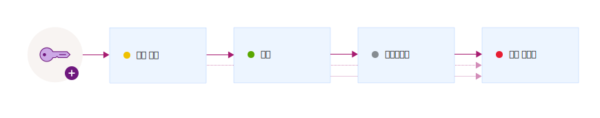

---

copyright:
  years: 2017, 2019
lastupdated: "2019-07-09"

keywords: encryption key states, encryption key lifecycle, manage key lifecycle

subcollection: key-protect

---

{:shortdesc: .shortdesc}
{:screen: .screen}
{:pre: .pre}
{:table: .aria-labeledby="caption"}
{:external: target="_blank" .external}
{:codeblock: .codeblock}
{:tip: .tip}
{:note: .note}
{:important: .important}

# 암호화 키의 라이프사이클 모니터링
{: #key-states}

{{site.data.keyword.keymanagementservicefull}}는 [키 상태와 관련된 NIST SP 800-57](https://www.nist.gov/publications/recommendation-key-management-part-1-general-0){: external}의 보안 가이드라인을 따릅니다.
{: shortdesc}

## 키 상태 및 상태 전이
{: #key-transitions}

암호화 키는 자체 수명 중에 키의 존재 기간과 데이터가 보호되는지 여부의 함수인 여러 상태를 거쳐 전이됩니다. 

{{site.data.keyword.keymanagementserviceshort}}에서는 자체 라이프사이클에서 여러 상태 간에 이동할 때 키를 추적하기 위한 그래픽 사용자 인터페이스와 REST API를 제공합니다. 다음의 다이어그램은 키가 생성되고 소멸되는 사이의 단계를 거치는 방식을 보여줍니다.

|상태 |설명 |
| --- | --- |
|활성화 이전 |처음에 키는 _활성화 이전_ 상태로 작성됩니다. 활성화 이전 상태의 키를 사용하여 암호로 데이터를 보호할 수는 없습니다.|
|활성 |키는 활성화 날짜에 즉시 _활성화됨_ 상태로 이동됩니다. 이 상태 전이는 키의 암호 사용 기간의 시작을 표시합니다. 활성화 날짜가 없는 키는 즉시 활성화되며, 만료되거나 영구 삭제될 때까지 활성화된 상태를 유지합니다. |
|비활성화됨 |지정되면 키가 만기 날짜에 _비활성화됨_ 상태가 됩니다. 이 상태에서 키는 데이터를 암호로 보호할 수 없으며 오직 _영구 삭제됨_ 상태로만 이동이 가능합니다.|
|영구 삭제됨 |삭제된 키는 _영구 삭제됨_ 상태입니다. 이 상태의 키는 복구가 불가능합니다. 키와 연관된 메타데이터(예: 키의 상태 전이 히스토리 및 이름)가 {{site.data.keyword.keymanagementserviceshort}} 데이터베이스에 보관됩니다. |
{: caption="표 1. 키 상태 및 상태 전이에 대해 설명합니다." caption-side="top"}

서비스에 키를 추가한 후 {{site.data.keyword.keymanagementserviceshort}} 대시보드 또는 {{site.data.keyword.keymanagementserviceshort}} REST API를 사용하여 키의 상태 전이 히스토리 및 구성을 보십시오. 감사를 위해 {{site.data.keyword.keymanagementserviceshort}}를 {{site.data.keyword.cloudaccesstrailfull}}에 통합하여 키에 대한 활동 추적을 모니터할 수도 있습니다. 두 서비스 모두 프로비저닝되고 실행 중이면, 사용자가 {{site.data.keyword.keymanagementserviceshort}}에서 키를 작성하고 삭제할 때 활동 이벤트가 생성되고 {{site.data.keyword.cloudaccesstrailshort}} 로그에 자동으로 수집됩니다. 

자세한 정보는 [{{site.data.keyword.keymanagementserviceshort}} 활동 모니터링](/docs/services/cloud-activity-tracker?topic=cloud-activity-tracker-kp){: external}을 참조하십시오.
