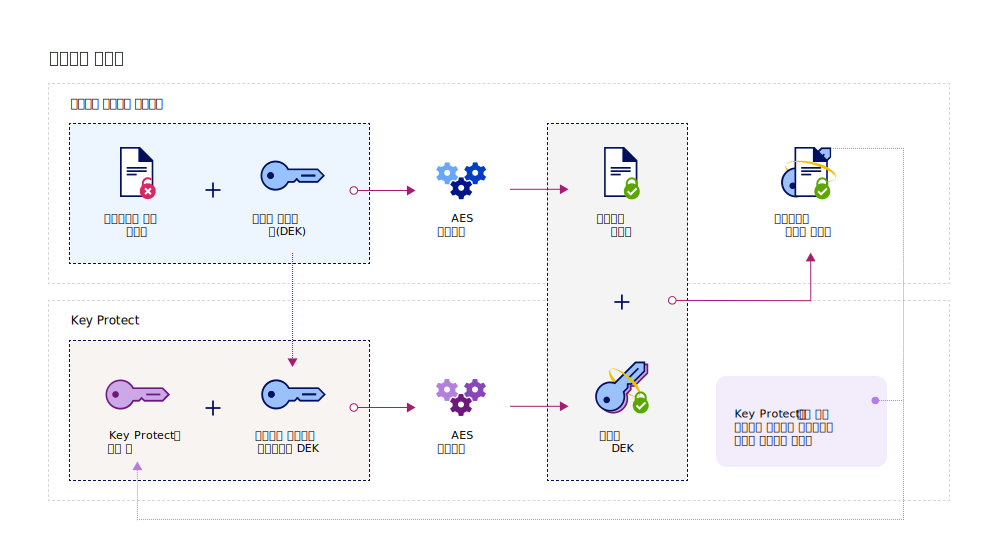

---

copyright:
  years: 2017, 2019
lastupdated: "2019-01-03"

---

{:shortdesc: .shortdesc}
{:codeblock: .codeblock}
{:screen: .screen}
{:new_window: target="_blank"}
{:pre: .pre}
{:tip: .tip}
{:note: .note}
{:important: .important}

# {{site.data.keyword.cos_full_notm}}와 통합
{: #integrate-cos}

{{site.data.keyword.keymanagementservicefull}} 및 {{site.data.keyword.cos_full}}는 함께 작동하여 저장 데이터의 보안을 소유하는 데 도움을 줍니다. {{site.data.keyword.keymanagementservicelong_notm}} 서비스를 사용하여 {{site.data.keyword.cos_full}} 리소스에 고급 암호화를 추가하는 방법을 알아보십시오.
{: shortdesc}

## {{site.data.keyword.cos_full_notm}} 정보
{: #cos}

{{site.data.keyword.cos_full_notm}}는 구조화되지 않은 데이터의 클라우드 스토리지를 제공합니다. 구조화되지 않은 데이터는 파일, 오디오/비주얼 미디어, PDF, 압축된 데이터 아카이브, 백업 이미지, 애플리케이션 아티팩트, 비즈니스 문서 또는 기타 2진 오브젝트를 나타냅니다.  

데이터 무결성과 가용성을 유지보수하려면 {{site.data.keyword.cos_full_notm}}가 데이터를 자르고 여러 지리적 위치의 스토리지 노드에 분산시킵니다. 데이터의 완전한 사본은 단일 스토리지 노드에 없으며, 네트워크에서 데이터를 완벽하게 검색할 수 있도록 노드의 서브세트만 사용 가능해야 합니다. 제공자 측 암호화가 제공되므로 데이터는 저장 시 그리고 전송 시에 보안됩니다. 스토리지를 관리하려면 {{site.data.keyword.cloud_notm}} 콘솔을 사용하거나 프로그래밍 방식으로 [{{site.data.keyword.cos_full_notm}} REST API ](/docs/services/cloud-object-storage/api-reference/about-compatibility-api.html){: new_window}를 사용하여 버킷을 작성하고 오브젝트를 가져옵니다.

자세한 정보는 [COS 정보 ](/docs/services/cloud-object-storage/about-cos.html){: new_window}를 참조하십시오.

## 통합 작동 방식
{: #kp_cos_how}

{{site.data.keyword.keymanagementserviceshort}}가 {{site.data.keyword.cos_full_notm}}와 통합되어 있어 사용자가 데이터 보안을 완전히 제어할 수 있습니다.  

{{site.data.keyword.cos_full_notm}}의 인스턴스로 데이터를 이동할 때 서비스는 데이터 암호화 키(DEK)를 사용하여 오브젝트를 자동으로 암호화합니다. {{site.data.keyword.cos_full_notm}} 내에서 DEK는 서비스에서 암호화된 리소스 옆에 안전하게 저장됩니다. 버킷에 액세스해야 하는 경우 서비스는 사용자 권한을 확인하고 버킷 내 오브젝트를 복호화합니다. 이 암호화 모델은 _제공자 관리 암호화_라고 합니다.

_고객 관리 암호화_의 보안 이점을 사용하기 위해 {{site.data.keyword.keymanagementserviceshort}} 서비스와 통합하여 {{site.data.keyword.cos_full_notm}}에서 DEK에 엔벨로프 암호화를 추가할 수 있습니다. {{site.data.keyword.keymanagementserviceshort}}의 경우 서비스에서 제어하는 마스터 키의 역할을 하는 보안성이 높은 루트 키를 프로비저닝합니다. {{site.data.keyword.cos_full_notm}}에서 버킷을 작성할 때 버킷에 대한 엔벨로프 암호화를 구성할 수 있습니다. 이 추가된 보호는 {{site.data.keyword.keymanagementserviceshort}}에서 관리하는 루트 키를 사용하여 버킷과 연관된 DEK를 랩핑(또는 암호화)합니다. _키 랩핑_이라고 하는 사례에서는 여러 AES 알고리즘을 사용하여 DEK의 무결성과 개인정보를 보호하므로 사용자만 연관된 데이터에 대한 액세스를 제어합니다.

다음 그림은 {{site.data.keyword.keymanagementserviceshort}}가 {{site.data.keyword.cos_full_notm}}와 통합하여 암호화 키를 보안하는 방법을 보여줍니다.

엔벨로프 암호화가 {{site.data.keyword.keymanagementserviceshort}}에서 작동되는 방식에 대해 자세히 보려면 [엔벨로프 암호화](/docs/services/key-protect/concepts/envelope-encryption.html)를 참조하십시오.

## 스토리지 버킷에 엔벨로프 암호화 추가
{: #kp_cos_envelope}

[{{site.data.keyword.keymanagementserviceshort}}에 루트 키를 지정](/docs/services/key-protect/create-root-keys.html)하고 [서비스 간 액세스를 부여](/docs/services/key-protect/integrations/integrate-services.html#grant-access)한 후 {{site.data.keyword.cos_full_notm}} GUI를 사용하여 지정된 스토리지 버킷에 대한 엔벨로프 암호화를 사용으로 설정할 수 있습니다.

 스토리지 버킷에 고급 구성 옵션을 사용하려면 {{site.data.keyword.cos_full_notm}}와 {{site.data.keyword.keymanagementserviceshort}} 서비스 인스턴스 간에 [권한](/docs/services/key-protect/integrations/integrate-services.html#grant-access)이 있는지 확인하십시오.
{: tip}

스토리지 버킷에 엔벨로프 암호화를 추가하려면 다음을 수행하십시오.

1. {{site.data.keyword.cos_full_notm}} 대시보드에서 **버킷 작성**을 클릭하십시오.
2. 버킷의 세부사항을 지정하십시오.
3. **고급 구성** 섹션에서 **{{site.data.keyword.keymanagementserviceshort}} 키 추가**를 선택하십시오.
4. {{site.data.keyword.keymanagementserviceshort}} 서비스 인스턴스의 목록에서 키 랩핑에 사용할 루트 키가 포함된 인스턴스를 선택하십시오.
5. **키 이름**에 대해 루트 키의 별명을 선택하십시오.
6. **작성**을 클릭하여 버킷 작성을 확인하십시오.

{{site.data.keyword.cos_full_notm}} GUI에서 {{site.data.keyword.keymanagementserviceshort}} 루트 키로 보호되는 버킷을 찾아볼 수 있습니다.

### 다음에 수행할 작업

- 스토리지 버킷을 {{site.data.keyword.keymanagementserviceshort}} 키와 연관시키는 데 대한 자세한 정보는 [암호화 관리 ](/docs/services/cloud-object-storage/basics/encryption.html#manage-encryption){: new_window}를 참조하십시오. 
