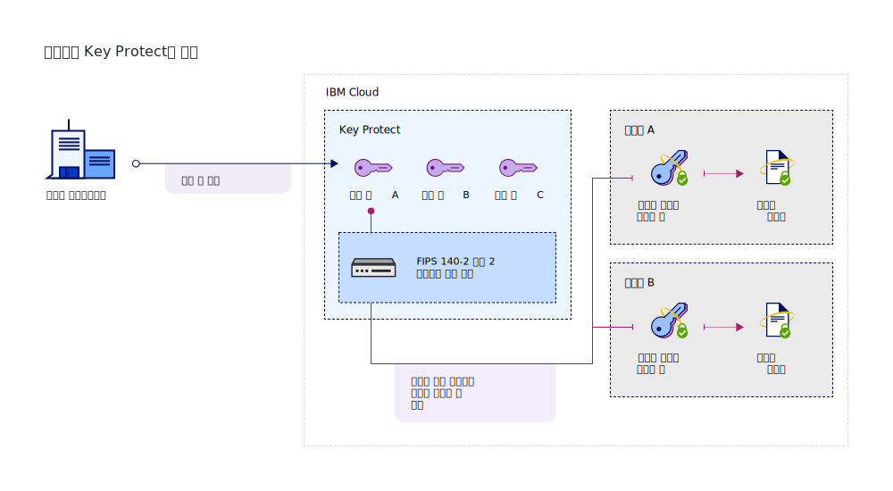

---

copyright:
  years: 2017, 2019
lastupdated: "2019-07-09"

keywords: Key Protect integration, integrate service with Key Protect

subcollection: key-protect

---

{:shortdesc: .shortdesc}
{:screen: .screen}
{:pre: .pre}
{:table: .aria-labeledby="caption"}
{:external: target="_blank" .external}
{:codeblock: .codeblock}
{:tip: .tip}
{:note: .note}
{:important: .important}

# 서비스 통합
{: #integrate-services}

{{site.data.keyword.keymanagementservicefull}}는 데이터와 스토리지 솔루션을 통합하여 클라우드에서 고유 암호화를 가져오고 관리하는 데 도움을 줍니다.
{: shortdesc}

[서비스의 인스턴스를 작성한 후](/docs/services/key-protect?topic=key-protect-provision), {{site.data.keyword.keymanagementserviceshort}}를 지원되는 다음 서비스와 통합할 수 있습니다.

|서비스 |설명 |
| --- | --- |
| {{site.data.keyword.cos_full_notm}} |{{site.data.keyword.keymanagementserviceshort}}를 사용하여 스토리지 버킷에 [엔벨로프 암호화](/docs/services/key-protect?topic=key-protect-envelope-encryption)를 추가하십시오. {{site.data.keyword.keymanagementserviceshort}}에서 관리하는 루트 키를 사용하여 저장 데이터를 암호화하는 데이터 암호화 키를 보호하십시오. 자세한 내용은 [{{site.data.keyword.cos_full_notm}}와 통합](/docs/services/key-protect?topic=key-protect-integrate-cos)을 참조하십시오.|
| {{site.data.keyword.databases-for-postgresql_full_notm}} |루트 키를 {{site.data.keyword.databases-for-postgresql}} 배치와 연관시켜 데이터베이스를 보호하십시오. 자세한 내용은 [{{site.data.keyword.databases-for-postgresql}} 문서](/docs/services/databases-for-postgresql?topic=cloud-databases-key-protect)를 참조하십시오.|
| {{site.data.keyword.cloud_notm}}의 {{site.data.keyword.cloudant_short_notm}}({{site.data.keyword.cloud_notm}} 데디케이티드) |{{site.data.keyword.cloudant_short_notm}} 데디케이티드 하드웨어 인스턴스와 루트 키를 연관시켜 저장 암호화 전략을 강화하십시오. 자세한 내용은 [{{site.data.keyword.cloudant_short_notm}} 문서](/docs/services/Cloudant/offerings?topic=cloudant-security#secure-access-control)를 참조하십시오. |
| {{site.data.keyword.containerlong_notm}} |[엔벨로프 암호화](/docs/services/key-protect?topic=key-protect-envelope-encryption)를 사용하여 {{site.data.keyword.containershort_notm}} 클러스터에서 시크릿을 보호하십시오. 자세한 내용은 [{{site.data.keyword.keymanagementserviceshort}}를 사용하여 Kubernetes 시크릿 암호화](/docs/containers?topic=containers-encryption#keyprotect)를 참조하십시오.|
{: caption="표 1. {{site.data.keyword.keymanagementserviceshort}}에서 사용 가능한 통합에 대한 설명 " caption-side="top"}

## 통합 이해 
{: #understand-integration}

지원되는 서비스를 {{site.data.keyword.keymanagementserviceshort}}와 통합할 때 해당 서비스에 대한 [엔벨로프 암호화](/docs/services/key-protect?topic=key-protect-envelope-encryption)를 사용으로 설정합니다. 이와 같이 통합하면 {{site.data.keyword.keymanagementserviceshort}}에 저장하는 루트 키를 사용하여 저장 데이터를 암호화하는 데이터 암호화 키를 랩핑할 수 있습니다. 

예를 들어, 루트 키를 작성하고 {{site.data.keyword.keymanagementserviceshort}}에서 키를 관리하며 루트 키를 사용하여 여러 클라우드 서비스에 저장된 데이터를 보호할 수 있습니다.

### {{site.data.keyword.keymanagementserviceshort}} API 메소드
{: #envelope-encryption-api-methods}

뒤에서 {{site.data.keyword.keymanagementserviceshort}} API가 엔벨로프 암호화 프로세스를 유도합니다.  

다음 표에는 리소스에 대한 엔벨로프 암호화를 추가하거나 제거하는 API 메소드가 나열되어 있습니다.

|메소드 |설명 |
| --- | --- |
| `POST /keys/{root_key_ID}?action=wrap` | [데이터 암호화 키 랩핑(암호화)](/docs/services/key-protect?topic=key-protect-wrap-keys) |
| `POST /keys/{root_key_ID}?action=unwrap` | [데이터 암호화 키 랩핑 해제(복호화)](/docs/services/key-protect?topic=key-protect-unwrap-keys) |
{: caption="표 2. {{site.data.keyword.keymanagementserviceshort}} API 메소드에 대한 설명" caption-side="top"}

{{site.data.keyword.keymanagementserviceshort}}에서 프로그래밍 방식으로 키를 관리하는 방법에 대해 자세히 알아보려면 [{{site.data.keyword.keymanagementserviceshort}} API 참조 문서](https://{DomainName}/apidocs/key-protect){: external}를 확인하십시오.
{: tip}

## 지원되는 서비스 통합
{: #grant-access}

통합을 추가하려면 {{site.data.keyword.iamlong}} 대시보드를 사용하여 서비스 간의 권한을 작성하십시오. 서비스에서 권한을 통해 서비스 액세스 정책을 제공할 수 있으므로 사용자가 클라우드 데이터베이스 서비스의 리소스를 {{site.data.keyword.keymanagementserviceshort}}에서 관리하는 [루트 키](/docs/services/key-protect?topic=key-protect-envelope-encryption#key-types)와 연관시킬 수 있습니다.

권한을 작성하기 전에 두 개의 서비스를 동일한 지역에 프로비저닝해야 합니다. 서비스 권한에 대해 자세히 알아보려면 [서비스 간 액세스 부여](/docs/iam?topic=iam-serviceauth){: external}를 참조하십시오.
{: note}

서비스를 통합할 준비가 되면 다음 단계를 사용하여 권한을 작성하십시오.

1. 메뉴 표시줄에서 **관리** &gt; **보안** &gt; **액세스(IAM)**를 클릭하고 **권한**을 선택하십시오. 
2. **작성**을 클릭하십시오.
3. 권한에 대한 소스 및 대상 서비스를 선택하십시오.
 
  **소스 서비스**에서 {{site.data.keyword.keymanagementserviceshort}}와 통합할 클라우드 데이터 서비스를 선택하십시오. **대상 서비스**에서 **{{site.data.keyword.keymanagementservicelong_notm}}**를 선택하십시오.

5. **독자** 역할을 사용으로 설정하십시오.

        _독자_ 권한이 있으면 소스 서비스가 {{site.data.keyword.keymanagementserviceshort}}의 지정된 인스턴스에 프로비저닝된 루트 키를 찾아볼 수 있습니다.

6. **권한 부여**를 클릭하십시오.

## 다음에 수행할 작업
{: #integration-next-steps}

{{site.data.keyword.keymanagementserviceshort}}에서 루트 키를 작성하여 클라우드 리소스에 고급 암호화를 추가하십시오. 지원되는 클라우드 데이터 서비스에 새 리소스를 추가한 후 고급 암호화에 사용할 루트 키를 선택하십시오.

- {{site.data.keyword.keymanagementserviceshort}} 서비스를 통해 루트 키를 작성하는 방법에 대해 자세히 알아보려면 [루트 키 작성](/docs/services/key-protect?topic=key-protect-create-root-keys)을 참조하십시오.
- {{site.data.keyword.keymanagementserviceshort}} 서비스에 고유 루트 키를 가져오는 방법에 대해 자세히 알아보려면 [루트 키 가져오기](/docs/services/key-protect?topic=key-protect-import-root-keys)를 참조하십시오.

