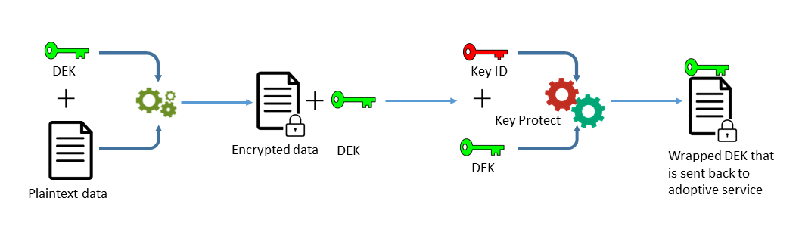
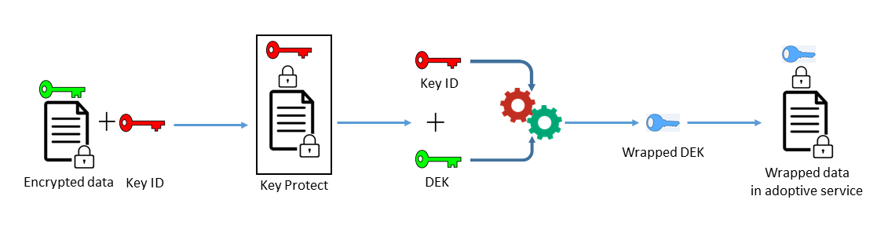
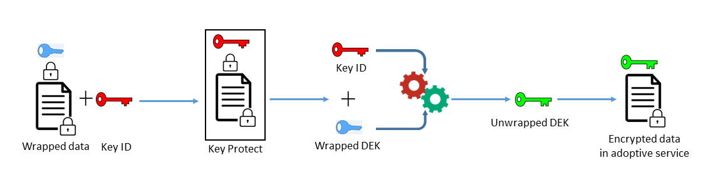

---

copyright:
  years: 2017
lastupdated: "2017-12-15"

---

{:shortdesc: .shortdesc}
{:codeblock: .codeblock}
{:screen: .screen}
{:new_window: target="_blank"}
{:pre: .pre}
{:tip: .tip}

# 엔벨로프 암호화
{: #envelope-encryption}

엔벨로프 암호화는 데이터 암호화 키(DEK)로 데이터를 암호화한 다음 완전히 관리할 수 있는 루트 키로 DEK를 암호화하는 사례입니다.
{: shortdesc}

{{site.data.keyword.keymanagementservicefull}}는 고급 암호화를 사용하여 저장된 데이터를 보호하고 여러 이점을 제공합니다.

<table>
  <th>이점</th>
  <th>설명</th>
  <tr>
    <td>고객 관리 암호화 키</td>
    <td>서비스를 사용하면 루트 키를 프로비저닝하여 클라우드에서 암호화된 데이터의 보안을 보호할 수 있습니다. 루트 키는 마스터 키-랩핑 키의 역할을 하며, 이 키를 사용하면 {{site.data.keyword.cloud_notm}} 데이터 서비스에 프로비저닝된 데이터 암호화 키(DEK)를 관리하고 보호할 수 있습니다. 기존 루트 키를 가져올지 아니면 {{site.data.keyword.keymanagementserviceshort}}에서 루트 키를 생성하도록 할지를 결정합니다.</td>
  </tr>
  <tr>
    <td>비밀 및 무결성 보호</td>
    <td>{{site.data.keyword.keymanagementserviceshort}}는 GCM(Galois/Counter Mode)에서 고급 암호화 표준(AES) 알고리즘을 사용하여 키를 작성하고 보호합니다. 사용자가 서비스에서 키를 작성할 때, {{site.data.keyword.keymanagementserviceshort}}가 {{site.data.keyword.cloud_notm}} HSM(Hardware Security Module)의 신뢰 경계 내에서 이 키를 생성하므로 암호화 키에 사용자만 액세스할 수 있습니다.</td>
  </tr>
  <tr>
    <td>데이터의 암호 파쇄</td>
    <td>조직이 보안 문제를 발견하거나 앱이 데이터 세트를 더 이상 필요로 하지 않는 경우 클라우드에서 데이터를 영구적으로 파쇄하도록 선택할 수 있습니다. 다른 DEK를 보호하는 루트 키를 삭제하면 키의 연관된 데이터에 더 이상 액세스할 수 없거나 이를 복호화할 수 없습니다.</td>
  </tr>
  <tr>
    <td>위임된 사용자 액세스 제어</td>
    <td>{{site.data.keyword.keymanagementserviceshort}}는 중앙화된 액세스 제어 시스템을 지원하여 키에 대한 세부적 액세스를 사용합니다. [IAM 사용자 역할 및 고급 권한을 지정하여](/docs/services/keymgmt/keyprotect_manage_access.html#roles) 보안 관리자가 서비스의 어떤 루트 키에 어떤 사용자가 액세스할 수 있는지를 결정합니다.</td>
  </tr>
  <caption style="caption-side:bottom;">표 1. {{site.data.keyword.keymanagementserviceshort}}의 엔벨로프 암호화 이점</caption>
</table>

## 작동 방식
{: #overview}

엔벨로프 암호화는 여러 암호화 알고리즘의 장점을 결합하여 클라우드의 민감한 데이터를 보호합니다. 이 암호화가 작동하려면 완전히 관리할 수 있는 루트 키를 사용하여 고급 암호화를 통해 하나 이상의 데이터 암호화 키(DEK)를 랩핑해야 합니다. 이 키 랩핑 프로세스는 무단 액세스 또는 노출로부터 저장된 데이터를 보호하는 랩핑된 DEK를 작성합니다. DEK를 랩핑 해제하면 동일한 루트 키를 사용하여 엔벨로프 암호화 프로세스를 되돌릴 수 있으며 그 결과 데이터가 복호화되고 인증됩니다.
 
다음 다이어그램은 키 랩핑 기능의 컨텍스트 보기를 표시합니다.

엔벨로프 암호화는 NIST Special Publication 800-57, Recommendation for Key Management에서 간단하게 다뤄집니다. 자세히 보려면 [NIST SP 800-57 Pt. 1 Rev. 4.](http://nvlpubs.nist.gov/nistpubs/SpecialPublications/NIST.SP.800-57pt1r4.pdf){: new_window}를 참조하십시오.

## 키 유형
{: #key_types}

서비스는 데이터의 고급 암호화 및 관리를 위해 두 가지 키 유형(루트 키와 표준 키)을 지원합니다.

<dl>
  <dt>루트 키</dt>
    <dd>루트 키는 {{site.data.keyword.keymanagementserviceshort}}의 기본 리소스입니다. 또한 데이터 서비스에 저장된 기타 키를 랩핑(암호화)하고 랩핑 해제(복호화)하기 위한 신뢰 루트로 사용되는 대칭 키-랩핑 키입니다. {{site.data.keyword.keymanagementserviceshort}}를 사용하면 루트 키의 라이프사이클을 작성하고 저장하고 관리하여 클라우드에 저장된 다른 키를 완전히 제어할 수 있습니다. 표준 키와 달리 루트 키는 {{site.data.keyword.keymanagementserviceshort}} 서비스 외에 사용될 수 없습니다.</dd>
  <dt>표준 키</dt>
    <dd>표준 키는 암호화에 사용되는 암호화 키입니다. 일반적으로 표준 키는 직접 데이터를 암호화합니다. {{site.data.keyword.keymanagementserviceshort}}를 사용하면 표준 키의 라이프사이클을 작성하고 저장하고 관리할 수 있습니다. 서비스에서 표준 키를 가져오거나 생성한 후 스토리지 버킷과 같은 외부 데이터 리소스로 내보내어 민감한 정보를 암호화할 수 있습니다. 저장된 데이터를 암호화하는 표준 키는 데이터 암호화 키(DEK)라고 하며, 고급 암호화로 랩핑될 수 있습니다. 랩핑된 DEK는 {{site.data.keyword.keymanagementserviceshort}}에 저장되지 않습니다.</dd>
</dl>

{{site.data.keyword.keymanagementserviceshort}}에서 키를 작성한 후 시스템은 서비스에 대한 API 호출을 작성하는 데 사용할 수 있는 ID 값을 리턴합니다. {{site.data.keyword.keymanagementserviceshort}} GUI 또는 [{{site.data.keyword.keymanagementserviceshort}} API](https://console.ng.bluemix.net/apidocs/639)를 사용하여 키에 대한 ID 값을 검색할 수 있습니다. 

## 키 랩핑
{: #wrapping}

루트 키를 사용하면 클라우드에 저장된 데이터 암호화 키(DEK)를 그룹화하고 관리하고 보호할 수 있습니다. 완전히 관리할 수 있는 {{site.data.keyword.keymanagementserviceshort}}의 루트 키를 지정하여 고급 암호화로 하나 이상의 DEK를 랩핑할 수 있습니다. 

{{site.data.keyword.keymanagementserviceshort}}에서 루트 키를 지정한 후 {{site.data.keyword.keymanagementserviceshort}} API를 사용하여 서비스로 키 랩핑 요청을 전송할 수 있습니다. 키 랩핑 오퍼레이션은 DEK를 위한 비밀과 무결성 보호를 제공합니다. 다음 다이어그램은 조치의 키 랩핑 프로세스를 표시합니다.

다음 표에는 키 랩핑 오퍼레이션을 수행하는 데 필요한 입력이 설명되어 있습니다.
<table>
  <th>입력</th>
  <th>설명</th>
  <tr>
    <td>루트 키 ID</td>
    <td>랩핑에 사용할 루트 키의 ID 값입니다. 루트 키를 서비스로 가져오거나 HSM의 {{site.data.keyword.keymanagementserviceshort}}에서 이 키를 생성할 수 있습니다. 랩핑 요청이 성공하려면 랩핑에 사용되는 루트 키가 256, 384 또는 512비트여야 합니다.</td>
  </tr>
  <tr>
    <td>일반 텍스트</td>
    <td>선택사항: 관리하고 보호할 데이터가 있는 DEK의 키 자료입니다. 키 랩핑에 사용되는 일반 텍스트는 base64로 인코딩되어야 합니다. 256비트 DEK를 생성하기 위해 `plaintext` 속성을 생략할 수 있습니다. 서비스는 키 랩핑에 사용할 base64 인코딩 DEK를 생성합니다.</td>
  </tr>
  <tr>
    <td>추가 인증 데이터(AAD)</td>
    <td>선택사항: 키 컨텐츠의 무결성을 검사하는 문자열의 배열입니다. 각 문자열은 최대 255자입니다. 랩핑 요청 중에 AAD를 제공하면 후속 랩핑 해제 요청 중에 동일한 AAD를 지정해야 합니다.</td>
  </tr>
    <caption style="caption-side:bottom;">표 2. {{site.data.keyword.keymanagementserviceshort}}에서 키 랩핑에 필요한 입력</caption>
</table>

암호화할 일반 텍스트를 지정하지 않고 랩핑 요청을 보내는 경우 AES-GCM 암호화 알고리즘이 일반 텍스트를 생성하고 암호문이라고 하는 이해할 수 없는 양식의 데이터로 변환합니다. 이 프로세스는 새 키 자료와 함께 256비트 DEK를 출력합니다. 그런 다음 시스템은 AES 키-랩핑 알고리즘을 사용하며, 이 알고리즘을 통해 지정된 루트 키로 DEK와 해당 키 자료를 랩핑합니다. 성공한 랩핑 오퍼레이션은 {{site.data.keyword.cloud_notm}} 앱 또는 서비스에 저장할 수 있는 랩핑된 base64 인코딩 DEK를 리턴합니다. 

## 키 랩핑 해제
{: #unwrapping}

데이터 암호화 키(DEK)를 랩핑 해제하면 키 내에서 컨텐츠가 복호화되고 인증되며, 원래 키 자료가 데이터 서비스에 리턴됩니다. 

비즈니스 애플리케이션이 랩핑된 DEK의 컨텐츠에 액세스해야 하는 경우 {{site.data.keyword.keymanagementserviceshort}} API를 사용하여 서비스로 랩핑 해제 요청을 보낼 수 있습니다. DEK를 랩핑 해제하려면 초기 랩핑 요청 중에 리턴된 `ciphertext` 값 및 루트 키의 ID 값을 지정합니다. 또한 랩핑 해제 요청을 완료하려면 추가 인증 데이터(AAD)를 제공하여 키 컨텐츠의 무결성을 검사해야 합니다.

다음 다이어그램은 조치의 키 랩핑 해제를 보여줍니다.

랩핑 해제 요청을 보내면 시스템이 동일한 AES 알고리즘을 사용하여 키 랩핑 프로세스를 되돌립니다. 성공한 랩핑 해제 오퍼레이션은 base64 인코딩 `plaintext` 값을 {{site.data.keyword.cloud_notm}} 저장 데이터 서비스로 리턴합니다.

