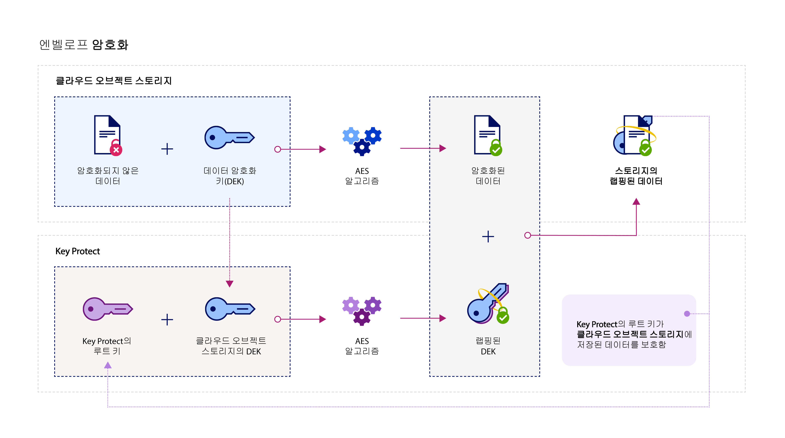

---

copyright:
  years: 2017
lastupdated: "2017-12-15"

---

{:shortdesc: .shortdesc}
{:codeblock: .codeblock}
{:screen: .screen}
{:new_window: target="_blank"}
{:pre: .pre}
{:tip: .tip}

# 통합
{: #integrations}

{{site.data.keyword.keymanagementservicefull}}는 {{site.data.keyword.cloud_notm}} 데이터와 스토리지 솔루션을 통합하여 사용자가 클라우드에서 암호화를 관리하는 데 도움이 될 수 있습니다.
{: shortdesc}

{{site.data.keyword.keymanagementserviceshort}} 서비스를 [{{site.data.keyword.objectstorageshort}} ](/docs/services/ObjectStorage/index.html) 등의 스토리지 솔루션과 통합하여 클라우드에 보관된 데이터를 암호화할 수 있습니다. 서로 다른 키로 각 문서를 보호할 수 있으므로
데이터에 대한 세부 단위의 제어가 가능합니다. 또한 {{site.data.keyword.keymanagementserviceshort}}를 사용하여 다음 서비스에 대한 고유 암호화를 가져와 관리할 수 있습니다.

- [{{site.data.keyword.cos_full_notm}} ](/docs/services/cloud-object-storage/about-cos.html#about-ibm-cloud-object-storage)

## {{site.data.keyword.keymanagementservicelong_notm}} 및 {{site.data.keyword.cos_full_notm}}

{{site.data.keyword.keymanagementserviceshort}} 서비스를 사용하여 {{site.data.keyword.cos_full_notm}} 리소스에서 엔벨로프 암호화를 수행할 수 있습니다.

### {{site.data.keyword.cos_full_notm}} 정보
{: #cos}

{{site.data.keyword.cos_full_notm}}는 구조화되지 않은 데이터의 클라우드 스토리지를 제공합니다. 구조화되지 않은 데이터는 파일, 오디오/비주얼 미디어, PDF, 압축된 데이터 아카이브, 백업 이미지, 애플리케이션 아티팩트, 비즈니스 문서 또는 기타 2진 오브젝트를 나타냅니다.  

데이터 무결성과 가용성을 유지보수하려면 {{site.data.keyword.cos_full_notm}}가 데이터를 자르고 균형을 맞춰 여러 지리적 위치의 스토리지 노드에 분산시킵니다. 데이터의 완전한 사본은 단일 스토리지 노드에 없으며, 네트워크에서 데이터를 완벽하게 검색할 수 있도록 노드의 서브세트만 사용 가능해야 합니다. 제공자 측 암호화가 제공되므로 데이터는 저장 시 그리고 전송 시에 보안됩니다. 스토리지를 관리하려면 {{site.data.keyword.cloud_notm}} 콘솔을 사용하거나 프로그래밍 방식으로 [{{site.data.keyword.cos_full_notm}} REST API](/docs/services/cloud-object-storage/api-reference/about-compatibility-api.html#about-the-cos-api)를 사용하여 버킷을 작성하고 오브젝트를 가져옵니다.

자세한 정보는 [COS 시작하기](/docs/services/cloud-object-storage/getting-started.html#getting-started-cli-)를 참조하십시오.

## 작동 방식
{: #kp_cos_how}

{{site.data.keyword.keymanagementserviceshort}}가 {{site.data.keyword.cos_full_notm}}와 통합되어 있어 사용자가 데이터 보안을 완전히 제어할 수 있습니다.  

{{site.data.keyword.cos_full_notm}}의 인스턴스로 데이터를 이동할 때 서비스는 데이터 암호화 키(DEK)를 사용하여 오브젝트를 자동으로 암호화합니다. {{site.data.keyword.cos_full_notm}} 내에서 DEK는 서비스에서 암호화된 리소스 옆에 안전하게 저장됩니다. 버킷에 액세스해야 하는 경우 서비스는 사용자 권한을 확인하고 버킷 내 오브젝트를 복호화합니다. 이 암호화 모델은 _제공자 관리 암호화_라고 합니다.

_고객 관리 암호화_의 보안 이점을 사용하기 위해 {{site.data.keyword.keymanagementserviceshort}} 서비스와 통합하여 {{site.data.keyword.cos_full_notm}}에서 DEK에 엔벨로프 암호화를 추가할 수 있습니다. {{site.data.keyword.keymanagementserviceshort}}의 경우 서비스에서 제어하는 마스터 키의 역할을 하는 보안성이 높은 루트 키를 프로비저닝합니다. {{site.data.keyword.cos_full_notm}}에서 버킷을 작성할 때 버킷에 대한 엔벨로프 암호화를 구성할 수 있습니다. 이 추가된 보호는 {{site.data.keyword.keymanagementserviceshort}}에서 관리하는 루트 키를 사용하여 버킷과 연관된 DEK를 랩핑(또는 암호화)합니다. _키 랩핑_이라고 하는 사례에서는 여러 AES 알고리즘을 사용하여 DEK의 무결성과 개인정보를 보호하므로 사용자만 연관된 데이터에 대한 액세스를 제어합니다.

다음 그림은 {{site.data.keyword.keymanagementserviceshort}}가 {{site.data.keyword.cos_full_notm}}와 통합하여 암호화 키를 보안하는 방법을 보여줍니다.

엔벨로프 암호화가 {{site.data.keyword.keymanagementserviceshort}}에서 작동되는 방식에 대해 자세히 보려면 [엔벨로프 암호화](/docs/services/keymgmt/keyprotect_envelope.html)를 참조하십시오.

## 서비스 간 액세스 부여
{: #grant_access}

{{site.data.keyword.cos_full_notm}}와 {{site.data.keyword.keymanagementserviceshort}} 서비스 인스턴스 간 액세스를 부여해야 하는 경우 {{site.data.keyword.iamlong}} 대시보드를 사용하여 권한을 설정할 수 있습니다. 권한을 통해 서비스가 액세스 정책을 제공할 수 있으므로 사용자는 {{site.data.keyword.keymanagementserviceshort}}에 프로비저닝된 루트 키와 COS의 스토리지 버킷을 연관시킬 수 있습니다.

권한을 작성하려면 다음을 수행하십시오.

1. 메뉴 표시줄에서 **관리** &gt; **계정** &gt; **ID 및 액세스**를 클릭한 다음 **권한**을 선택하십시오. 
2. **권한 작성**을 클릭하십시오.
3. 권한에 대한 소스 및 대상을 선택하십시오.
 
    a. **소스 서비스**에서 **{{site.data.keyword.cos_full_notm}}**를 선택하십시오.

    b. **대상 서비스**에서 **{{site.data.keyword.keymanagementservicelong_notm}}**를 선택하십시오. 
4. 서비스 간에 읽기 전용 액세스를 부여하려면 **독자** 선택란을 선택하십시오.

    _독자_ 권한을 사용하면 {{site.data.keyword.cos_full_notm}}의 인스턴스가 {{site.data.keyword.keymanagementserviceshort}}의 지정된 인스턴스에 프로비저닝된 루트 키를 찾아볼 수 있습니다. 버킷 작성 중에 지정된 {{site.data.keyword.keymanagementserviceshort}} 루트 키와 버킷을 연관시킬 수 있습니다.
5. **권한 부여**를 클릭하십시오.

서비스 권한에 대해 자세히 보려면 [IAM 문서](/docs/iam/authorizations.html#serviceauth)를 참조하십시오. 

## 스토리지 버킷에 엔벨로프 암호화 추가
{: #kp_cos_envelope}

[{{site.data.keyword.keymanagementserviceshort}}](/docs/services/keymgmt/keyprotect_create_keys.html)에 루트 키를 지정하고 서비스 간 액세스를 부여한 후 {{site.data.keyword.cos_full_notm}} GUI를 사용하여 지정된 스토리지 버킷에 엔벨로프 암호화를 사용할 수 있습니다.

**참고:** 엔벨로프 암호화는 현재 미국 남부 지역에 프로비저닝된 버킷에만 사용 가능합니다. 스토리지 버킷에 고급 구성 옵션을 사용하려면 서비스 정책에 대한 서비스가 COS와 {{site.data.keyword.keymanagementserviceshort}} 서비스 인스턴스 간에 있는지 확인하십시오.

스토리지 버킷에 엔벨로프 암호화를 추가하려면 다음을 수행하십시오.

1. {{site.data.keyword.cos_full_notm}} 대시보드에서 **버킷 작성**을 클릭하십시오.
2. 버킷의 세부사항을 지정하십시오.
3. **고급 구성** 섹션에서 **{{site.data.keyword.keymanagementserviceshort}} 키 추가**를 선택하십시오.
4. {{site.data.keyword.keymanagementserviceshort}} 서비스 인스턴스의 목록에서 키 랩핑에 사용할 루트 키가 포함된 인스턴스를 선택하십시오.
5. **키 이름**에 대해 루트 키의 별명을 선택하십시오.
6. **작성**을 클릭하여 버킷 작성을 확인하십시오.

{{site.data.keyword.cos_full_notm}} GUI에서 {{site.data.keyword.keymanagementserviceshort}} 루트 키로 보호되는 버킷을 찾아볼 수 있습니다.

## {{site.data.keyword.keymanagementserviceshort}} API 메소드
{: #api_methods}

뒤에서 {{site.data.keyword.keymanagementserviceshort}} API가 키 랩핑(또는 엔벨로프 암호화) 프로세스를 유도합니다.  

다음 표에는 호출될 때 엔벨로프 암호화를 추가하거나 제거하는 API 메소드 목록이 있습니다.

<table>
  <tr>
    <th>메소드</th>
    <th>설명</th>
  </tr>
  <tr>
    <td><code>POST /keys/{root_key_ID}?action=wrap</code></td>
    <td><a href="/docs/services/keymgmt/keyprotect_wrap_keys.html">데이터 암호화 키 랩핑(암호화)</a></td>
  </tr>
  <tr>
    <td><code>POST /keys/{root_key_ID}?action=unwrap</code></td>
    <td><a href="/docs/services/keymgmt/keyprotect_unwrap_keys.html">데이터 암호화 키 랩핑 해제(복호화)</a></td>
  </tr>
  <caption style="caption-side:bottom;">표 1. {{site.data.keyword.keymanagementserviceshort}} API 메소드에 대한 설명</caption>
</table>

{{site.data.keyword.keymanagementserviceshort}}에서 키를 프로그래밍 방식으로 관리하는 데 대해 자세히 보려면 코드 샘플에 대한 [{{site.data.keyword.keymanagementserviceshort}} API 참조 문서](https://console.ng.bluemix.net/apidocs/639)를 확인하십시오.

