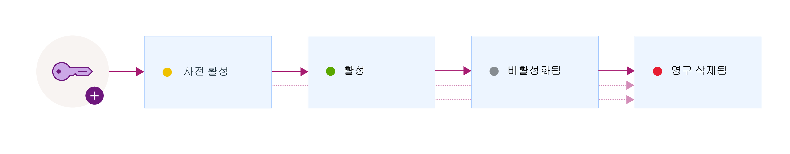

---

copyright:
  years: 2017
lastupdated: "2017-12-15"

---

{:shortdesc: .shortdesc}
{:codeblock: .codeblock}
{:screen: .screen}
{:new_window: target="_blank"}
{:pre: .pre}
{:tip: .tip}

# 키 상태
{: #key-states}

{{site.data.keyword.keymanagementservicefull}}는 [키 상태와 관련된 NIST SP 800-57 ](http://nvlpubs.nist.gov/nistpubs/SpecialPublications/NIST.SP.800-57pt1r4.pdf){: new_window}의 보안 가이드라인을 따릅니다.
{: shortdesc}

## 키 상태 및 상태 전이
{: #key_transitions}

키는 해당 라이프사이클의 네 단계를 진행할 수 있습니다.

다음 다이어그램은 키가 생성과 소멸 사이의 여러 단계를 거치는 방식을 보여줍니다.

<table>
  <tr>
    <th>시/도</th>
    <th>설명</th>
  </tr>
  <tr>
    <td>활성화 이전</td>
    <td>처음에 키는 <i>활성화 이전</i> 상태로 작성됩니다. 키 소유 증명 또는 키 확인을 위한 경우가 아니면 데이터를 암호로 보호하는 데 활성화 이전 키를 사용할 수 없습니다.</td>
  </tr>
  <tr>
    <td>활성</td>
    <td>키는 활성화 날짜에 즉시 <i>활성화됨</i> 상태로 이동됩니다. 이 상태 전이는 키의 암호 사용 기간의 시작을 표시합니다. 활성화 날짜가 없는 키는 즉시 활성화되며, 만료되거나 영구 삭제될 때까지 활성화된 상태를 유지합니다.</td>
  </tr>
  <tr>
    <td>비활성화됨</td>
    <td>지정되면 키가 만기 날짜에 <i>비활성화됨</i> 상태가 됩니다. 이 상태에서 키는 데이터를 암호로 보호할 수 없으며 오직 <i>영구 삭제됨</i> 상태로만 이동이 가능합니다.</td>
  </tr>
  <tr>
    <td>영구 삭제됨</td>
    <td>삭제된 키는 <i>영구 삭제됨</i> 상태입니다. 이 상태의 키는 복구가 불가능합니다. 키와 연관된 메타데이터(예: 키의 상태 전이 히스토리 및 이름)가 {{site.data.keyword.keymanagementserviceshort}} 데이터베이스에 보관됩니다.</td>
  </tr>
  <caption style="caption-side:bottom;">표 1. 키 상태 및 상태 전이에 대해 설명합니다.</caption>
</table>

서비스에 키를 추가한 후 {{site.data.keyword.keymanagementserviceshort}} 대시보드 또는 {{site.data.keyword.keymanagementserviceshort}} REST API를 사용하여 키의 상태 전이 히스토리 및 구성을 보십시오. 감사를 위해 {{site.data.keyword.keymanagementserviceshort}}를 {{site.data.keyword.cloudaccesstrailfull}}에 통합하여 키에 대한 활동 추적을 모니터할 수도 있습니다. 두 서비스 모두 프로비저닝되고 실행 중이면, 사용자가 {{site.data.keyword.keymanagementserviceshort}}에서 키를 작성하고 삭제할 때 활동 이벤트가 생성되고 {{site.data.keyword.cloudaccesstrailshort}} 로그에 자동으로 수집됩니다. 

자세한 정보는 [{{site.data.keyword.keymanagementserviceshort}} 활동 모니터링](https://console.stage1.bluemix.net/docs/services/cloud-activity-tracker/svcs/kp_at.html#kp_at){: new_window}을 참조하십시오.
