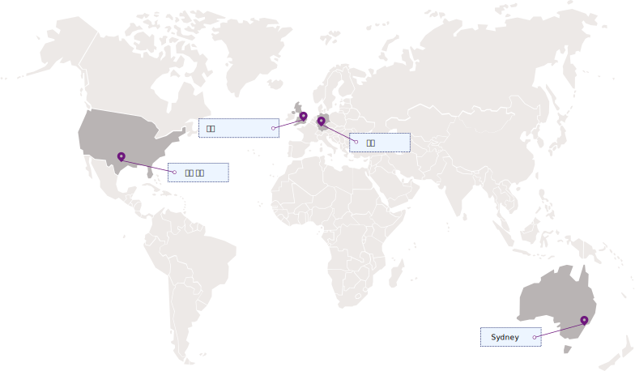

---

copyright:
  years: 2017, 2019
lastupdated: "2019-07-09"

keywords: Key Protect API endpoints, available regions

subcollection: key-protect

---

{:shortdesc: .shortdesc}
{:codeblock: .codeblock}
{:screen: .screen}
{:new_window: target="_blank"}
{:pre: .pre}
{:tip: .tip}
{:note: .note}
{:important: .important}
{:deprecated: .deprecated}

# 지역 및 엔드포인트
{: #regions}

지역 서비스 엔드포인트를 지정하여 {{site.data.keyword.keymanagementservicelong}} 서비스에 애플리케이션을 연결할 수 있습니다.
{: shortdesc}

## 사용 가능한 지역
{: #available-regions}

{{site.data.keyword.keymanagementserviceshort}}는 다음과 같은 지역과 위치에서 사용 가능합니다.

## 서비스 엔드포인트
{: #service-endpoints}

{{site.data.keyword.keymanagementserviceshort}} 리소스를 프로그래밍 방식으로 관리하는 경우 [{{site.data.keyword.keymanagementserviceshort}} API](https://{DomainName}/apidocs/key-protect)에 연결할 때 사용할 API 엔드포인트를 판별하려면 다음 표를 확인하십시오. 

<table>
    <tr>
        <th>위치</th>
        <th>서비스 API 엔드포인트</th>
    </tr>
    <tr>
        <td>댈러스</td>
        <td>
            <code>us-south.kms.cloud.ibm.com</code>
        </td>
    </tr>
    <tr>
        <td>워싱턴 DC</td>
        <td>
            <code>us-east.kms.cloud.ibm.com</code>
        </td>
    </tr>
    <tr>
        <td>런던</td>
        <td>
            <code>eu-gb.kms.cloud.ibm.com</code>
        </td>
    </tr>
    <tr>
        <td>프랑크푸르트</td>
        <td>
            <code>eu-de.kms.cloud.ibm.com</code>
        </td>
    </tr>
    <tr>
        <td>시드니</td>
        <td>
            <code>au-syd.kms.cloud.ibm.com</code>
        </td>
    </tr>
    <tr>
        <td>도쿄</td>
        <td>
            <code>jp-tok.kms.cloud.ibm.com</code>
        </td>
    </tr>
    <caption style="caption-side:bottom;">표 1. {{site.data.keyword.keymanagementserviceshort}} API에 사용 가능한 엔드포인트를 보여줍니다.</caption>
</table>

오퍼레이션에 필요한 서비스를 대상으로 지정하기 위해 `https://keyprotect.<region>.bluemix.net`을 계속해서 사용할 수 있거나 새 `cloud.ibm.com` 엔드포인트를 사용하여 애플리케이션을 업데이트할 수 있습니다. 
{: tip}

{{site.data.keyword.keymanagementserviceshort}} 인증에 대한 자세한 정보는 [API에 액세스](/docs/services/key-protect?topic=key-protect-set-up-api)를 참조하십시오.
