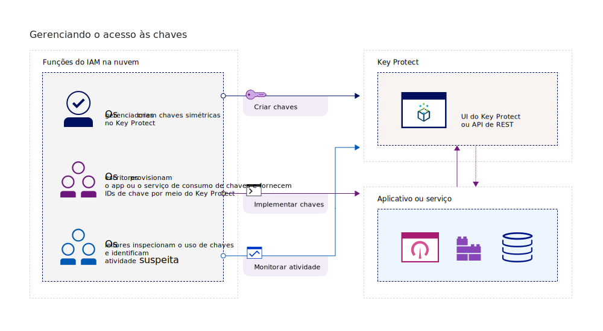
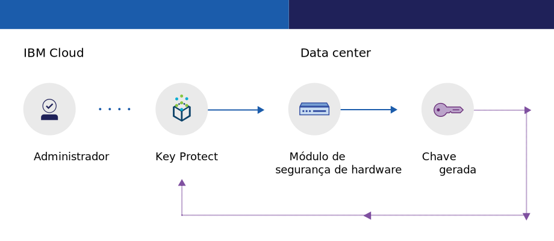
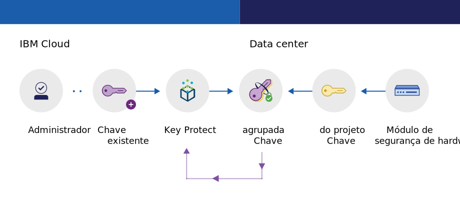

---

copyright:
  years: 2017, 2019
lastupdated: "2019-04-03"

keywords: key management service, KMS, about Key Protect, about KMS, Key Protect use cases, KMS use cases

subcollection: key-protect

---

{:shortdesc: .shortdesc}
{:codeblock: .codeblock}
{:screen: .screen}
{:new_window: target="_blank"}
{:pre: .pre}
{:tip: .tip}
{:note: .note}
{:important: .important}

# Sobre {{site.data.keyword.keymanagementserviceshort}}
{: #about}

O {{site.data.keyword.keymanagementservicefull}} ajuda a provisionar chaves criptografadas para apps em serviços {{site.data.keyword.cloud_notm}}. Conforme você gerencia o ciclo de vida de suas chaves, é possível saber que as suas chaves estão protegidas por módulos de segurança de hardware (HSMs) baseados em nuvem certificados por FIPS 140-2 Nível 2 que protegem contra roubo de
informações.
{: shortdesc}

## Razões para usar o {{site.data.keyword.keymanagementserviceshort}}
{: #use-cases}

Pode ser necessário gerenciar chaves nos cenários a seguir:

| Cenários | Razões|
| --- | ---- |
| Como um administrador de TI de uma grande empresa, você precisa integrar, controlar e alternar chaves para muitas ofertas de serviços diferentes. | A interface do {{site.data.keyword.keymanagementserviceshort}}
simplifica o gerenciamento dos diversos serviços de criptografia. Com esse serviço, é possível gerenciar e classificar chaves de criptografia em um local centralizado ou separar as chaves por projeto e armazená-las em espaços diferentes do {{site.data.keyword.cloud_notm}}. |
| Como um desenvolvedor, você deseja integrar seus aplicativos preexistentes, como armazenamento de autocriptografia, ao {{site.data.keyword.keymanagementserviceshort}}. | Apps dentro ou fora do {{site.data.keyword.cloud_notm}} podem ser integrados às APIs do {{site.data.keyword.keymanagementserviceshort}}. É possível usar suas próprias chaves existentes em seus apps. |
| Sua equipe de desenvolvimento tem políticas rigorosas, e você precisa de uma maneira de gerar e alternar chaves a cada 30 dias. | Com o {{site.data.keyword.keymanagementserviceshort}}, é possível gerar chaves rapidamente por meio de um hardware security module (HSM) do {{site.data.keyword.cloud_notm}}. Quando for a hora de substituir uma chave, será possível [alternar a chave on demand](/docs/services/key-protect?topic=key-protect-rotate-keys) ou [configurar uma política de rotação](/docs/services/key-protect?topic=key-protect-set-rotation-policy) para que a chave atenda às suas necessidades de segurança em andamento. |
| Você é um administrador de segurança em um segmento de mercado, como finanças ou jurídico, que deve aderir ao controle sobre como os dados
são protegidos. É necessário conceder acesso controlado às chaves sem comprometer os dados
que elas protegem. | Com o serviço, é possível controlar o acesso de usuário para gerenciar chaves [designando diferentes funções do Identity and Access Management](/docs/services/key-protect?topic=key-protect-manage-access#roles). Por exemplo, é possível conceder acesso somente leitura aos usuários
que precisam visualizar informações sobre a criação da chave sem visualizar o material da chave. |
| Você deseja executar criptografia de envelope ao mover dados para a nuvem. É necessário trazer sua própria chave mestra de criptografia, para que seja possível gerenciar e proteger outras chaves que criptografam seus dados em repouso. | Com o {{site.data.keyword.keymanagementserviceshort}}, é possível [agrupar (criptografar) suas chaves de criptografia de dados com uma chave raiz altamente segura](/docs/services/key-protect?topic=key-protect-envelope-encryption). É possível trazer suas próprias chaves raiz ou criá-las no serviço.|

Procurando uma solução de gerenciamento de chaves dedicada que suporte os hardware security modules (HSMs) baseados em nuvem, controlados pelo cliente? O [{{site.data.keyword.cloud_notm}} {{site.data.keyword.hscrypto}}](/docs/services/hs-crypto?topic=hs-crypto-get-started) integra-se ao {{site.data.keyword.keymanagementserviceshort}} para ativar o Keep Your Own Keys (KYOK) para o {{site.data.keyword.cloud_notm}}, para que sua organização tenha mais controle e autoridade sobre seus dados. Confira a [{{site.data.keyword.hscrypto}}página de detalhes da oferta ](https://{DomainName}/catalog/services/hyper-protect-crypto-services) para saber mais.
{: tip}

## Como o {{site.data.keyword.keymanagementserviceshort}}
funciona
{: #kp-how}

O {{site.data.keyword.keymanagementservicelong_notm}} ajuda a gerenciar chaves de criptografia em sua organização por meio do alinhamento com as funções do {{site.data.keyword.cloud_notm}} Identity and Access Management.

Um
administrador de TI ou de segurança precisa de permissões avançadas que um auditor pode não
precisar. Para simplificar o acesso, o {{site.data.keyword.keymanagementserviceshort}} é mapeado para as funções do {{site.data.keyword.cloud_notm}} Identity and Access Management para que cada função tenha uma visualização diferente do serviço. Para ajudar a orientar qual visualização e nível de acesso melhor se adéqua às suas necessidades, veja [Gerenciando usuários e acesso](/docs/services/key-protect?topic=key-protect-manage-access#roles).

O diagrama a seguir mostra como os gerenciadores, leitores e gravadores podem interagir com as chaves que são
gerenciadas no serviço.

<dl>
  <dt>Integração de Serviço</dt>
    <dd>Os gerenciadores para sua instância de serviço do {{site.data.keyword.keymanagementserviceshort}}
gerenciam as chaves para criptografia.</dd>
  <dt>Auditorias</dt>
    <dd>Leitores acessam uma visualização de alto nível de chaves e identificam atividades suspeitas.</dd>
  <dt>Aplicativos</dt>
    <dd>Gravadores gerenciam as chaves para a criptografia que eles codificam nos aplicativos.</dd>
</dl>

## Arquitetura do {{site.data.keyword.keymanagementserviceshort}}
{: #kp_architecture}

O {{site.data.keyword.keymanagementservicelong_notm}}
é composto de tecnologias aceitas pelo segmento de mercado.

<dl>
  <dt>Servidor {{site.data.keyword.cloud_notm}}</dt>
    <dd>Identidade, projetos e os tokens do servidor {{site.data.keyword.cloud_notm}} deixam os recursos do mapa de serviço do {{site.data.keyword.keymanagementserviceshort}} para chaves.</dd>
  <dt>API para o {{site.data.keyword.keymanagementserviceshort}}</dt>
    <dd>A API de REST do {{site.data.keyword.keymanagementserviceshort}}
impulsiona a criação e o gerenciamento de chaves. O serviço fornece ocupação variada criptografada.</dd>
  <dt>Interface com o usuário no {{site.data.keyword.cloud_notm}}</dt>
    <dd>Com a interface com o usuário (UI) do {{site.data.keyword.keymanagementserviceshort}}, é possível trabalhar com suas chaves de forma segura.</dd>
  <dt>Hardware security module (HSM)</dt>
    <dd>Nos bastidores, os data centers da {{site.data.keyword.cloud_notm}} fornecem o hardware para proteger suas chaves.</dd>
  <dt>Cluster do banco de dados</dt>
    <dd>É possível contar com armazenamento seguro e redundante de suas
chaves com um banco de dados em cluster.</dd>
</dl>

Os diagramas a seguir mostram como o {{site.data.keyword.keymanagementserviceshort}}
trabalha com os módulos de segurança de hardware para gerar chaves
comparado a como o serviço armazena as chaves.

