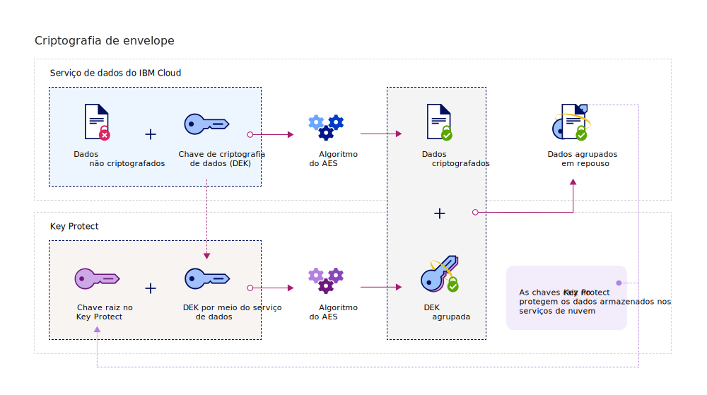
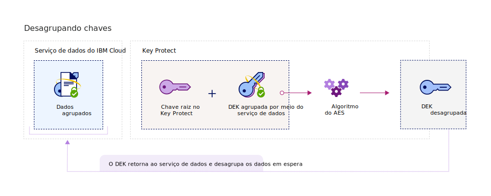

---

copyright:
  years: 2017, 2019
lastupdated: "2019-04-03"

keywords: data-at-rest encryption, envelope encryption, root key, data encryption key, protect data encryption key, encrypt data encryption key, wrap data encryption key, unwrap data encryption key

subcollection: key-protect

---

{:shortdesc: .shortdesc}
{:codeblock: .codeblock}
{:screen: .screen}
{:new_window: target="_blank"}
{:pre: .pre}
{:tip: .tip}
{:note: .note}
{:important: .important}

# Protegendo dados com criptografia de envelope
{: #envelope-encryption}

A criptografia de envelope é a prática de criptografar dados com uma chave de criptografia de dados (DEK) e, em seguida,
criptografar a DEK com uma chave raiz que você pode gerenciar totalmente. 
{: shortdesc}

O {{site.data.keyword.keymanagementservicefull}} protege seus dados armazenados com criptografia avançada e oferece
vários benefícios:

<table>
  <th>Benefício</th>
  <th>Descrição</th>
  <tr>
    <td>Chaves de criptografia gerenciadas pelo cliente</td>
    <td>Com o serviço, é possível provisionar chaves raiz para proteger a segurança de seus dados criptografados na nuvem. As chaves
raiz servem como chave de agrupamento de chave, que ajudam a gerenciar e proteger as chaves de criptografia de dados
(DEKs) fornecidas nos serviços de dados do {{site.data.keyword.cloud_notm}}. Você decide se importa as chaves raiz
existentes ou faz com que o {{site.data.keyword.keymanagementserviceshort}} as gere em seu nome.</td>
  </tr>
  <tr>
    <td>Confidencialidade e proteção de integridade</td>
    <td>{{site.data.keyword.keymanagementserviceshort}} usa o algoritmo Advanced Encryption Standard (AES) no Galois/Counter
Mode (GCM) para criar e proteger chaves. Ao criar chaves no serviço, o {{site.data.keyword.keymanagementserviceshort}}
as gera dentro do limite de confiança dos módulos de segurança de hardware (HSMs) do {{site.data.keyword.cloud_notm}},
então, somente você tem acesso às suas chaves de criptografia.</td>
  </tr>
  <tr>
    <td>Fragmentação criptográfica de dados</td>
    <td>Se sua organização detectar um problema de segurança ou o aplicativo não precisar mais de um conjunto de dados, será
possível escolher fragmentar os dados permanentemente da nuvem. Ao excluir uma chave raiz que protege outros DEKS, você
assegura que os dados associados das chaves não possam mais ser acessados nem decriptografados.</td>
  </tr>
  <tr>
    <td>Controle de acesso do usuário delegado</td>
    <td>O {{site.data.keyword.keymanagementserviceshort}} suporta um sistema de controle de acesso centralizado para permitir
acesso granular para suas chaves. [Ao designar funções de
usuário do IAM e permissões avançadas](/docs/services/key-protect?topic=key-protect-manage-access#roles), os administradores de segurança decidem quem pode acessar quais chaves raiz no
serviço.</td>
  </tr>
  <caption style="caption-side:bottom;">Tabela 1. Descreve os benefícios da criptografia gerenciada por cliente</caption>
</table>

## Como ele funciona
{: #overview}

A criptografia de envelope combina a força de múltiplos algoritmos de criptografia para proteger seus dados sensíveis na
nuvem. Ela funciona agrupando de uma ou mais chaves de criptografia de dados (DEKs) com criptografia avançada usando uma chave
raiz que você pode gerenciar totalmente. Esse processo de agrupamento de chave cria DEKs agrupadas que protegem seus dados
armazenados de acesso ou exposição não autorizada. O desagrupamento de um DEK reverte o processo de criptografia do envelope
usando a mesma chave raiz, resultando em dados decriptografados e autenticados.
 
O diagrama a seguir mostra uma visualização contextual da funcionalidade de agrupamento de chaves. 

A criptografia de envelope é tratada rapidamente em NIST Special Publication 800-57, Recomendação para gerenciamento de
chave. Para saber mais, consulte [NIST SP
800-57 Pt. 1 Rev. 4. ](https://www.nist.gov/publications/recommendation-key-management-part-1-general-0){: new_window}

## Tipos de chave
{: #key-types}

O serviço suporta dois tipos de chave, chaves raiz e chaves padrão, para a criptografia avançada e o gerenciamento de
dados.

<dl>
  <dt>Chaves raiz</dt>
    <dd>Chaves raiz são recursos primários no {{site.data.keyword.keymanagementserviceshort}}. São chaves de
agrupamento de chave simétrica usadas como raízes de confiança para agrupar (criptografar) e desagrupar (decriptografar) outras
chaves armazenadas em um serviço de dados. Com o {{site.data.keyword.keymanagementserviceshort}}, é possível criar,
armazenar e gerenciar o ciclo de vida das chaves raiz para obter controle total das outras chaves armazenadas na nuvem. Diferentemente de uma chave padrão, uma chave raiz nunca pode deixar os limites do serviço do
{{site.data.keyword.keymanagementserviceshort}}.</dd>
  <dt>Chaves padrão</dt>
    <dd>Chaves padrão são uma maneira de persistir um segredo, como uma senha ou uma chave de criptografia. Ao usar o
{{site.data.keyword.keymanagementserviceshort}} para armazenar chaves padrão, você ativa o armazenamento do
módulo de segurança de hardware (HSM) para seus segredos, o controle de acesso de baixa granularidade para seus
recursos com o <a href="/docs/services/key-protect?topic=key-protect-manage-access" target="_blank">{{site.data.keyword.iamshort}} (IAM)</a>
e a capacidade de auditar chamadas API para o serviço com o <a href="/docs/services/key-protect?topic=key-protect-activity-tracker-events" target="_blank">{{site.data.keyword.cloudaccesstrailshort}}</a>.</dd>
</dl>

Depois de criar chaves no {{site.data.keyword.keymanagementserviceshort}}, o sistema retorna um valor de ID que pode
ser usado para fazer chamadas API para o serviço. É possível recuperar o valor do ID para as chaves com a GUI do
{{site.data.keyword.keymanagementserviceshort}} ou a API do [{{site.data.keyword.keymanagementserviceshort}}](https://{DomainName}/apidocs/key-protect). 

## Chaves de quebra
{: #wrapping}

As chaves raiz ajudam a agrupar, gerenciar e proteger as chaves de criptografia de dados (DEKs) armazenadas na nuvem. É
possível agrupar um ou mais DEKs com criptografia avançada designando uma chave raiz no
{{site.data.keyword.keymanagementserviceshort}} que pode ser totalmente gerenciada. 

Depois de designar uma chave raiz no {{site.data.keyword.keymanagementserviceshort}}, é possível enviar uma
solicitação de agrupamento de chave para o serviço usando a API do {{site.data.keyword.keymanagementserviceshort}}. A
operação de agrupamento de chave fornece confidencialidade e proteção de integridade para um DEK. O diagrama a seguir mostra o
processo de agrupamento de chave em ação: 

A tabela a seguir descreve as entradas necessárias para executar uma operação de agrupamento de chave:
<table>
  <th>Entrada</th>
  <th>Descrição</th>
  <tr>
    <td>ID da chave raiz</td>
    <td>O valor do ID para a chave raiz que você deseja usar para agrupamento. A chave raiz pode ser importada para o serviço ou
pode se originar no {{site.data.keyword.keymanagementserviceshort}} do HSMs. As chaves raiz que são usadas para o agrupamento devem ser de 128, 192 ou 256 bits para que uma solicitação de agrupamento possa ser bem-sucedida.</td>
  </tr>
  <tr>
    <td>Texto sem formatação</td>
    <td>Opcional: o material da chave do DEK que contém os dados que você deseja gerenciar e proteger. Um texto sem formatação que é
usado para agrupamento de chave deve ser codificado em Base64. Para gerar um DEK de 256 bits, é possível omitir o atributo
`plaintext`. O serviço gera um DEK codificado em Base64 para usar para agrupamento de chave.</td>
  </tr>
  <tr>
    <td>Dados de autenticação adicionais (AAD)</td>
    <td>Opcional: uma matriz de sequências que verifica a integridade dos conteúdos da chave. Cada sequência pode ter até 255 caracteres. Se você fornecer AAD durante uma solicitação de agrupamento, deverá especificar o mesmo AAD durante a solicitação de
desagrupamento subsequente.</td>
  </tr>
    <caption style="caption-side:bottom;">Tabela 2. Entradas necessárias para agrupamento de chave no {{site.data.keyword.keymanagementserviceshort}}</caption>
</table>

Se você enviar uma solicitação de agrupamento sem especificar o texto sem formatação a criptografar, o
algoritmo de criptografia AES-GCM gerará e converterá um texto sem formatação para uma forma ininteligível de dados
chamado de texto cifrado. Esse processo gera um DEK de 256 bits com novo material de chave. O sistema então usa um algoritmo de
agrupamento de chave AES, que agrupa o DEK e seu material de chave com a chave raiz especificada. Uma operação de agrupamento bem-sucedida retorna um DEK agrupado codificado em base64 que você pode armazenar em um app ou serviço do {{site.data.keyword.cloud_notm}}. 

## Desagrupando chaves
{: #unwrapping}

O desagrupamento de uma chave de criptografia de dados (DEK) decriptografa e autentica os conteúdos dentro de uma chave, retornando o
material de chave original para o seu serviço de dados. 

Se o seu aplicativo de negócios precisar acessar os conteúdos de seus DEKs agrupados, será possível usar a API do
{{site.data.keyword.keymanagementserviceshort}} para enviar uma solicitação de desagrupamento para o serviço. Para
desagrupar um DEK, você especifica o valor do ID da chave raiz e o valor `ciphertext` retornado
durante a solicitação de agrupamento inicial. Para concluir a solicitação de desagrupamento, também é necessário fornecer os
dados autenticados adicionais (AAD) para verificar a integridade dos conteúdos da chave.

O diagrama a seguir mostra o desagrupamento de chave em ação. 

Depois de enviar a solicitação de desagrupamento, o sistema reverte o processo de agrupamento de chave usando os mesmos
algoritmos AES. Uma operação de desagrupamento bem-sucedida retorna o valor `plaintext` codificado em Base64 para
seus dados do {{site.data.keyword.cloud_notm}} no serviço REST.

