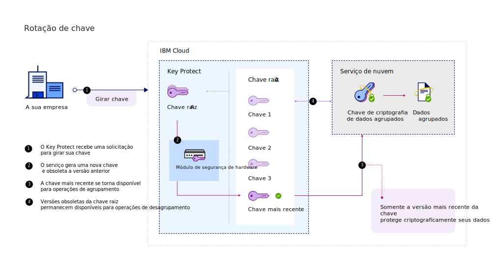
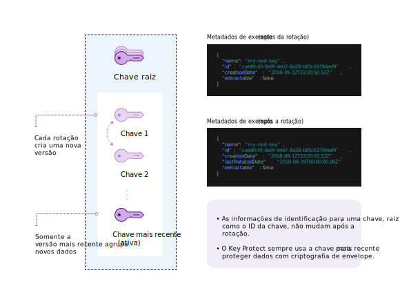

---

copyright:
  years: 2017, 2019
lastupdated: "2019-01-03"

---

{:shortdesc: .shortdesc}
{:codeblock: .codeblock}
{:screen: .screen}
{:new_window: target="_blank"}
{:pre: .pre}
{:tip: .tip}
{:note: .note}
{:important: .important}

# Rotação de chave
{: #key-rotation}

A rotação de chave ocorre ao retirar uma chave de criptografia e substituí-la gerando um novo material de chave criptográfica.

Fazer a rotação das chaves regularmente ajuda a atender os padrões de mercado e as melhores práticas criptográficas. A tabela a seguir descreve os principais benefícios da rotação de chave:

<table>
  <th>Benefício</th>
  <th>Descrição</th>
  <tr>
    <td>Gerenciamento do período criptográfico para as chaves</td>
    <td>A rotação de chave limita a quantidade de informações que são protegidas por uma única chave. Ao fazer a rotação das chaves raiz em intervalos regulares, você também encurte o período criptográfico das chaves. Quanto mais longo o tempo
de vida de uma chave de criptografia, maior a probabilidade de uma violação de segurança.</td>
  </tr>
  <tr>
    <td>Mitigação de incidente</td>
    <td>Se a sua organização detectar um problema de segurança, será possível fazer a rotação da chave imediatamente para mitigar ou reduzir custos que estão associados com o comprometimento da chave.</td>
  </tr>

  <caption style="caption-side:bottom;">Tabela 1. Descreve os benefícios da rotação de chave</caption>
</table>

A rotação de chave é tratada na Publicação Especial do NIST 800-57, Recomendação para o gerenciamento de chave. Para saber mais, consulte [NIST SP
800-57 Pt. 1 Rev. 4. ](http://nvlpubs.nist.gov/nistpubs/SpecialPublications/NIST.SP.800-57pt1r4.pdf){: new_window}
{: tip}

## Como a rotação de chave funciona
{: #how-rotation-works}

Chaves criptográficas, em seu tempo de vida, fazem a transição por meio de diferentes [estados de chave](/docs/services/key-protect/concepts/key-states.html). No estado _Ativo_, as chaves criptografam e decriptografam dados. No estado _Desativado_, as chaves não podem criptografar dados, mas permanecem disponíveis para decriptografia. No estado _Destruído_, as chaves não podem mais ser usadas para criptografia ou decriptografia.

A rotação de chave funciona por meio da transição segura do material de chave de um estado
_Ativo_ para um estado _Desativado_. Para substituir o material de chave obsoleto, o novo material de chave é movido para o estado _Ativo_ e se torna disponível para operações criptográficas.

No {{site.data.keyword.keymanagementserviceshort}}, é possível girar suas chaves raiz sob demanda sem precisar rastrear o seu material de chave raiz obsoleto. O diagrama a seguir mostra uma visualização contextual da funcionalidade da rotação de chave. 

A rotação está disponível apenas para chaves raízes. 
{: note}

### Rotação de chaves raiz
{: #rotating-key}

Com cada solicitação de rotação, o {{site.data.keyword.keymanagementserviceshort}} associa o novo material de chave com sua chave raiz. 

Depois que uma rotação é concluída, o novo material de chave raiz se torna disponível para proteger futuras chaves de criptografia de dados (DEKs) com a [criptografia de envelope](/docs/services/key-protect/concepts/envelope-encryption.html). O material de chave obsoleto é movido para o estado _Desativado_, no qual ele pode ser usado apenas para desagrupar e acessar as DEKs mais antigas que ainda não estão protegidas pelo material de chave raiz mais recente. Se o {{site.data.keyword.keymanagementserviceshort}} detectar que você está usando o material de chave raiz obsoleto para desagrupar uma DEK mais antiga, o serviço automaticamente criptografará novamente a DEK e retornará uma chave de criptografia de dados agrupada (WDEK) que se baseia no material de chave raiz mais recente. Armazene e use a nova WDEK para operações futuras de desagrupamento e, assim, proteja as suas DEKs com o material de chave raiz mais recente.

Para saber como usar a API do {{site.data.keyword.keymanagementserviceshort}} para girar as chaves raiz, consulte [Girando chaves](/docs/services/key-protect/rotate-keys.html).

Ao girar uma chave no {{site.data.keyword.keymanagementserviceshort}}, taxas adicionais não são cobradas. É possível continuar desagrupando as chaves de criptografia de dados agrupadas (WDEKs) com o material de chave obsoleto sem custo extra. Para obter mais informações sobre as opções de precificação, consulte a página do catálogo do [{{site.data.keyword.keymanagementserviceshort}}](https://{DomainName}/catalog/services/key-protect).
{: tip}

## Frequência de rotação de chave
{: #rotation-frequency}

Depois de gerar uma chave raiz no {{site.data.keyword.keymanagementserviceshort}}, decida a frequência de sua rotação. Você pode desejar girar suas chaves devido à rotatividade de pessoal, mau funcionamento de processo ou de acordo com a política de expiração de chave interna de sua organização. 

Gire suas chaves regularmente, por exemplo, a cada 30 dias, para atender às melhores práticas criptográficas. O {{site.data.keyword.keymanagementserviceshort}} permite uma rotação por hora para cada chave raiz.
