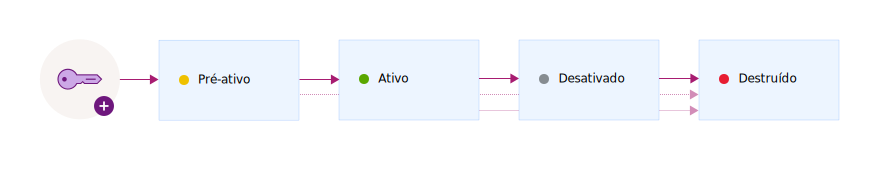

---

copyright:
  years: 2017, 2018
lastupdated: "2018-08-24"

---

{:shortdesc: .shortdesc}
{:codeblock: .codeblock}
{:screen: .screen}
{:new_window: target="_blank"}
{:pre: .pre}
{:tip: .tip}

# Estados de chave
{: #key-states}

O {{site.data.keyword.keymanagementservicefull}} segue as diretrizes de segurança do [NIST SP 800-57 para estados de chave ](http://nvlpubs.nist.gov/nistpubs/SpecialPublications/NIST.SP.800-57pt1r4.pdf){: new_window}.
{: shortdesc}

## Estados e transições de chave
{: #key_transitions}

As chaves criptográficas, durante seu tempo de vida, fazem a transição por vários estados que demonstram há quanto tempo as chaves existem e se os dados
estão protegidos. 

O {{site.data.keyword.keymanagementserviceshort}} fornece uma interface gráfica com o usuário e uma API de REST para rastrear as chaves à medida que elas passam por vários estados em seus ciclos de vida. O diagrama a seguir mostra como uma chave passa pelos estados entre sua geração e sua destruição.

<table>
  <tr>
    <th>Estado</th>
    <th>Descrição</th>
  </tr>
  <tr>
    <td>Pré-ativação</td>
    <td>As chaves são criadas inicialmente no estado <i>pré-ativação</i>. Uma chave pré-ativa não pode ser usada para proteger os dados criptograficamente.</td>
  </tr>
  <tr>
    <td>Ativo</td>
    <td>As chaves são movidas imediatamente para o estado <i>ativo</i> na data de ativação. Essa transação marca o início do período de criptografia de uma chave. As chaves sem data de ativação se tornam ativas imediatamente e permanecem ativas até que expirem ou sejam destruídas.</td>
  </tr>
  <tr>
    <td>Desativado</td>
    <td>Uma chave será movida para o estado <i>desativado</i> na data de expiração, se uma estiver designada. Nesse estado, a chave é incapaz de proteger os dados de forma criptográfica e pode ser movida somente para o estado <i>destruído</i>.</td>
  </tr>
  <tr>
    <td>Destruído</td>
    <td>As chaves excluídas estão no estado <i>destruído</i>. As chaves nesse estado não são recuperáveis. Metadados que estão associados a uma chave, como o nome e o histórico de transição da chave, são mantidos no banco de dados do {{site.data.keyword.keymanagementserviceshort}}.</td>
  </tr>
  <caption style="caption-side:bottom;">Tabela 1. Descreve as transições e os estados da chave.</caption>
</table>

Depois de incluir uma chave para o serviço, use o painel {{site.data.keyword.keymanagementserviceshort}} ou as APIs de REST do {{site.data.keyword.keymanagementserviceshort}} para visualizar o histórico de transição e a configuração da sua chave. Para propósitos de auditoria, também é possível monitorar a trilha de atividade para uma chave integrando o {{site.data.keyword.keymanagementserviceshort}} com o {{site.data.keyword.cloudaccesstrailfull}}. Depois que ambos os serviços são provisionados e estão em execução, eventos de atividade são gerados e coletados automaticamente em um log do {{site.data.keyword.cloudaccesstrailshort}} quando você cria e exclui chaves no {{site.data.keyword.keymanagementserviceshort}}. 

Para obter mais informações, veja [Monitorando a atividade do {{site.data.keyword.keymanagementserviceshort}} ](/docs/services/cloud-activity-tracker/services/security_svcs.html#key_protect){: new_window}.
