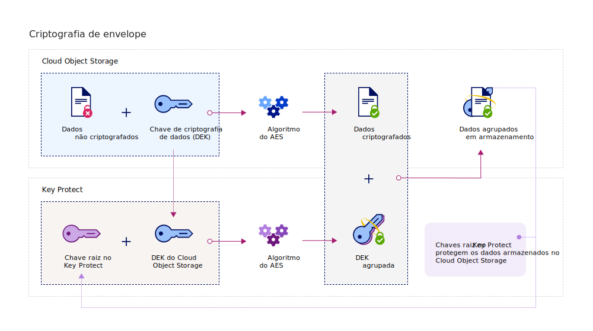

---

copyright:
  years: 2017, 2019
lastupdated: "2019-04-03"

keywords: Key Protect integration, integrate COS with Key Protect

subcollection: key-protect

---

{:shortdesc: .shortdesc}
{:codeblock: .codeblock}
{:screen: .screen}
{:new_window: target="_blank"}
{:pre: .pre}
{:tip: .tip}
{:note: .note}
{:important: .important}

# Integrando com o {{site.data.keyword.cos_full_notm}}
{: #integrate-cos}

O {{site.data.keyword.keymanagementservicefull}} e o {{site.data.keyword.cos_full}} trabalham juntos para ajudar você a deter a segurança de seus dados em repouso. Saiba como incluir criptografia avançada em seus recursos do {{site.data.keyword.cos_full}} usando o serviço do {{site.data.keyword.keymanagementservicelong_notm}}.
{: shortdesc}

## Sobre {{site.data.keyword.cos_full_notm}}
{: #cos}

O {{site.data.keyword.cos_full_notm}} fornece armazenamento em nuvem para dados não estruturados. Dados não estruturados se referem a arquivos, mídia audiovisual, PDFs, archives de dados compactados, imagens de backup, artefatos de aplicativos, documentos de negócios ou qualquer outro objeto binário.  

Para manter a integridade e a disponibilidade de dados, o {{site.data.keyword.cos_full_notm}} fatia e dispersa dados para nós de armazenamento em múltiplas localizações geográficas. Nenhuma cópia completa dos dados reside em nenhum nó de
armazenamento único e apenas um subconjunto de nós precisa estar disponível para que você possa recuperar totalmente os dados na
rede. Criptografia do lado do provedor é fornecida, então, seus dados são protegidos em repouso e em andamento. Para gerenciar o armazenamento, crie depósitos e importe objetos com o console do {{site.data.keyword.cloud_notm}} ou usando programaticamente a [API de REST do {{site.data.keyword.cos_full_notm}}](/docs/services/cloud-object-storage?topic=cloud-object-storage-compatibility-api-about#compatibility-api-about){: new_window}.

Para obter mais informações, consulte [Sobre o COS ](/docs/services/cloud-object-storage?topic=cloud-object-storage-about-ibm-cloud-object-storage){: new_window}.

## Como a integração funciona
{: #kp_cos_how}

O {{site.data.keyword.keymanagementserviceshort}} se integra com {{site.data.keyword.cos_full_notm}} para
ajudá-lo a atingir controle total da segurança de seus dados.  

Ao mover dados para a sua instância do {{site.data.keyword.cos_full_notm}}, o serviço automaticamente criptografa seus
objetos com chaves de criptografia de dados (DEKs). Dentro do {{site.data.keyword.cos_full_notm}}, os DEKs são armazenados
no serviço com segurança, próximos dos recursos que eles criptografam. Quando você precisar acessar um depósito, o serviço verificará
suas permissões do usuário e decriptografará os objetos dentro do depósito para você. Esse modelo de criptografia é chamado
_criptografia gerenciada por provedor_.

Para ativar os benefícios de segurança da _criptografia gerenciada por cliente_, é possível incluir
criptografia de envelope para seu DEKs no {{site.data.keyword.cos_full_notm}} integrando com o serviço do {{site.data.keyword.keymanagementserviceshort}}. Com o {{site.data.keyword.keymanagementserviceshort}}, você fornece chaves raiz altamente seguras, que servem como
uma chave mestra que você controla no serviço. Ao criar um depósito em {{site.data.keyword.cos_full_notm}}, é possível
configurar a criptografia de envelope para o depósito em sua criação. Essa proteção incluída agrupa (ou criptografa) os DEKs
associados ao depósito usando uma chave raiz que você gerencia em {{site.data.keyword.keymanagementserviceshort}}. A
prática, chamada _agrupamento de chave_, usa algoritmos AES múltiplos para proteger a privacidade e a
integridade de seus DEKs, assim, somente você controla o acesso aos dados associados.

A figura a seguir mostra como o {{site.data.keyword.keymanagementserviceshort}} se integra com
o {{site.data.keyword.cos_full_notm}} para proteger ainda mais suas chaves de criptografia.

Para saber mais sobre como a criptografia de envelope funciona no {{site.data.keyword.keymanagementserviceshort}}, consulte [Protegendo dados com criptografia de envelope](/docs/services/key-protect?topic=key-protect-envelope-encryption).

## Incluindo criptografia de envelope para seus buckets de armazenamento
{: #kp_cos_envelope}

[Após designar uma chave de raiz no {{site.data.keyword.keymanagementserviceshort}}](/docs/services/key-protect?topic=key-protect-create-root-keys) e [conceder acesso entre seus serviços](/docs/services/key-protect?topic=key-protect-integrate-services#grant-access), é possível ativar a criptografia de envelope para um depósito de armazenamento especificado usando a GUI do {{site.data.keyword.cos_full_notm}}.

 Para ativar opções de configuração avançada para o seu bucket de armazenamento, assegure-se de que uma [autorização](/docs/services/key-protect?topic=key-protect-integrate-services#grant-access) exista entre as suas instâncias de serviço do {{site.data.keyword.cos_full_notm}} e do {{site.data.keyword.keymanagementserviceshort}}.
{: tip}

Para incluir criptografia de envelope para seu bucket de armazenamento:

1. No seu painel do {{site.data.keyword.cos_full_notm}}, clique em **Criar bucket**.
2. Especifique os detalhes do bucket.
3. Na seção **Configuração avançada**, selecione **Incluir {{site.data.keyword.keymanagementserviceshort}} Chaves**.
4. Na lista de instâncias de serviço do {{site.data.keyword.keymanagementserviceshort}}, selecione a instância que contém a chave raiz que você deseja usar para agrupamento de chave.
5. Para **Nome da chave**, selecione o alias da chave raiz.
6. Clique em **Criar** para confirmar a criação do bucket.

Na GUI do {{site.data.keyword.cos_full_notm}}, é possível procurar pelos buckets que são protegidos por uma chave raiz do {{site.data.keyword.keymanagementserviceshort}}.

## O que vem a seguir
{: #cos-integration-next-steps}

- Para obter mais informações sobre como associar os seus buckets de armazenamento com chaves do {{site.data.keyword.keymanagementserviceshort}}, veja [Gerenciar criptografia ](/docs/services/cloud-object-storage?topic=cloud-object-storage-manage-encryption){: new_window}. 
