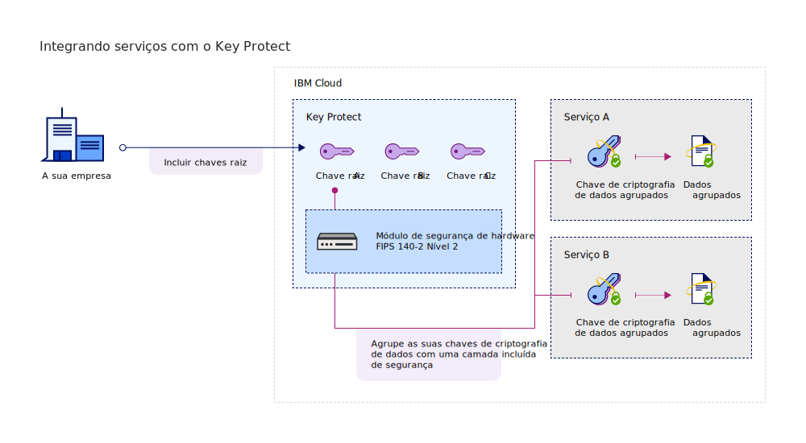

---

copyright:
  years: 2017, 2019
lastupdated: "2019-07-09"

keywords: Key Protect integration, integrate service with Key Protect

subcollection: key-protect

---

{:shortdesc: .shortdesc}
{:screen: .screen}
{:pre: .pre}
{:table: .aria-labeledby="caption"}
{:external: target="_blank" .external}
{:codeblock: .codeblock}
{:tip: .tip}
{:note: .note}
{:important: .important}

# Integrando serviços
{: #integrate-services}

O {{site.data.keyword.keymanagementservicefull}} integra-se com dados e soluções de armazenamento para ajudá-lo a trazer e gerenciar a sua própria criptografia na nuvem.
{: shortdesc}

[Depois de criar uma instância do serviço](/docs/services/key-protect?topic=key-protect-provision), é possível integrar o {{site.data.keyword.keymanagementserviceshort}} com os serviços suportados a seguir:

| Serviço | Descrição |
| --- | --- |
| {{site.data.keyword.cos_full_notm}} | Inclua a [criptografia de envelope](/docs/services/key-protect?topic=key-protect-envelope-encryption) em seus buckets de armazenamento usando o {{site.data.keyword.keymanagementserviceshort}}. Use chaves raiz que você gerencia no {{site.data.keyword.keymanagementserviceshort}} para proteger as chaves de criptografia de dados que criptografam os seus dados em repouso. Para saber mais, confira [Integrando ao {{site.data.keyword.cos_full_notm}} ](/docs/services/key-protect?topic=key-protect-integrate-cos).|
| {{site.data.keyword.databases-for-postgresql_full_notm}} | Proteja seus bancos de dados associando chaves raiz a sua implementação do {{site.data.keyword.databases-for-postgresql}}. Para saber mais, confira a [documentação do {{site.data.keyword.databases-for-postgresql}}](/docs/services/databases-for-postgresql?topic=cloud-databases-key-protect).|
| {{site.data.keyword.cloudant_short_notm}} for {{site.data.keyword.cloud_notm}} ({{site.data.keyword.cloud_notm}} Dedicated) | Fortaleça sua criptografia na estratégia de repouso associando chaves raiz à sua instância do {{site.data.keyword.cloudant_short_notm}} Dedicated Hardware. Para saber mais, confira a [documentação {{site.data.keyword.cloudant_short_notm}}](/docs/services/Cloudant/offerings?topic=cloudant-security#secure-access-control). |
| {{site.data.keyword.containerlong_notm}} | Use a [criptografia de envelope](/docs/services/key-protect?topic=key-protect-envelope-encryption) para proteger segredos no cluster do {{site.data.keyword.containershort_notm}}. Para saber mais, confira [Criptografando segredos do Kubernetes usando o {{site.data.keyword.keymanagementserviceshort}}](/docs/containers?topic=containers-encryption#keyprotect).|
{: caption="Tabela 1. Descreve as integrações que estão disponíveis com o {{site.data.keyword.keymanagementserviceshort}}" caption-side="top"}

## Entendendo sua integração 
{: #understand-integration}

Ao integrar um serviço suportado com o {{site.data.keyword.keymanagementserviceshort}}, você ativa a [criptografia de envelope](/docs/services/key-protect?topic=key-protect-envelope-encryption) para esse serviço. Essa integração permite o uso de uma chave raiz que você armazena no {{site.data.keyword.keymanagementserviceshort}} para agrupar as chaves de criptografia de dados que criptografam os seus dados em repouso. 

Por exemplo, é possível criar uma chave raiz, gerenciá-la no {{site.data.keyword.keymanagementserviceshort}} e usá-la para proteger os dados que são armazenados em serviços de nuvem diferentes.

### {{site.data.keyword.keymanagementserviceshort}} métodos de API
{: #envelope-encryption-api-methods}

Nos bastidores, a API do {{site.data.keyword.keymanagementserviceshort}} conduz o processo de criptografia de envelope.  

A tabela a seguir lista os métodos de API que incluem ou removem a criptografia de envelope em um recurso.

| Método | Descrição |
| --- | --- |
| `POST /keys/{root_key_ID}?action=wrap` | [Agrupar (criptografar) uma chave de criptografia de dados](/docs/services/key-protect?topic=key-protect-wrap-keys) |
| `POST /keys/{root_key_ID}?action=unwrap` | [Desagrupar (decriptografar) uma chave de criptografia de dados](/docs/services/key-protect?topic=key-protect-unwrap-keys) |
{: caption="Tabela 2. Descreve os métodos de API {{site.data.keyword.keymanagementserviceshort}}" caption-side="top"}

Para saber mais sobre como gerenciar programaticamente as suas chaves no {{site.data.keyword.keymanagementserviceshort}}, confira o [doc de referência da API do {{site.data.keyword.keymanagementserviceshort}}](https://{DomainName}/apidocs/key-protect){: external}.
{: tip}

## Integrando um serviço suportado
{: #grant-access}

Para incluir uma integração, crie uma autorização entre serviços usando o painel do {{site.data.keyword.iamlong}}. As autorizações permitem políticas de acesso de serviço para serviço, para que você possa associar um recurso em seu serviço de dados em nuvem com uma [chave raiz](/docs/services/key-protect?topic=key-protect-envelope-encryption#key-types) que você gerencia no {{site.data.keyword.keymanagementserviceshort}}.

Certifique-se de fornecer ambos os serviços na mesma região antes de criar uma autorização. Para saber mais sobre autorizações de serviço, consulte [Concedendo acesso entre serviços](/docs/iam?topic=iam-serviceauth){: external}.
{: note}

Quando você estiver pronto para integrar um serviço, use as etapas a seguir para criar uma autorização:

1. Na barra de menus, clique em **Gerenciar** &gt; **Segurança** &gt; **Acesso (IAM)** e selecione **Autorizações**. 
2. Clique em **Criar**.
3. Selecione um serviço de origem e de destino para a autorização.
 
  Para **Serviço de origem**, selecione o serviço de dados em nuvem que você deseja integrar com o {{site.data.keyword.keymanagementserviceshort}}. Para **Serviço de destino**, selecione **{{site.data.keyword.keymanagementservicelong_notm}}**.

5. Ative a função **Leitor**.

    Com as permissões de _Leitor_, o seu serviço de origem pode procurar as chaves raiz que são fornecidas na instância especificada do {{site.data.keyword.keymanagementserviceshort}}.

6. Clique em **Autorizar**.

## O que vem a seguir
{: #integration-next-steps}

Inclua a criptografia avançada em seus recursos em nuvem criando uma chave raiz no {{site.data.keyword.keymanagementserviceshort}}. Inclua um novo recurso em um serviço de dados de nuvem suportado e, em seguida, selecione a chave raiz que deseja usar para a criptografia avançada.

- Para saber mais sobre como criar chaves raiz com o serviço do {{site.data.keyword.keymanagementserviceshort}}, veja [Criando chaves raiz](/docs/services/key-protect?topic=key-protect-create-root-keys).
- Para saber mais sobre como trazer as suas próprias chaves raiz para o serviço do {{site.data.keyword.keymanagementserviceshort}}, veja [Importando chaves raiz](/docs/services/key-protect?topic=key-protect-import-root-keys).

