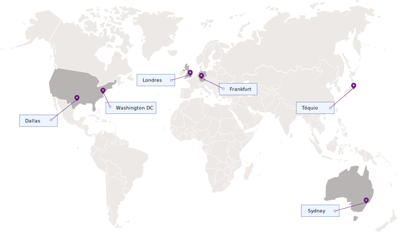

---

copyright:
  years: 2017, 2018
lastupdated: "2018-06-07"

---

{:shortdesc: .shortdesc}
{:codeblock: .codeblock}
{:screen: .screen}
{:new_window: target="_blank"}
{:pre: .pre}
{:tip: .tip}

# Regiões e locais
{: #regions-and-locations}

É possível conectar seus aplicativos com o serviço do {{site.data.keyword.keymanagementservicelong_notm}}
especificando um endpoint de serviço regional.
{: shortdesc}

## Regiões disponíveis
{: #regions}

O {{site.data.keyword.keymanagementserviceshort}} está disponível nas regiões e nos locais a seguir:

## Terminais de serviço
{: #endpoints}

Se você estiver gerenciando os seus recursos do {{site.data.keyword.keymanagementserviceshort}} programaticamente, veja a tabela a seguir para determinar os terminais de API a serem usados ao se conectar à API do [{{site.data.keyword.keymanagementserviceshort}}](https://console.bluemix.net/apidocs/639): 

<table>
    <tr>
        <th>Nome da Região</th>
        <th>Localização geográfica</th>
        <th>Serviço de API</th>
    </tr>
    <tr>
        <td>Alemanha</td>
        <td>Frankfurt, Alemanha</td>
        <td>
            <code>keyprotect.eu-de.bluemix.net</code>
        </td>
    </tr>
    <tr>
        <td>Sydney</td>
        <td>Sydney, Austrália</td>
        <td>
            <code>keyprotect.au-syd.bluemix.net</code>
        </td>
    </tr>
    <tr>
        <td>Reino Unido</td>
        <td>Londres, Inglaterra</td>
        <td>
            <code>keyprotect.eu-gb.bluemix.net</code>
        </td>
    </tr>
    <tr>
        <td>Sul dos EUA</td>
        <td>Dallas, EUA</td>
        <td>
            <code>keyprotect.us-south.bluemix.net</code>
        </td>
    </tr>
    <caption style="caption-side:bottom;">Tabela 1. Mostra os terminais disponíveis para a API do {{site.data.keyword.keymanagementserviceshort}}</caption>
</table>

Para as instâncias de serviço do {{site.data.keyword.keymanagementserviceshort}} que existem dentro de uma organização ou espaço do Cloud Foundry, use o terminal de legado `https://ibm-key-protect.edge.bluemix.net` para interagir com a API do {{site.data.keyword.keymanagementserviceshort}}.
{: tip}

Para obter mais informações sobre a autenticação com o {{site.data.keyword.keymanagementserviceshort}}, veja [Acessando a API](/docs/services/keymgmt/keyprotect_authentication.html).
