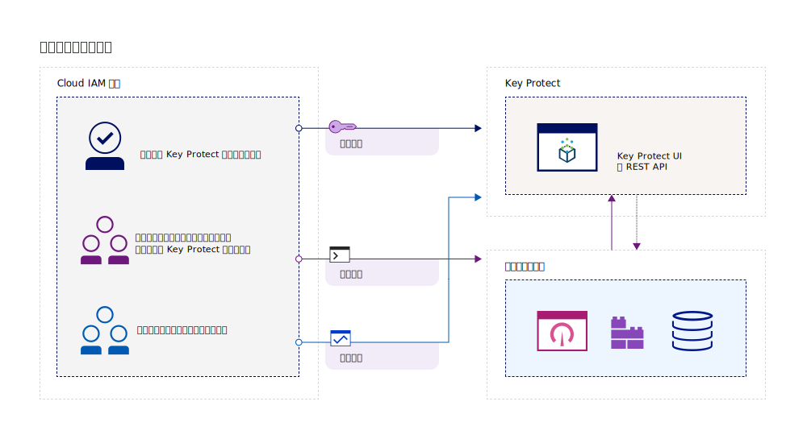
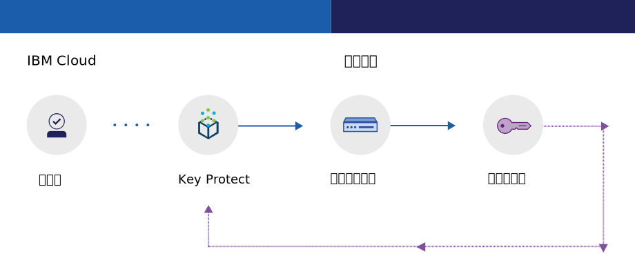
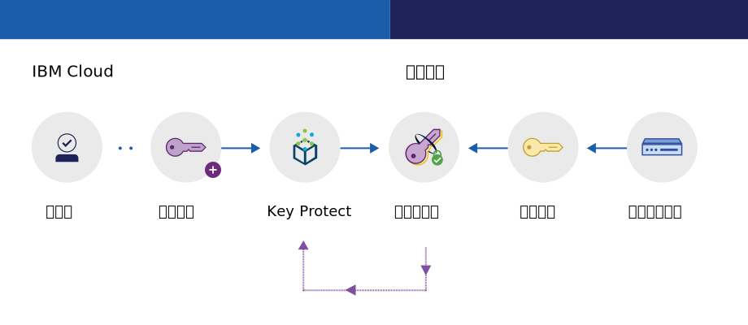

---

copyright:
  years: 2017, 2019
lastupdated: "2019-02-18"

keywords: key management service, KMS, about Key Protect, about KMS, Key Protect use cases, KMS use cases

subcollection: key-protect

---

{:shortdesc: .shortdesc}
{:codeblock: .codeblock}
{:screen: .screen}
{:new_window: target="_blank"}
{:pre: .pre}
{:tip: .tip}
{:note: .note}
{:important: .important}

# 关于 {{site.data.keyword.keymanagementserviceshort}}
{: #about}

{{site.data.keyword.keymanagementservicefull}} 可帮助您为 {{site.data.keyword.cloud_notm}} 服务中的应用程序供应加密的密钥。在管理密钥的生命周期时，您应当了解，密钥受已通过 FIPS 140-2 Level 2 认证的基于云的硬件安全模块 (HSM) 保护，可防止信息被盗。
{: shortdesc}

## 使用 {{site.data.keyword.keymanagementserviceshort}} 的原因
{: #use-cases}

在以下场景中，您可能需要管理密钥：

<table>
  <tr>
    <th>场景</th>
    <th>理由</th>
  </tr>
  <tr>
    <td>您希望在将数据移入云中时执行包络加密。为此，您需要提供自己的主加密密钥，以便可以管理和保护用于加密静态数据的其他密钥。</td>
    <td>通过 {{site.data.keyword.keymanagementserviceshort}}，可以[使用高度安全的根密钥打包数据加密密钥](/docs/services/key-protect?topic=key-protect-envelope-encryption)。可以自带根密钥，也可以在服务中创建根密钥。</td>
  </tr>
  <tr>
    <td>作为大公司的 IT 管理员，您需要对许多不同服务产品的密钥进行集成、跟踪和轮询。</td>
    <td>{{site.data.keyword.keymanagementserviceshort}} 界面可以简化对多个加密服务的管理。借助该服务，您可以在一个集中的位置对密钥进行管理和排序，也可以按项目分隔密钥并将其存储在不同的 {{site.data.keyword.cloud_notm}} 空间中。</td>
  </tr>
  <tr>
    <td>您是必须遵守数据保护监管规定的某个行业（如金融或法律）的安全管理员。您需要授予受控的密钥访问权，同时不能破坏密钥所保护的数据。</td>
    <td>借助该服务，可以通过[指定不同的 Identity and Access Management 角色](/docs/services/key-protect?topic=key-protect-manage-access#roles)来控制用户对管理密钥的访问权。例如，对于需要查看密钥创建信息而不需要查看密钥资料的用户，您可以授予只读访问权。</td>
  <tr>
    <td>作为开发者，您要将已有的应用程序（例如，自加密存储器）集成到 {{site.data.keyword.keymanagementserviceshort}}。</td>
    <td>在 {{site.data.keyword.cloud_notm}} 内部或外部的应用程序可以与 {{site.data.keyword.keymanagementserviceshort}} API 集成。您可以将您自己的现有密钥用于应用程序。</td>
  </tr>
  <tr>
    <td>您的开发团队制定了严格的策略，您需要采用一种方法来每 14 天生成密钥和对密钥进行循环。</td>
    <td>借助 {{site.data.keyword.keymanagementserviceshort}}，可快速从 {{site.data.keyword.cloud_notm}} 硬件安全模块 (HSM) 生成密钥，以持续满足安全需求。</td>
  </tr>
</table>

要查找支持受客户控制并且基于云的硬件安全模块 (HSM) 的专用密钥管理解决方案吗？[{{site.data.keyword.cloud_notm}} {{site.data.keyword.hscrypto}} (Beta)](/docs/services/hs-crypto?topic=hs-crypto-get-started) 与 {{site.data.keyword.keymanagementserviceshort}} 相集成，可为 {{site.data.keyword.cloud_notm}} 启用“保管自有密钥”(Keep Your Own Keys, KYOK) 功能，这样您的组织可以对数据拥有更多控制力和权限。请查看 [{{site.data.keyword.hscrypto}} 产品详细信息页面 ](https://{DomainName}/catalog/services/hyper-protect-crypto-services) 以了解更多信息。
{: tip}

## {{site.data.keyword.keymanagementserviceshort}} 的工作原理
{: #kp-how}

{{site.data.keyword.keymanagementservicelong_notm}} 通过与 {{site.data.keyword.cloud_notm}} Identity and Access Management 角色保持一致，帮助您管理整个组织中的加密密钥。

IT 或安全管理员需要高级权限，而审计员可能不需要。为了简化访问，{{site.data.keyword.keymanagementserviceshort}} 映射到 {{site.data.keyword.cloud_notm}} Identity and Access Management 角色，这样每个角色将看到该服务的不同视图。要获取有关哪个视图和访问级别最符合您需求的指南，请参阅[管理用户和访问权](/docs/services/key-protect?topic=key-protect-manage-access#roles)。

下图显示管理者、读取者和写入者如何与在该服务中管理的密钥进行交互。

<dl>
  <dt>服务集成</dt>
    <dd>{{site.data.keyword.keymanagementserviceshort}} 服务实例的管理者可管理用于加密的密钥。</dd>
  <dt>审计</dt>
    <dd>读取者可访问密钥的高级视图并识别可疑活动。</dd>
  <dt>应用程序</dt>
    <dd>写入者可管理自己编码到应用程序的用于加密的密钥。</dd>
</dl>

## {{site.data.keyword.keymanagementserviceshort}} 体系结构
{: #kp_architecture}

{{site.data.keyword.keymanagementservicelong_notm}} 采用的都是行业认可的技术。

<dl>
  <dt>{{site.data.keyword.cloud_notm}} 服务器</dt>
    <dd>通过 {{site.data.keyword.cloud_notm}} 服务器中的身份、项目及其令牌，{{site.data.keyword.keymanagementserviceshort}} 服务可将资源映射到密钥。</dd>
  <dt>用于 {{site.data.keyword.keymanagementserviceshort}} 的 API</dt>
    <dd>{{site.data.keyword.keymanagementserviceshort}} REST API 推动了密钥创建和管理。该服务提供加密的多租户。</dd>
  <dt>{{site.data.keyword.cloud_notm}} 中的用户界面</dt>
    <dd>通过 {{site.data.keyword.keymanagementserviceshort}} 用户界面 (UI)，您可以安全地使用密钥。</dd>
  <dt>硬件安全模块 (HSM)</dt>
    <dd>{{site.data.keyword.cloud_notm}} 数据中心在后台提供硬件来保护密钥。</dd>
  <dt>数据库集群</dt>
    <dd>通过集群数据库，可以确保对密钥进行冗余的安全存储。</dd>
</dl>

下图显示了 {{site.data.keyword.keymanagementserviceshort}} 如何使用硬件安全模块来生成密钥，以及如何存储密钥。

