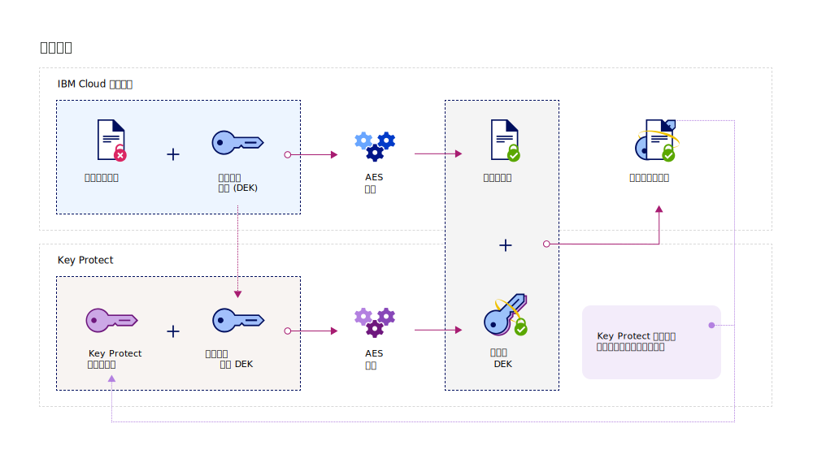
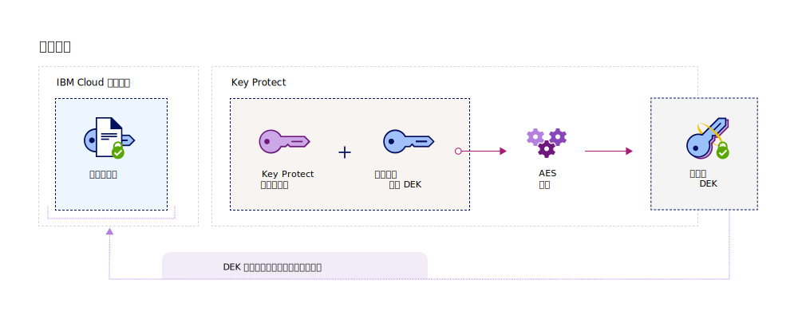

---

copyright:
  years: 2017, 2019
lastupdated: "2019-03-08"

keywords: data-at-rest encryption, envelope encryption, root key, data encryption key, protect data encryption key, encrypt data encryption key, wrap data encryption key, unwrap data encryption key

subcollection: key-protect

---

{:shortdesc: .shortdesc}
{:codeblock: .codeblock}
{:screen: .screen}
{:new_window: target="_blank"}
{:pre: .pre}
{:tip: .tip}
{:note: .note}
{:important: .important}

# 使用包络加密保护数据
{: #envelope-encryption}

包络加密方法是指使用数据加密密钥 (DEK) 对数据进行加密，然后使用可完全管理的根密钥对 DEK 进行加密。
{: shortdesc}

{{site.data.keyword.keymanagementservicefull}} 通过高级加密保护存储的数据，并提供了多种优点：

<table>
  <th>优点</th>
  <th>描述</th>
  <tr>
    <td>客户管理的加密密钥</td>
    <td>通过该服务，可以供应根密钥来保护云中已加密数据的安全性。根密钥充当主密钥打包密钥，可帮助您管理和保护在 {{site.data.keyword.cloud_notm}} 数据服务中供应的数据加密密钥 (DEK)。您可决定是导入现有根密钥，还是由 {{site.data.keyword.keymanagementserviceshort}} 代表您生成根密钥。</td>
  </tr>
  <tr>
    <td>机密性和完整性保护</td>
    <td>{{site.data.keyword.keymanagementserviceshort}} 使用 Galois/Counter Mode (GCM) 中的高级加密标准 (AES) 算法来创建和保护密钥。在服务中创建密钥时，{{site.data.keyword.keymanagementserviceshort}} 会在 {{site.data.keyword.cloud_notm}} 硬件安全模块 (HSM) 的信任边界内生成密钥，因此只有您有权访问自己的加密密钥。</td>
  </tr>
  <tr>
    <td>加密粉碎数据</td>
    <td>如果您的组织检测到安全问题，或者应用程序不再需要一组数据，那么可以选择从云中永久粉碎数据。删除用于保护其他 DEK 的根密钥时，请确保无法再访问或解密这些密钥的关联数据。</td>
  </tr>
  <tr>
    <td>授权用户访问控制</td>
    <td>{{site.data.keyword.keymanagementserviceshort}} 支持集中式访问控制系统，以启用对密钥的精确访问权。[通过指定 IAM 用户角色和高级许可权](/docs/services/key-protect?topic=key-protect-manage-access#roles)，安全管理员可决定谁可以访问服务中的哪些根密钥。</td>
  </tr>
  <caption style="caption-side:bottom;">表 1. 描述客户管理的加密的优点</caption>
</table>

## 工作原理
{: #overview}

包络加密结合了多种加密算法的优势来保护云中的敏感数据。包络加密的工作方式是使用您可以完全管理的根密钥，通过高级加密来打包一个或多个数据加密密钥 (DEK)。此密钥打包过程将创建打包的 DEK，用于保护存储的数据，避免未经授权访问数据或数据泄露。解包 DEK 将使用相同的根密钥来逆转包络加密过程，从而生成解密和认证的数据。
 
下图显示密钥打包功能的上下文视图。

在 NIST Special Publication 800-57 Recommendation for Key Management 中简要介绍了包络加密。要了解更多信息，请参阅 [NIST SP 800-57 Pt.1 Rev. 4 ](http://nvlpubs.nist.gov/nistpubs/SpecialPublications/NIST.SP.800-57pt1r4.pdf){: new_window}。

## 密钥类型
{: #key-types}

服务支持两种密钥类型用于数据高级加密和管理：根密钥和标准密钥。

<dl>
  <dt>根密钥</dt>
    <dd>根密钥是 {{site.data.keyword.keymanagementserviceshort}} 中的主要资源。根密钥是对称密钥打包密钥，用作对数据服务中所存储的其他密钥进行打包（加密）和解包（解密）的信任根。通过 {{site.data.keyword.keymanagementserviceshort}}，可以创建、存储和管理根密钥的生命周期，从而完全控制存储在云中的其他密钥。与标准密钥不同，根密钥永远不能离开 {{site.data.keyword.keymanagementserviceshort}} 服务的边界。</dd>
  <dt>标准密钥</dt>
    <dd>标准密钥是一种持久存储密钥（例如密码或加密密钥）的方式。使用 {{site.data.keyword.keymanagementserviceshort}} 存储标准密钥时，可以使用硬件安全模块 (HSM) 来存储密钥，使用 <a href="/docs/services/key-protect?topic=key-protect-manage-access" target="_blank">{{site.data.keyword.iamshort}} (IAM)</a> 对资源进行细颗粒度访问控制，以及使用 <a href="/docs/services/key-protect?topic=key-protect-activity-tracker-events" target="_blank">{{site.data.keyword.cloudaccesstrailshort}}</a> 来审计对服务的 API 调用。</dd>
</dl>

在 {{site.data.keyword.keymanagementserviceshort}} 中创建密钥之后，系统会返回标识值，在对服务进行 API 调用时可使用此标识。可以使用 {{site.data.keyword.keymanagementserviceshort}} GUI 或 [{{site.data.keyword.keymanagementserviceshort}}API](https://{DomainName}/apidocs/key-protect) 来检索密钥的标识值。 

## 打包密钥
{: #wrapping}

根密钥可帮助您对云中存储的数据加密密钥 (DEK) 进行分组、管理和保护。可以通过指定 {{site.data.keyword.keymanagementserviceshort}} 中您可以完全管理的根密钥并借助高级加密来打包一个或多个 DEK。 

指定 {{site.data.keyword.keymanagementserviceshort}} 中的根密钥后，可以使用 {{site.data.keyword.keymanagementserviceshort}} API 向该服务发送密钥打包请求。密钥打包操作将为 DEK 提供机密性和完整性保护。下图显示正在执行的密钥打包过程：

下表描述执行密钥打包操作所需的输入：
<table>
  <th>输入</th>
  <th>描述</th>
  <tr>
    <td>根密钥标识</td>
    <td>要用于打包的根密钥的标识值。可以将根密钥导入到服务中，也可以在 {{site.data.keyword.keymanagementserviceshort}} 中从其 HSM 生成根密钥。用于打包的根密钥必须为 128 位、192 位或 256 位，这样打包请求才可以成功执行。</td>
  </tr>
  <tr>
    <td>明文</td>
    <td>可选：DEK 的密钥资料，包含要管理和保护的数据。用于密钥打包的明文必须采用 Base64 编码。要生成 256 位 DEK，可以省略 `plaintext` 属性。服务会生成 Base64 编码的 DEK 来用于密钥打包。</td>
  </tr>
  <tr>
    <td>附加认证数据 (AAD)</td>
    <td>可选：用于检查密钥内容完整性的字符串数组。每个字符串可含有最多 255 个字符。如果在打包请求期间提供 AAD，那么在随后的解包请求期间必须指定同一 AAD。</td>
  </tr>
    <caption style="caption-side:bottom;">表 2. {{site.data.keyword.keymanagementserviceshort}} 中的密钥打包所需的输入</caption>
</table>

如果在未指定要加密的明文的情况下发送打包请求，那么 AES-GCM 加密算法会生成明文，并将明文转换为一种无法理解的数据形式，这种数据形式称为密文。此过程将输出使用新密钥资料的 256 位 DEK。然后，系统会使用 AES 密钥打包算法，通过指定的根密钥对 DEK 及其密钥资料打包。成功的打包操作会返回 Base64 编码的打包 DEK，您可以将其存储在 {{site.data.keyword.cloud_notm}} 应用程序或服务中。 

## 解包密钥
{: #unwrapping}

解包数据加密密钥 (DEK) 会解密并认证密钥中的内容，从而将原始密钥资料返回给数据服务。 

如果业务应用程序需要访问打包 DEK 的内容，那么可以使用 {{site.data.keyword.keymanagementserviceshort}} API 向服务发送解包请求。要对 DEK 解包，请指定根密钥的标识值以及初始打包请求期间返回的 `ciphertext` 值。要完成解包请求，还必须提供附加认证数据 (AAD)，以用于检查密钥内容的完整性。

下图显示正在执行的密钥解包过程：

发送解包请求后，系统会使用相同的 AES 算法来逆转密钥打包过程。成功的解包操作会将 Base64 编码的 `plaintext` 值返回给 {{site.data.keyword.cloud_notm}} 静态数据服务。

