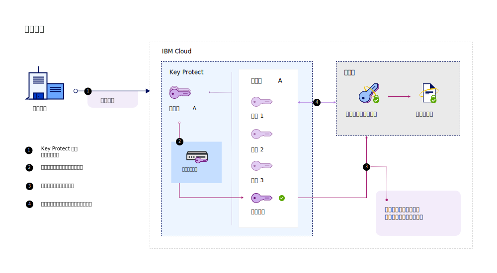
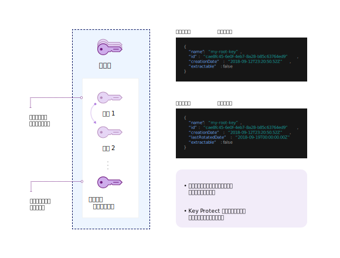

---

copyright:
  years: 2017, 2019
lastupdated: "2019-07-09"

keywords: rotate encryption keys, rotate keys automatically, key rotation

subcollection: key-protect

---

{:shortdesc: .shortdesc}
{:screen: .screen}
{:pre: .pre}
{:table: .aria-labeledby="caption"}
{:external: target="_blank" .external}
{:codeblock: .codeblock}
{:tip: .tip}
{:note: .note}
{:important: .important}

# 轮换加密密钥
{: #key-rotation}

当您撤销某个根密钥的原始密钥资料，然后通过生成新的密钥资料来替换该密钥时，会发生密钥轮换。

定期轮换密钥有助于符合行业标准和加密最佳实践。下表描述了密钥轮换的主要优点：

|优点|描述|
| --- | --- |
|密钥的加密期管理|密钥轮换可限制信息受单个密钥保护的时长。通过定期轮换根密钥，还可以缩短密钥的加密期。加密密钥的生命周期越长，出现安全漏洞的可能性越高。|
|事件缓解|如果您的组织检测到安全问题，您可以立即轮换密钥，以降低或减少与密钥泄漏相关的成本。|
{: caption="表 1. 描述密钥轮换的优点" caption-side="top"}

NIST Special Publication 800-57 Recommendation for Key Management 中对密钥轮换进行了介绍。要了解更多信息，请参阅 [NIST SP 800-57 Pt.1 Rev. 4.](https://www.nist.gov/publications/recommendation-key-management-part-1-general-0){: external}
{: tip}

## 在 {{site.data.keyword.keymanagementserviceshort}} 中比较密钥轮换选项
{: #compare-key-rotation-options}

在 {{site.data.keyword.keymanagementserviceshort}} 中，可以[设置密钥轮换策略](/docs/services/key-protect?topic=key-protect-set-rotation-policy)或[按需轮换根密钥](/docs/services/key-protect?topic=key-protect-rotate-keys)，而无需跟踪已撤销的根密钥资料。 

轮换选项仅适用于根密钥。
{: note}

<dl>
  <dt>设置密钥轮换策略</dt>
    <dd>{{site.data.keyword.keymanagementserviceshort}} 有助于简化加密密钥的轮换，方法是为服务中生成的密钥启用轮换策略。创建根密钥之后，可以在 {{site.data.keyword.keymanagementserviceshort}} GUI 中或通过 API 管理密钥的轮换策略。基于持续的安全需求<a href="/docs/services/key-protect?topic=key-protect-key-rotation#rotation-frequency">为密钥选择一个介于 1 到 12 个月之间的自动轮换时间间隔</a>。根据指定的轮换时间间隔，需要轮换密钥时，{{site.data.keyword.keymanagementserviceshort}} 会自动使用新密钥资料替换该密钥。</dd>
  <dt>根据需要轮换密钥</dt>
    <dd>作为安全管理员，可能要更好地控制密钥的轮换频率。如果不想为密钥设置自动轮换策略，可以手动创建一个新密钥来替换现有密钥，并随后更新应用程序以使其引用该新密钥。要简化此过程，可以使用 {{site.data.keyword.keymanagementserviceshort}} 来根据需要轮换密钥。在此场景中，{{site.data.keyword.keymanagementserviceshort}} 会代表您为每个轮换请求创建密钥并进行替换。该密钥保留相同的元数据和密钥标识。</dd>
</dl>

## 密钥轮换的工作原理 
{: #how-key-rotation-works}

密钥轮换就是将密钥资料从_活动_状态安全地转换为_已停用_密钥状态。替换已停用或已撤销的密钥资料后，新的密钥资料会变为_活动_状态，并且可用于加密操作。

### 使用 {{site.data.keyword.keymanagementserviceshort}} 轮换密钥
{: #use-key-protect-rotate-keys}

当您准备使用 {{site.data.keyword.keymanagementserviceshort}} 轮换根密钥时，请记住以下注意事项。

<dl>
  <dt>轮换 {{site.data.keyword.keymanagementserviceshort}} 中生成的根密钥</dt>
    <dd>可以通过设置密钥的轮换策略或通过根据需要轮换密钥，使用 {{site.data.keyword.keymanagementserviceshort}} 来轮换 {{site.data.keyword.keymanagementserviceshort}} 中生成的根密钥。根密钥的元数据（例如，密钥标识）在轮换密钥时不会更改。</dd>
  <dt>轮换移至服务的根密钥</dt>
    <dd>要轮换最初导入到服务的根密钥，必须为该密钥生成并提供新的密钥资料。可以使用 {{site.data.keyword.keymanagementserviceshort}} 来根据需要轮换已导入的根密钥，方法是将新密钥资料作为轮换请求的一部分提供。根密钥的元数据（例如，密钥标识）在轮换密钥时不会更改。由于必须提供新的密钥资料才能轮换已导入的密钥，因此自动轮换策略不适用于已导入密钥资料的根密钥。</dd>
  <dt>管理已撤销的密钥资料</dt>
    <dd>轮换根密钥之后，{{site.data.keyword.keymanagementserviceshort}} 会创建新的密钥资料。服务将撤销旧密钥资料并保留已撤销的版本，直到删除根密钥为止。使用根密钥进行包络加密时，{{site.data.keyword.keymanagementserviceshort}} 仅会使用与该密钥关联的最新密钥资料。已撤销的密钥资料不能再用于保护密钥，但仍可用于解包操作。当 {{site.data.keyword.keymanagementserviceshort}} 检测到您正在使用已撤销的密钥资料来解包 DEK 时，该服务会提供基于最新根密钥资料的新打包的 DEK。</dd>
 <dt>为 {{site.data.keyword.cloud_notm}} 数据服务启用密钥轮换</dt>
    <dd>要在 {{site.data.keyword.cloud_notm}} 上为数据服务启用这些密钥轮换选项，必须将数据服务与 {{site.data.keyword.keymanagementserviceshort}} 相集成。请参阅 {{site.data.keyword.cloud_notm}} 数据服务的文档，或<a href="/docs/services/key-protect?topic=key-protect-integrate-services">查看我们的集成服务列表以了解更多信息</a>。</dd>
</dl>

在 {{site.data.keyword.keymanagementserviceshort}} 中轮换密钥时，不会收取额外费用。您可以继续使用已撤销的密钥资料来解包已打包的数据加密密钥 (WDEK)，而无需支付额外费用。有关定价选项的更多信息，请参阅 [{{site.data.keyword.keymanagementserviceshort}} 目录页面](https://{DomainName}/catalog/services/key-protect)。
{: tip}

### 了解密钥轮换过程
{: #understand-key-rotation-process}

{{site.data.keyword.keymanagementserviceshort}} API 在后台驱动密钥轮换过程。  

下图显示了密钥轮换功能的上下文视图。

每次收到轮换请求时，{{site.data.keyword.keymanagementserviceshort}} 都会将新的密钥资料与根密钥相关联。 

要了解如何使用 {{site.data.keyword.keymanagementserviceshort}} API 来轮换根密钥，请参阅[轮换密钥](/docs/services/key-protect?topic=key-protect-rotate-keys)。
{: tip}

## 密钥轮换的频率
{: #rotation-frequency}

在 {{site.data.keyword.keymanagementserviceshort}} 中生成根密钥后，需要确定其轮换频率。密钥轮换的原因可能是人员流动、流程故障或您组织的内部密钥到期策略。 

根据加密最佳实践，应定期轮换密钥，例如每 30 天。 

| 轮换类型| 频率|描述|
| --- | --- | --- |
| [基于策略的密钥轮换](/docs/services/key-protect?topic=key-protect-set-rotation-policy) | 每 1 - 12 个月|基于持续的安全需求为密钥选择一个介于 1 到 12 个月之间的轮换时间间隔。为密钥设置轮换策略之后，时钟将根据密钥的初始创建日期立即启动。例如，如果为 `2019/02/01` 创建的密钥设置按每月轮换策略，那么 {{site.data.keyword.keymanagementserviceshort}} 会在 `2019/03/01` 自动轮换该密钥。|
| [根据需求的密钥轮换](/docs/services/key-protect?topic=key-protect-rotate-keys) | 最多每小时轮换一次|如果根据需求轮换密钥，那么在 {{site.data.keyword.keymanagementserviceshort}} 中，每个根密钥可以每小时轮换一次。|
{: caption="表 2. {{site.data.keyword.keymanagementserviceshort}} 中轮换密钥的轮换频率选项" caption-side="top"}

## 后续工作
{: #rotation-next-steps}

- 要了解如何使用 {{site.data.keyword.keymanagementserviceshort}} 为单个密钥设置自动轮换策略，请参阅[设置轮换策略](/docs/services/key-protect?topic=key-protect-set-rotation-policy)。
- 要了解有关手动轮换根密钥的更多信息，请参阅[根据需求轮换密钥](/docs/services/key-protect?topic=key-protect-rotate-keys)。
