---

copyright:
  years: 2017, 2019
lastupdated: "2019-07-09"

keywords: encryption key states, encryption key lifecycle, manage key lifecycle

subcollection: key-protect

---

{:shortdesc: .shortdesc}
{:screen: .screen}
{:pre: .pre}
{:table: .aria-labeledby="caption"}
{:external: target="_blank" .external}
{:codeblock: .codeblock}
{:tip: .tip}
{:note: .note}
{:important: .important}

# 监视加密密钥的生命周期
{: #key-states}

{{site.data.keyword.keymanagementservicefull}} 遵循 [密钥状态的 NIST SP 800-57](https://www.nist.gov/publications/recommendation-key-management-part-1-general-0){: external} 所提出的安全准则。
{: shortdesc}

## 密钥状态和转换
{: #key-transitions}

密钥在其生命周期内会经历若干状态转换，这些状态的作用是指示密钥存在了多久以及数据是否受到保护。 

{{site.data.keyword.keymanagementserviceshort}} 提供了一个图形用户界面和一个 REST API，用于跟踪密钥在其生命周期中经历的若干状态移动。下图显示密钥如何经历从其生成到其销毁之间的各个状态。

|状态|描述|
| --- | --- |
|预激活|密钥最初以_预激活_状态创建。预激活的密钥不能用于以加密方式保护数据。|
|活动|密钥在激活日期会立即变为_活动_状态。此转换标志着密钥加密期的开始。没有激活日期的密钥会立即变为活动状态，并且在到期或销毁之前会保持活动状态。|
|已停用|密钥在其到期日期（如果指定）会变为_已停用_状态。在此状态下，密钥无法以加密方式保护数据，只能变为_已销毁_状态。|
|已销毁|已删除的密钥处于_已销毁_状态。处于此状态的密钥不可恢复。与密钥关联的元数据（例如，密钥的转换历史记录和名称）会保存在 {{site.data.keyword.keymanagementserviceshort}} 数据库中。|
{: caption="表 1. 描述密钥状态和转换。" caption-side="top"}

向服务添加密钥后，请使用 {{site.data.keyword.keymanagementserviceshort}} 仪表板或 {{site.data.keyword.keymanagementserviceshort}} REST API 来查看密钥的转换历史记录和配置。出于审计目的，还可以通过将 {{site.data.keyword.keymanagementserviceshort}} 与 {{site.data.keyword.cloudaccesstrailfull}} 相集成来监视密钥的活动跟踪。供应并开始运行这两项服务后，在 {{site.data.keyword.keymanagementserviceshort}} 中创建和删除密钥时，会在 {{site.data.keyword.cloudaccesstrailshort}} 日志中生成并自动收集活动事件。 

有关更多信息，请参阅[监视 {{site.data.keyword.keymanagementserviceshort}} 活动](/docs/services/cloud-activity-tracker?topic=cloud-activity-tracker-kp){: external}。
