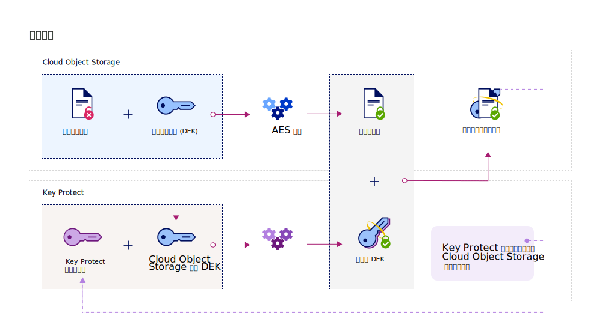

---

copyright:
  years: 2017, 2019
lastupdated: "2019-02-18"

keywords: Key Protect integration, integrate COS with Key Protect

subcollection: key-protect

---

{:shortdesc: .shortdesc}
{:codeblock: .codeblock}
{:screen: .screen}
{:new_window: target="_blank"}
{:pre: .pre}
{:tip: .tip}
{:note: .note}
{:important: .important}

# 与 {{site.data.keyword.cos_full_notm}} 集成
{: #integrate-cos}

{{site.data.keyword.keymanagementservicefull}} 和 {{site.data.keyword.cos_full}} 协同工作，帮助您掌控静态数据的安全性。通过使用 {{site.data.keyword.keymanagementservicelong_notm}} 服务，了解如何向 {{site.data.keyword.cos_full}} 资源添加高级加密。
{: shortdesc}

## 关于 {{site.data.keyword.cos_full_notm}}
{: #cos}

{{site.data.keyword.cos_full_notm}} 用于为非结构化数据提供云存储。非结构化数据是指文件、音频/视频媒体、PDF、压缩的数据归档、备份映像、应用程序工件、业务文档或其他任何二进制对象。  

为了保持数据完整性和可用性，{{site.data.keyword.cos_full_notm}} 会对数据执行分片，还会将数据分散到跨多个地理位置的存储节点。数据完整副本不会位于任何单个存储节点中，只需要有一部分节点可用，就可以在网络上完整检索到数据。提供了提供者端加密，以确保您的静态和动态数据的安全。要管理存储器，请使用 {{site.data.keyword.cloud_notm}} 控制台或使用 [{{site.data.keyword.cos_full_notm}} REST API ](/docs/services/cloud-object-storage?topic=cloud-object-storage-about-the-ibm-cloud-object-storage-api){: new_window} 以编程方式创建存储区和导入对象。

有关更多信息，请参阅[关于 COS ](/docs/services/cloud-object-storage?topic=cloud-object-storage-about-ibm-cloud-object-storage){: new_window}。

## 集成的工作方式
{: #kp_cos_how}

{{site.data.keyword.keymanagementserviceshort}} 与 {{site.data.keyword.cos_full_notm}} 相集成，可帮助您完全控制数据安全性。  

将数据移入 {{site.data.keyword.cos_full_notm}} 的实例时，服务会自动使用数据加密密钥 (DEK) 来加密对象。在 {{site.data.keyword.cos_full_notm}} 中，DEK 会安全地存储在服务中，靠近它们所加密的资源。需要访问存储区时，服务会检查您的用户许可权，并对存储区内的对象进行解密。此加密模型称为_提供者管理的加密_。

要利用_客户管理的加密_的安全优势，可以通过在 {{site.data.keyword.cos_full_notm}} 中与 {{site.data.keyword.keymanagementserviceshort}} 服务相集成，将包络加密添加到 DEK。通过 {{site.data.keyword.keymanagementserviceshort}}，可以供应高度安全的根密钥，这些密钥充当您在服务中控制的主密钥。在 {{site.data.keyword.cos_full_notm}} 中创建存储区时，可以为该存储区配置包络加密。这一添加的保护功能将使用您在 {{site.data.keyword.keymanagementserviceshort}} 中管理的根密钥来打包（或加密）与该存储区关联的 DEK。这种做法称为_密钥打包_，使用多种 AES 算法来保护 DEK 的隐私性和完整性，使得只有您可控制对其关联数据的访问权。

下图显示 {{site.data.keyword.keymanagementserviceshort}} 如何与 {{site.data.keyword.cos_full_notm}} 集成以进一步保护加密密钥。

要了解包络加密如何在 {{site.data.keyword.keymanagementserviceshort}} 中工作的更多信息，请参阅[使用包络加密保护数据](/docs/services/key-protect?topic=key-protect-envelope-encryption)。

## 向存储区添加包络加密
{: #kp_cos_envelope}

[指定 {{site.data.keyword.keymanagementserviceshort}}](/docs/services/key-protect?topic=key-protect-create-root-keys) 中的根密钥并[授予服务之间的访问权](/docs/services/key-protect?topic=key-protect-integrate-services#grant-access)后，可以使用 {{site.data.keyword.cos_full_notm}} GUI 对指定的存储区启用包络加密。

 要对存储区启用高级配置选项，请确保 {{site.data.keyword.cos_full_notm}} 和 {{site.data.keyword.keymanagementserviceshort}} 服务实例之间存在[授权](/docs/services/key-protect?topic=key-protect-integrate-services#grant-access)。
{: tip}

要向存储区添加包络加密，请执行以下操作：

1. 在 {{site.data.keyword.cos_full_notm}} 仪表板中，单击**创建存储区**。
2. 指定存储区的详细信息。
3. 在**高级配置**部分中，选择**添加 {{site.data.keyword.keymanagementserviceshort}} 密钥**。
4. 从 {{site.data.keyword.keymanagementserviceshort}} 服务实例列表中，选择包含要用于密钥打包的根密钥的实例。
5. 对于**密钥名称**，选择根密钥的别名。
6. 单击**创建**以确认创建存储区。

在 {{site.data.keyword.cos_full_notm}} GUI 中，可以浏览受 {{site.data.keyword.keymanagementserviceshort}} 根密钥保护的存储区。

## 后续工作
{: #cos-integration-next-steps}

- 有关将存储区与 {{site.data.keyword.keymanagementserviceshort}} 密钥相关联的更多信息，请参阅[管理加密 ](/docs/services/cloud-object-storage?topic=cloud-object-storage-manage-encryption){: new_window}。 
