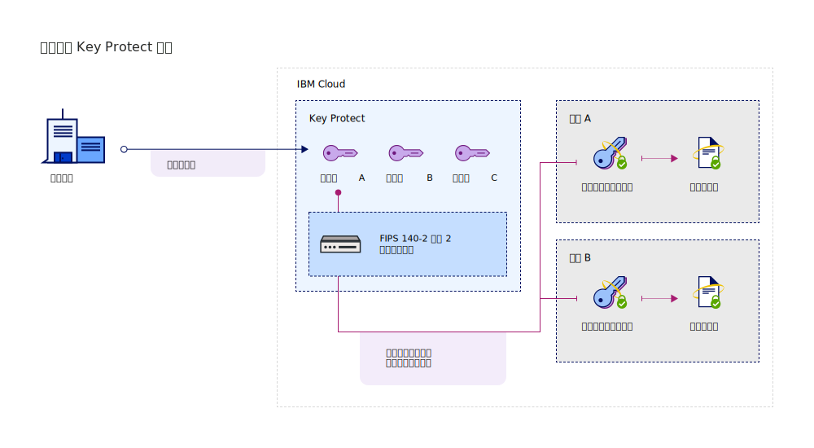

---

copyright:
  years: 2017, 2018
lastupdated: "2018-08-24"

---

{:shortdesc: .shortdesc}
{:codeblock: .codeblock}
{:screen: .screen}
{:new_window: target="_blank"}
{:pre: .pre}
{:tip: .tip}

# 集成服务
{: #integrate-services}

{{site.data.keyword.keymanagementservicefull}} 与数据和存储解决方案相集成，可帮助您在云中引入和管理自己的加密。
{: shortdesc}

[创建服务实例后](/docs/services/key-protect/provision.html)，您可以将 {{site.data.keyword.keymanagementserviceshort}} 与以下受支持的服务相集成：

<table>
    <tr>
        <th>服务</th>
        <th>描述</th>
    </tr>
    <tr>
        <td>
          
{{site.data.keyword.cos_full_notm}}

        </td>
        <td>
          
使用 {{site.data.keyword.keymanagementserviceshort}} 向存储区添加[包络加密](/docs/services/key-protect/concepts/envelope-encryption.html)。使用在 {{site.data.keyword.keymanagementserviceshort}} 中管理的根密钥来保护加密静态数据的数据加密密钥。

          
有关更多信息，请查看[与 {{site.data.keyword.cos_full_notm}} 相集成](/docs/services/key-protect/integrations/integrate-cos.html)。

        </td>
    </tr>
   <caption style="caption-side:bottom;">表 1. 描述适用于 {{site.data.keyword.keymanagementserviceshort}} 的集成</caption>
</table>

## 了解集成 
{: #understand-integration}

在将受支持的服务与 {{site.data.keyword.keymanagementserviceshort}} 相集成时，针对此服务启用[包络加密](/docs/services/key-protect/concepts/envelope-encryption.html)。此集成允许您使用在 {{site.data.keyword.keymanagementserviceshort}} 中存储的根密钥来打包用于加密静态数据的数据加密密钥。 

例如，您可以创建根密钥，在 {{site.data.keyword.keymanagementserviceshort}} 中管理密钥，并使用根密钥来保护跨不同云服务存储的数据。

### {{site.data.keyword.keymanagementserviceshort}} API 方法
{: #api-methods}

在后台，{{site.data.keyword.keymanagementserviceshort}} API 驱动包络加密过程。  

下表列出用于添加或除去针对资源的包络加密的 API 方法。

<table>
  <tr>
    <th>方法</th>
    <th>描述</th>
  </tr>
  <tr>
    <td><code>POST /keys/{root_key_ID}?action=wrap</code></td>
    <td><a href="/docs/services/key-protect/wrap-keys.html">打包（加密）数据加密密钥</a></td>
  </tr>
  <tr>
    <td><code>POST /keys/{root_key_ID}?action=unwrap</code></td>
    <td><a href="/docs/services/key-protect/unwrap-keys.html">解包（解密）数据加密密钥</a></td>
  </tr>
  <caption style="caption-side:bottom;">表 2. 描述 {{site.data.keyword.keymanagementserviceshort}} API 方法</caption>
</table>

要了解有关在 {{site.data.keyword.keymanagementserviceshort}} 中以编程方式管理密钥的更多信息，请查看 [{{site.data.keyword.keymanagementserviceshort}} API 参考文档 ](https://console.bluemix.net/apidocs/kms){: new_window}。
{: tip}

## 集成受支持的服务
{: #grant-access}

要添加集成，请使用 {{site.data.keyword.iamlong}} 仪表板在服务之间创建授权。授权将启用服务到服务访问策略，以便可以将云数据服务中的资源与在 {{site.data.keyword.keymanagementserviceshort}} 中管理的[根密钥](/docs/services/key-protect/concepts/envelope-encryption.html#key-types)相关联。

请确保在相同区域中供应两个服务，然后再创建授权。要了解有关服务授权的更多信息，请参阅[授予服务之间的访问权 ](/docs/iam/authorizations.html){: new_window}。
{: tip}

在准备好集成服务时，请使用以下步骤以创建授权：

1. [登录到 {{site.data.keyword.cloud_notm}} 控制台 ](https://console.bluemix.net/){: new_window}。
2. 在菜单栏中，单击**管理** &gt; **安全性** &gt; **身份和访问权**，然后选择**授权**。 
3. 单击**创建**。
4. 选择授权的源和目标。
 
  - 对于**源服务**，选择要与 {{site.data.keyword.keymanagementserviceshort}} 相集成的云数据服务。例如，**Cloud Object Storage**。
  - 对于**目标服务**，选择 **{{site.data.keyword.keymanagementservicelong_notm}}**。 
4. 要授予服务之间的只读访问权，请选中**读者**复选框。

    借助_读者_许可权，您的源服务可以浏览在指定的 {{site.data.keyword.keymanagementserviceshort}} 实例中供应的根密钥。
5. 单击**授权**。

### 后续工作

通过在 {{site.data.keyword.keymanagementserviceshort}} 中创建根密钥，向云资源添加高级加密。向受支持的云数据服务添加新资源，然后选择要用于高级加密的根密钥。

- 要查找有关使用 {{site.data.keyword.keymanagementserviceshort}} 服务创建根密钥的更多信息，请参阅[创建根密钥](/docs/services/key-protect/create-root-keys.html)。
- 要查找有关将自己的根密钥引入到 {{site.data.keyword.keymanagementserviceshort}} 服务的更多信息，请参阅[导入根密钥](/docs/services/key-protect/import-root-keys.html)。

