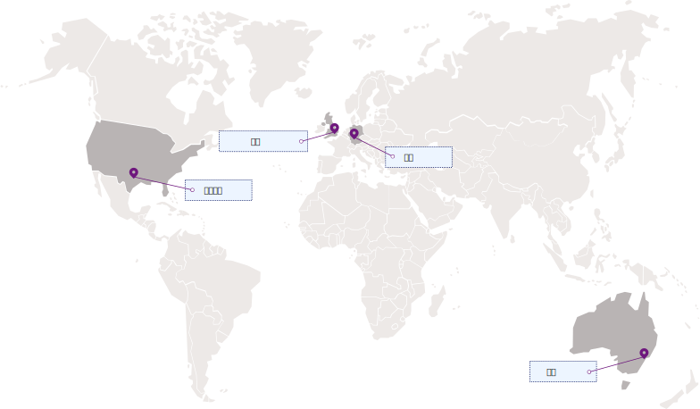

---

copyright:
  years: 2017, 2019
lastupdated: "2019-01-03"

---

{:shortdesc: .shortdesc}
{:codeblock: .codeblock}
{:screen: .screen}
{:new_window: target="_blank"}
{:pre: .pre}
{:tip: .tip}
{:note: .note}
{:important: .important}

# 区域和位置
{: #regions}

您可以通过指定区域服务端点来连接应用程序和 {{site.data.keyword.keymanagementservicelong_notm}} 服务。
{: shortdesc}

## 可用区域
{: #available-regions}

{{site.data.keyword.keymanagementserviceshort}} 在以下区域和位置中可用：

## 服务端点
{: #service-endpoints}

如果是以编程方式管理 {{site.data.keyword.keymanagementserviceshort}} 资源，请参阅下表以确定连接到 [{{site.data.keyword.keymanagementserviceshort}} API](https://console.bluemix.net/apidocs/key-protect) 时要使用的 API 端点： 

<table>
    <tr>
        <th>位置</th>
        <th>服务 API 端点</th>
    </tr>
    <tr>
        <td>达拉斯</td>
        <td>
            <code>us-south.kms.cloud.ibm.com</code>
        </td>
    </tr>
    <tr>
        <td>华盛顿</td>
        <td>
            <code>us-east.kms.cloud.ibm.com</code>
        </td>
    </tr>
    <tr>
        <td>伦敦</td>
        <td>
            <code>eu-gb.kms.cloud.ibm.com</code>
        </td>
    </tr>
    <tr>
        <td>法兰克福</td>
        <td>
            <code>eu-de.kms.cloud.ibm.com</code>
        </td>
    </tr>
    <tr>
        <td>悉尼</td>
        <td>
            <code>au-syd.kms.cloud.ibm.com</code>
        </td>
    </tr>
    <tr>
        <td>东京</td>
        <td>
            <code>jp-tok.kms.cloud.ibm.com</code>
        </td>
    </tr>
    <caption style="caption-side:bottom;">表 1. 显示 {{site.data.keyword.keymanagementserviceshort}} API 的可用端点</caption>
</table>

您可以继续使用 `https://keyprotect.<region>.bluemix.net` 来设置目标服务以便执行操作，也可以使用新的 `cloud.ibm.com` 端点来更新应用程序。对于 Cloud Foundry 组织或空间内存在的 {{site.data.keyword.keymanagementserviceshort}} 服务实例，请使用旧的 `https://ibm-key-protect.edge.bluemix.net` 端点来与 {{site.data.keyword.keymanagementserviceshort}} API 进行交互。
{: tip}

有关向 {{site.data.keyword.keymanagementserviceshort}} 进行认证的更多信息，请参阅[访问 API](/docs/services/key-protect/access-api.html)。
