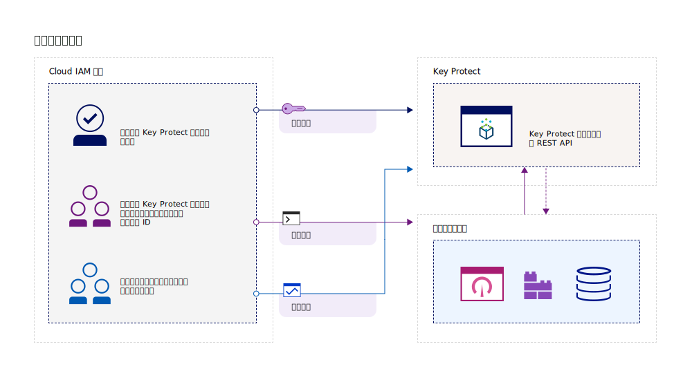
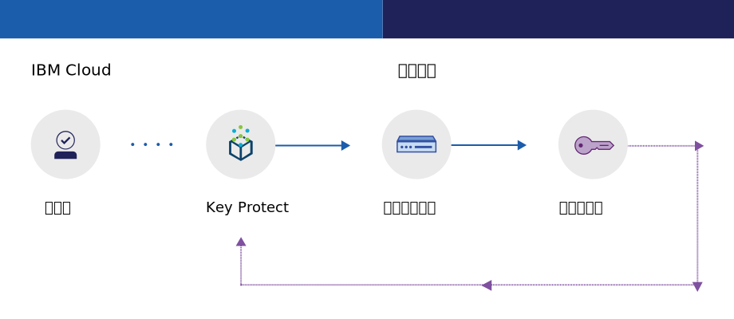
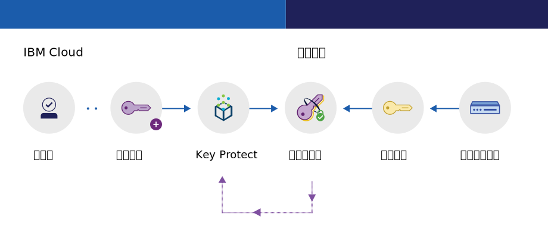

---

copyright:
  years: 2017, 2019
lastupdated: "2019-04-03"

keywords: key management service, KMS, about Key Protect, about KMS, Key Protect use cases, KMS use cases

subcollection: key-protect

---

{:shortdesc: .shortdesc}
{:codeblock: .codeblock}
{:screen: .screen}
{:new_window: target="_blank"}
{:pre: .pre}
{:tip: .tip}
{:note: .note}
{:important: .important}

# 關於 {{site.data.keyword.keymanagementserviceshort}}
{: #about}

{{site.data.keyword.keymanagementservicefull}} 可協助您在 {{site.data.keyword.cloud_notm}} 服務之間為應用程式佈建加密金鑰。當您管理金鑰的生命週期時，可以因為知道金鑰受到保護資訊免遭竊取的 FIPS 140-2 Level 2 認證雲端型硬體安全模組 (HSM) 保護而受益。
{: shortdesc}

## 使用 {{site.data.keyword.keymanagementserviceshort}} 的原因
{: #use-cases}

您可能需要在下列情境中管理金鑰：

|情境|原因|
| --- | ---- |
|身為大公司的 IT 管理者，您需要針對許多不同的服務供應項目，整合、追蹤和替換加密金鑰。|{{site.data.keyword.keymanagementserviceshort}} 介面能簡化多個加密服務的管理。使用此服務，您可以在一個中央位置管理及排序加密金鑰，或者可以依專案隔離金鑰，並將它們存放在不同的 {{site.data.keyword.cloud_notm}} 空間中。|
|身為開發人員，您要將預先存在的應用程式（例如，自行加密儲存空間）整合至 {{site.data.keyword.keymanagementserviceshort}}。|{{site.data.keyword.cloud_notm}} 上或外部的應用程式可與 {{site.data.keyword.keymanagementserviceshort}} API 整合。您可以對應用程式使用您自己的現有金鑰。|
|您的開發團隊具有嚴格原則，而且您需要一種每 30 天產生並替換金鑰的方式。|使用 {{site.data.keyword.keymanagementserviceshort}}，您可以從 {{site.data.keyword.cloud_notm}} Hardware Security Module (HSM) 快速產生金鑰。該更換金鑰時，您可以[隨需應變替換金鑰](/docs/services/key-protect?topic=key-protect-rotate-keys)或[設定替換原則](/docs/services/key-protect?topic=key-protect-set-rotation-policy)，讓金鑰符合您的持續安全需要。|
|您是業界（例如財務或法務）的安全管理者，必須遵守對於資料保護方式的治理。您需要授與受控制的金鑰存取，而不危害它保護的資料。|使用此服務，您可以藉由[指派不同的身分及存取管理角色](/docs/services/key-protect?topic=key-protect-manage-access#roles)，控制管理金鑰的使用者存取權。例如，您可以授與唯讀存取給需要檢視金鑰建立資訊而不必檢視金鑰資料的使用者。|
|您想要在將資料移入雲端時執行封套加密。您需要自帶主要加密金鑰，才能管理及保護其他用來加密靜置資料的金鑰。|使用 {{site.data.keyword.keymanagementserviceshort}}，您可以[使用高度安全的根金鑰來包裝（加密）資料加密金鑰](/docs/services/key-protect?topic=key-protect-envelope-encryption)。您可以自帶根金鑰，或在服務中建立它們。|

尋找用於支援客戶控制的雲端型硬體安全模組 (HSM) 的專用金鑰管理解決方案？[{{site.data.keyword.cloud_notm}} {{site.data.keyword.hscrypto}}](/docs/services/hs-crypto?topic=hs-crypto-get-started) 與 {{site.data.keyword.keymanagementserviceshort}} 整合以啟用 Keep Your Own Keys (KYOK) for {{site.data.keyword.cloud_notm}}，讓您的組織對其資料具有更多的控制和權限。請參閱 [{{site.data.keyword.hscrypto}} 供應項目詳細資料頁面 ](https://{DomainName}/catalog/services/hyper-protect-crypto-services)，以進一步瞭解。
{: tip}

## {{site.data.keyword.keymanagementserviceshort}} 如何運作
{: #kp-how}

{{site.data.keyword.keymanagementservicelong_notm}} 可藉由與 {{site.data.keyword.cloud_notm}} 身分及存取管理角色一致，協助您管理組織裡的加密金鑰。

IT 或安全管理者需要進階許可權，審核員則可能不需要這些。為了簡化存取，{{site.data.keyword.keymanagementserviceshort}} 會對應至 {{site.data.keyword.cloud_notm}} 身分及存取管理角色，以便每個角色有不同的服務視圖。為了協助指引哪個視圖及存取層次最適合您的需要，請參閱[管理使用者及存取](/docs/services/key-protect?topic=key-protect-manage-access#roles)。

下圖顯示管理員、讀者及作者如何與服務中管理的金鑰互動。

<dl>
  <dt>服務整合</dt>
    <dd>{{site.data.keyword.keymanagementserviceshort}} 服務實例的管理員會管理加密用的金鑰。</dd>
  <dt>審核</dt>
    <dd>讀者會存取高階金鑰視圖以及識別可疑的活動。</dd>
  <dt>應用程式</dt>
    <dd>作者會管理他們編入應用程式的加密用金鑰。</dd>
</dl>

## {{site.data.keyword.keymanagementserviceshort}} 架構
{: #kp_architecture}

{{site.data.keyword.keymanagementservicelong_notm}} 是由業界接受的技術組成。

<dl>
  <dt>{{site.data.keyword.cloud_notm}} 伺服器</dt>
    <dd>來自 {{site.data.keyword.cloud_notm}} 伺服器的身分、專案及其記號，可讓 {{site.data.keyword.keymanagementserviceshort}} 服務將資源對映至金鑰。</dd>
  <dt>{{site.data.keyword.keymanagementserviceshort}} 的 API</dt>
    <dd>{{site.data.keyword.keymanagementserviceshort}} REST API 可促使金鑰的建立及管理。服務提供加密的多承租戶。</dd>
  <dt>{{site.data.keyword.cloud_notm}} 中的使用者介面</dt>
    <dd>搭配 {{site.data.keyword.keymanagementserviceshort}} 使用者介面，您可以安全地使用金鑰。</dd>
  <dt>硬體安全模組 (HSM)</dt>
    <dd>{{site.data.keyword.cloud_notm}} 資料中心會在幕後提供硬體來保護您的金鑰。</dd>
  <dt>資料庫叢集</dt>
    <dd>您可以藉由叢集資料庫，依靠金鑰的備用及安全儲存。</dd>
</dl>

下列圖表顯示 {{site.data.keyword.keymanagementserviceshort}} 如何使用硬體安全模組來產生金鑰與服務如何儲存金鑰的對比。

