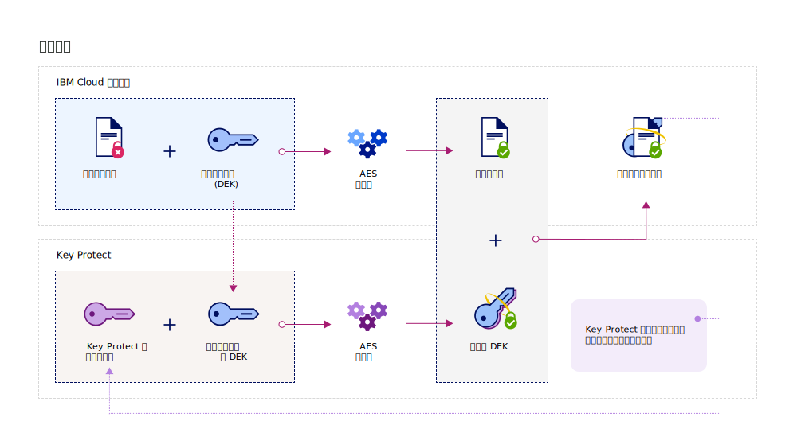
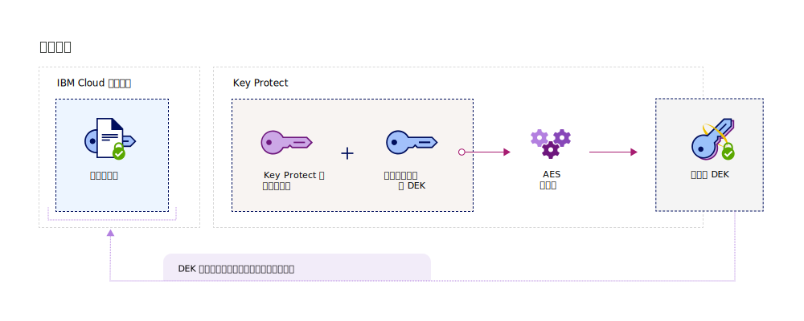

---

copyright:
  years: 2017, 2019
lastupdated: "2019-07-09"

keywords: data-at-rest encryption, envelope encryption, root key, data encryption key, protect data encryption key, encrypt data encryption key, wrap data encryption key, unwrap data encryption key

subcollection: key-protect

---

{:shortdesc: .shortdesc}
{:screen: .screen}
{:pre: .pre}
{:table: .aria-labeledby="caption"}
{:external: target="_blank" .external}
{:codeblock: .codeblock}
{:tip: .tip}
{:note: .note}
{:important: .important}

# 使用封套加密保護資料
{: #envelope-encryption}

封套加密這種作法，是使用資料加密金鑰 (DEK) 來加密資料，然後使用您可完全管理的根金鑰來加密 DEK。
{: shortdesc}

{{site.data.keyword.keymanagementservicefull}} 透過進階加密來保護您已儲存的資料，並提供數個優點：

|優點|說明
|
| --- | --- |
|客戶管理的加密金鑰|您可以使用此服務來佈建根金鑰，以保護雲端中已加密資料的安全。根金鑰作為主要金鑰包裝金鑰，可協助您管理及保護 {{site.data.keyword.cloud_notm}} 資料服務中所佈建的資料加密金鑰 (DEK)。您可以決定匯入現有根金鑰，還是讓 {{site.data.keyword.keymanagementserviceshort}} 代表您產生它們。|
|機密性及完整性保護| {{site.data.keyword.keymanagementserviceshort}} 會使用「進階加密標準 (AES)」演算法，並採用「Galois/計數器模式 (GCM)」來保護金鑰。在服務中建立金鑰時，{{site.data.keyword.keymanagementserviceshort}} 會在 {{site.data.keyword.cloud_notm}} 硬體安全模組 (HSM) 的信任界限內產生它們，因此只有您才有權存取加密金鑰。|
|資料的加密清除|如果您的組織偵測到安全問題，或者您的應用程式不再需要一組資料，則可以選擇從雲端永久地清除資料。當您刪除保護其他 DEK 的根金鑰時，即可確保無法再存取或解密這些金鑰的相關聯資料。|
|委派的使用者存取控制|{{site.data.keyword.keymanagementserviceshort}} 支援一個集中化存取控制系統，可對您的金鑰啟用精細存取。[透過指派 IAM 使用者角色及進階許可權](/docs/services/key-protect?topic=key-protect-manage-access#roles)，安全管理者就可以決定誰能存取服務中的哪些根金鑰。|
{: caption="表 1. 說明客戶所管理加密的好處" caption-side="top"}

## 如何運作
{: #overview}

封套加密結合多個加密演算法的長處，用來保護您在雲端中的機密資料。其運作方式是使用您可完全管理的根金鑰，以利用進階加密來包裝一個以上的資料加密金鑰 (DEK)。此金鑰包裝處理程序會建立已包裝的 DEK，它們能保護您儲存的資料免於遭受未獲授權的存取或曝光。解除包裝 DEK 會使用相同的根金鑰來反轉封套加密處理程序，進而產生解密且經過鑑別的資料。
 
下圖顯示金鑰包裝功能的環境定義視圖。

「NIST 特殊出版品 800-57」的「金鑰管理建議」中，簡要地論述封套加密。若要進一步瞭解，請參閱 [NIST SP 800-57 Pt. 1 Rev. 4。](https://www.nist.gov/publications/recommendation-key-management-part-1-general-0){: external}

## 金鑰類型
{: #key-types}

對於資料的進階加密及管理，服務支援兩種金鑰類型：根金鑰及標準金鑰。

<dl>
  <dt>根金鑰</dt>
    <dd>根金鑰是 {{site.data.keyword.keymanagementserviceshort}} 中的主要資源。它們是對稱金鑰包裝金鑰，用來作為信任根金鑰，以包裝（加密）及解除包裝（解密）資料服務中所儲存的其他金鑰。使用 {{site.data.keyword.keymanagementserviceshort}}，您可以建立、儲存及管理根金鑰的生命週期，來完全控制雲端中所儲存的其他金鑰。與標準金鑰不同，根金鑰永遠無法離開 {{site.data.keyword.keymanagementserviceshort}} 服務的範圍。</dd>
  <dt>標準金鑰</dt>
    <dd>標準金鑰可以持續保存密碼，例如密碼或加密金鑰。當您使用 {{site.data.keyword.keymanagementserviceshort}} 來儲存標準金鑰時，您會啟用密碼的硬體安全模組 (HSM) 儲存空間，使用 <a href="/docs/services/key-protect?topic=key-protect-manage-access" target="_blank">{{site.data.keyword.iamshort}} (IAM)</a> 進行資源的精細存取控制，並且能夠使用 <a href="/docs/services/key-protect?topic=key-protect-at-events" target="_blank">{{site.data.keyword.cloudaccesstrailshort}}</a> 審核對服務的 API 呼叫。</dd>
</dl>

在 {{site.data.keyword.keymanagementserviceshort}} 中建立金鑰之後，系統會傳回一個 ID 值，您可以用它來對服務發出 API 呼叫。您可以使用 {{site.data.keyword.keymanagementserviceshort}} GUI 或 [{{site.data.keyword.keymanagementserviceshort}} API](https://{DomainName}/apidocs/key-protect) 來擷取金鑰的 ID 值。 

## 包裝金鑰
{: #wrapping}

根金鑰可協助您分組、管理及保護雲端中所儲存的資料加密金鑰 (DEK)。在 {{site.data.keyword.keymanagementserviceshort}} 中指定您可完全管理的根金鑰，即可使用進階加密來包裝一個以上的 DEK。 

在 {{site.data.keyword.keymanagementserviceshort}} 中指定根金鑰之後，即可使用 {{site.data.keyword.keymanagementserviceshort}} API 將金鑰 wrap 要求傳送至服務。金鑰 wrap 作業同時提供 DEK 的機密性及完整性保護。下圖顯示運作中的金鑰包裝處理程序：

下表說明執行金鑰包裝作業所需的輸入：

|輸入|說明
|
| --- | --- |
|根金鑰 ID|您要用於包裝之根金鑰的 ID 值。根金鑰可以匯入至服務，也可以從其 HSM 於 {{site.data.keyword.keymanagementserviceshort}} 中產生。用於包裝的根金鑰必須是 128、192 或 256 位元，包裝要求才能成功。|
|純文字| 選用項目：您要用於資料加密的資料加密金鑰 (DEK)。此值必須以 base64 編碼。若要產生新的 DEK，您可以省略 `plaintext` 內容。Key Protect 會產生根源於 HSM 的隨機純文字（32 個位元組），然後包裝該值。|
|其他鑑別資料 (AAD)|選用項目：檢查金鑰內容完整性的字串陣列。每一個字串最多可以保留 255 個字元。如果您在 wrap 要求期間提供 AAD，則必須在後續 unwrap 要求期間指定相同的 AAD。|
{: caption="表 2. {{site.data.keyword.keymanagementserviceshort}} 中金鑰包裝所需的輸入" caption-side="top"}

如果您傳送 wrap 要求，而未指定要加密的純文字，則 AES-GCM 加密演算法會產生純文字並將其轉換為難理解的資料格式（稱為密文）。此處理程序使用新的金鑰資料來輸出 256 位元 DEK。系統接著會使用 AES 金鑰包裝演算法，它會使用指定的根金鑰來包裝 DEK 及其金鑰資料。成功的 wrap 作業會傳回以 base64 編碼的已包裝 DEK，而您可以將它儲存在 {{site.data.keyword.cloud_notm}} 應用程式或服務中。 

## 解除包裝金鑰
{: #unwrapping}

解除包裝資料加密金鑰 (DEK) 會解密並鑑別金鑰內的內容，並將原始金鑰資料傳回給您的資料服務。 

如果您的商業應用程式需要存取已包裝 DEK 的內容，則可以使用 {{site.data.keyword.keymanagementserviceshort}} API 將 unwrap 要求傳送給服務。若要解除包裝 DEK，請指定根金鑰的 ID 值以及起始 wrap 要求期間所傳回的 `ciphertext` 值。若要完成 unwrap 要求，您也必須提供其他鑑別資料 (AAD)，以檢查金鑰內容的完整性。

下圖顯示運作中的金鑰解除包裝。

在您傳送 unwrap 要求之後，系統會使用相同的 AES 演算法來反轉金鑰包裝處理程序。成功的 unwrap 作業會將以 base64 編碼的 `plaintext` 值傳回給 {{site.data.keyword.cloud_notm}} 靜置資料服務。

