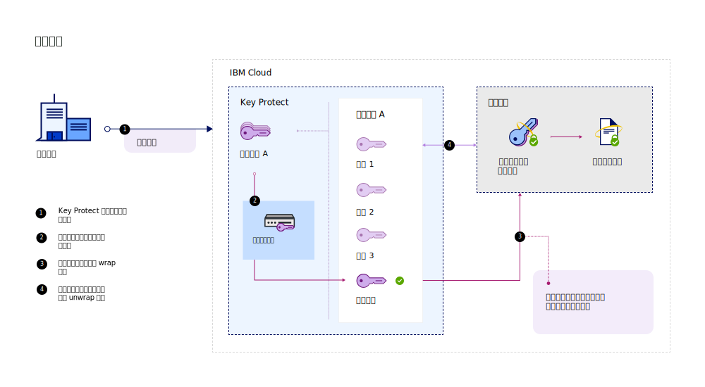
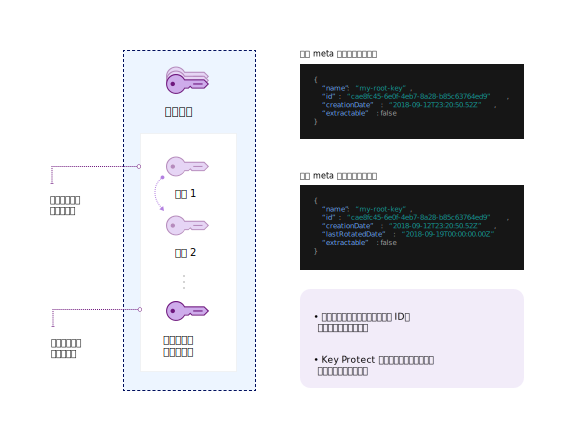

---

copyright:
  years: 2017, 2019
lastupdated: "2019-03-22"

keywords: rotate encryption keys, rotate keys automatically, key rotation

subcollection: key-protect

---

{:shortdesc: .shortdesc}
{:codeblock: .codeblock}
{:screen: .screen}
{:new_window: target="_blank"}
{:pre: .pre}
{:tip: .tip}
{:note: .note}
{:important: .important}

# 替換加密金鑰
{: #key-rotation}

當您淘汰根金鑰的原始金鑰資料，並藉由產生新的加密金鑰資料來重新建立金鑰時，即會進行金鑰替換。

定期替換金鑰有助於您符合業界標準和加密最佳作法。下表說明金鑰替換的主要好處：

<table>
  <th>優點</th>
  <th>說明</th>
  <tr>
    <td>金鑰的加密期間管理</td>
    <td>金鑰替換會限制單一金鑰保護資訊的時間長度。藉由定期替換根金鑰，您也縮短了金鑰的加密期間。加密金鑰的生命期限越長，安全侵害的機率便越高。</td>
  </tr>
  <tr>
    <td>突發事件降低</td>
    <td>如果您的組織偵測到安全問題，您可以立即替換金鑰以便降低或減少與金鑰洩漏相關聯的成本。</td>
  </tr>
  <caption style="caption-side:bottom;">表 1. 說明金鑰替換的好處</caption>
</table>

「NIST 特殊出版品 800-57」的「金鑰管理建議」中，論述了金鑰替換。若要進一步瞭解，請參閱 [NIST SP 800-57 Pt. 1 Rev. 4. ](http://nvlpubs.nist.gov/nistpubs/SpecialPublications/NIST.SP.800-57pt1r4.pdf){: new_window}
{: tip}

## 比較 {{site.data.keyword.keymanagementserviceshort}} 中的金鑰替換選項
{: #compare-key-rotation-options}

在 {{site.data.keyword.keymanagementserviceshort}} 中，您可以[為金鑰設定替換原則](/docs/services/key-protect?topic=key-protect-set-rotation-policy)或[隨需應變替換金鑰](/docs/services/key-protect?topic=key-protect-rotate-keys)，而不需要追蹤已汰換的根金鑰資料。 

替換選項僅適用於根金鑰。
{: note}

<dl>
  <dt>為金鑰設定替換原則</dt>
    <dd>{{site.data.keyword.keymanagementserviceshort}} 可協助您簡化加密金鑰的替換，方法是為您在服務中產生的金鑰啟用替換原則。建立根金鑰之後，您可以在 {{site.data.keyword.keymanagementserviceshort}} GUI 中或使用 API 來管理金鑰的替換原則。根據進行中安全需求，<a href="/docs/services/key-protect?topic=key-protect-rotation-frequency">為您的金鑰選擇 1 到 12 個月的自動替換間隔</a>。當要根據您指定的替換間隔來替換金鑰時，{{site.data.keyword.keymanagementserviceshort}} 會自動將金鑰取代為新的金鑰資料。</dd>
  <dt>隨需應變替換金鑰</dt>
    <dd>身為安全管理者，您可能想要進一步控制金鑰的替換頻率。如果您不想為金鑰設定自動替換原則，則可以手動建立新的金鑰來取代現有金鑰，然後更新應用程式，它們才能參照新的金鑰。若要簡化此處理程序，您可以使用 {{site.data.keyword.keymanagementserviceshort}} 隨需應變替換金鑰。在此情境中，{{site.data.keyword.keymanagementserviceshort}} 會代表您為每一個替換要求建立及取代金鑰。金鑰會保留相同的 meta 資料和金鑰 ID。</dd>
</dl>

## 金鑰替換的運作方式 
{: #how-key-rotation-works}

金鑰替換的運作方式是將金鑰資料安全地從_作用中_ 狀態轉移為_取消啟動_ 金鑰狀態。為了取代取消啟動或已淘汰的金鑰資料，新的金鑰資料會移入_作用中_ 狀態，並且可用於加密作業。

### 使用 {{site.data.keyword.keymanagementserviceshort}} 替換金鑰
{: #use-key-protect-rotate-keys}

為替換根金鑰而準備使用 {{site.data.keyword.keymanagementserviceshort}} 時，請謹記下列考量。

<dl>
  <dt>替換在 {{site.data.keyword.keymanagementserviceshort}} 中產生的根金鑰</dt>
    <dd>您可以使用 {{site.data.keyword.keymanagementserviceshort}}，藉由為金鑰設定替換原則，或藉由隨需應變替換金鑰，來替換在 {{site.data.keyword.keymanagementserviceshort}} 中產生的根金鑰。當您替換金鑰時，根金鑰的 meta 資料（例如，其金鑰 ID）不會變更。</dd>
  <dt>替換您帶至服務的根金鑰</dt>
    <dd>若要替換您最初匯入至服務的根金鑰，您必須產生並提供金鑰的新金鑰資料。您可以使用 {{site.data.keyword.keymanagementserviceshort}}，藉由在替換要求中提供新的金鑰資料，以隨需應變替換匯入的根金鑰。當您替換金鑰時，根金鑰的 meta 資料（例如，其金鑰 ID）不會變更。因為您必須提供新的金鑰資料才能替換匯入的金鑰，所以自動替換原則不適用於已匯入金鑰資料的根金鑰。</dd>
  <dt>管理已淘汰的金鑰資料</dt>
    <dd>{{site.data.keyword.keymanagementserviceshort}} 會在您替換根金鑰之後建立新的金鑰資料。服務會重試舊的金鑰資料，並保留已淘汰的版本，直到刪除根金鑰為止。當您使用封套加密的根金鑰時，{{site.data.keyword.keymanagementserviceshort}} 只會使用與金鑰相關聯的最新金鑰資料。無法再使用已淘汰的金鑰資料來保護金鑰，但它仍可用於解除包裝作業。如果 {{site.data.keyword.keymanagementserviceshort}} 偵測到您是使用已淘汰的金鑰資料來解除包裝 DEK，服務會根據最新的根金鑰資料提供剛包裝的 DEK。您可以使用新包裝的 DEK 來使用最新的金鑰資料重新包裝金鑰。</dd>
 <dt>啟用 {{site.data.keyword.cloud_notm}} 資料服務的金鑰替換</dt>
    <dd>若要在 {{site.data.keyword.cloud_notm}} 上為您的資料服務啟用這些金鑰替換選項，資料服務必須已與 {{site.data.keyword.keymanagementserviceshort}} 整合。請參閱 {{site.data.keyword.cloud_notm}} 資料服務的文件，或<a href="/docs/services/key-protect?topic=key-protect-integrate-services">參閱我們的整合服務清單，以進一步瞭解</a>。</dd>
</dl>

當您在 {{site.data.keyword.keymanagementserviceshort}} 替換金鑰時，不會向您收取額外的費用。您可以繼續用已淘汰的金鑰資料來對已包裝的資料加密金鑰 (WDEK) 進行解除包裝，而不需額外的成本。如需定價選項的相關資訊，請參閱 [{{site.data.keyword.keymanagementserviceshort}} 型錄頁面](https://{DomainName}/catalog/services/key-protect)。
{: tip}

### 瞭解金鑰替換處理程序
{: #understand-key-rotation-process}

{{site.data.keyword.keymanagementserviceshort}} API 會在幕後驅動金鑰替換處理程序。  

下圖顯示金鑰替換功能的環境定義視圖。

針對每個替換要求，{{site.data.keyword.keymanagementserviceshort}} 會將新的金鑰資料與您的根金鑰相關聯。 

替換完成之後，新的根金鑰資料便可用於使用[封套加密](/docs/services/key-protect?topic=key-protect-envelope-encryption)保護未來的資料加密金鑰 (DEK)。已淘汰的金鑰資料會移到_取消啟動_ 狀態，只能用來解除包裝及存取較舊且尚未被最新根金鑰資料保護的 DEK。如果 {{site.data.keyword.keymanagementserviceshort}} 偵測到您正在使用已淘汰的根金鑰資料解除包裝較舊的 DEK，服務會自動重新加密 DEK 並傳回已包裝且根據最新根金鑰資料的資料加密金鑰 (WDEK)。請儲存並使用新的 WDEK 來進行未來的 unwrap 作業，以便用最新的根金鑰資料保護 DEK。

若要了解如何使用 {{site.data.keyword.keymanagementserviceshort}} API 來替換您的根金鑰，請參閱[替換金鑰](/docs/services/key-protect?topic=key-protect-rotate-keys)。

## 金鑰替換的頻率
{: #rotation-frequency}

在 {{site.data.keyword.keymanagementserviceshort}} 產生根金鑰之後，您要決定替換的頻率。由於人事異動、處理程序故障，或是組織內部金鑰到期原則的緣故，您可能會想要替換金鑰。 

請定期替換金鑰，例如每 30 天一次，以符合加密最佳作法。 

| 替換類型 | 頻率 |說明
| --- | --- | --- |
| [原則型金鑰替換](/docs/services/key-protect?topic=key-protect-set-rotation-policy) | 每隔 1 到 12 個月 | 根據進行中安全需求，為您的金鑰選擇 1 到 12 個月的替換間隔。在為金鑰設定替換原則之後，時鐘會根據金鑰的起始建立日期立即開始。例如，如果您為在 `2019/02/01` 建立的金鑰設定每月替換原則，{{site.data.keyword.keymanagementserviceshort}} 即會在 `2019/03/01` 自動替換金鑰。|
| [隨需應變金鑰替換](/docs/services/key-protect?topic=key-protect-rotate-keys) | 每小時最多一次替換 | 如果您是以隨需應變方式替換金鑰，則 {{site.data.keyword.keymanagementserviceshort}} 容許每個根金鑰每小時替換一次。|
{: caption="表 2. {{site.data.keyword.keymanagementserviceshort}} 中替換金鑰的替換頻率選項" caption-side="top"}

## 下一步為何？
{: #rotation-next-steps}

- 若要瞭解如何使用 {{site.data.keyword.keymanagementserviceshort}} 為個別金鑰設定自動替換原則，請參閱[設定替換原則](/docs/services/key-protect?topic=key-protect-set-rotation-policy)。
- 若要進一步瞭解手動替換根金鑰，請參閱[隨需應變替換金鑰](/docs/services/key-protect?topic=key-protect-rotate-keys)。
