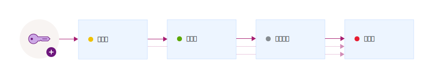

---

copyright:
  years: 2017, 2019
lastupdated: "2019-01-03"

---

{:shortdesc: .shortdesc}
{:codeblock: .codeblock}
{:screen: .screen}
{:new_window: target="_blank"}
{:pre: .pre}
{:tip: .tip}
{:note: .note}
{:important: .important}

# 金鑰狀態
{: #key-states}

{{site.data.keyword.keymanagementservicefull}} 遵循 [NIST SP 800-57 對於金鑰狀態 ](http://nvlpubs.nist.gov/nistpubs/SpecialPublications/NIST.SP.800-57pt1r4.pdf){: new_window} 的安全準則。
{: shortdesc}

## 金鑰狀態及轉移
{: #key_transitions}

加密金鑰可在其生命期限的數個狀態間轉移，而這些狀態是涉及金鑰存在多久以及資料是否受到保護的體現。 

{{site.data.keyword.keymanagementserviceshort}} 提供了圖形使用者介面及 REST API，可用來追蹤在其生命週期的數個狀態間移動的金鑰。下圖顯示金鑰如何通過其產生到破壞之間的狀態。

<table>
  <tr>
    <th>狀態</th>
    <th>說明</th>
  </tr>
  <tr>
    <td>啟動前</td>
    <td>金鑰一開始是以<i>啟動前</i> 狀態建立。啟動前金鑰無法用來加密保護資料。</td>
  </tr>
  <tr>
    <td>已啟動</td>
    <td>金鑰在啟動日立即進入<i>作用中</i> 狀態。此項轉移會標示金鑰的 cryptoperid 開頭。沒有啟動日的金鑰，會立即變為作用中，並維持作用中一直到它們到期或被破壞為止。</td>
  </tr>
  <tr>
    <td>取消啟動</td>
    <td>金鑰在到期日（如果已指派的話）立即進入<i>取消啟動</i> 狀態。在這個狀態下，金鑰無法以加密方式保護資料，且只能進入<i>已破壞</i> 狀態。</td>
  </tr>
  <tr>
    <td>已破壞</td>
    <td>已刪除的金鑰處於<i>已破壞</i> 狀態。在這個狀態下無法回復金鑰。與金鑰相關聯的 meta 資料（例如金鑰轉移歷程及名稱）保存在 {{site.data.keyword.keymanagementserviceshort}} 資料庫中。</td>
  </tr>
  <caption style="caption-side:bottom;">表 1. 說明金鑰狀態及轉移。</caption>
</table>

在服務中新增金鑰之後，請使用 {{site.data.keyword.keymanagementserviceshort}} 儀表板或 {{site.data.keyword.keymanagementserviceshort}} REST API 來檢視金鑰的轉移歷程及配置。為了進行審核，您也可以透過整合 {{site.data.keyword.cloudaccesstrailfull}} 與 {{site.data.keyword.keymanagementserviceshort}}，來監視金鑰的活動追蹤。在佈建及執行這兩項服務之後，當您在 {{site.data.keyword.keymanagementserviceshort}} 中建立及刪除金鑰時，會在 {{site.data.keyword.cloudaccesstrailshort}} 日誌中產生及自動收集活動事件。 

如需相關資訊，請參閱[監視 {{site.data.keyword.keymanagementserviceshort}} 活動 ](/docs/services/cloud-activity-tracker/services/security_svcs.html#key_protect){: new_window}。
