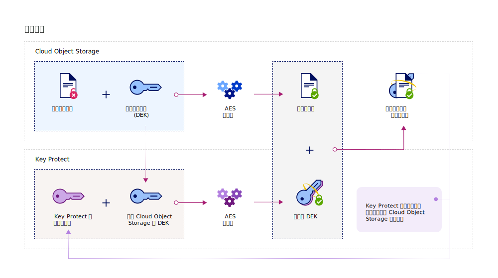

---

copyright:
  years: 2017, 2019
lastupdated: "2019-02-18"

keywords: Key Protect integration, integrate COS with Key Protect

subcollection: key-protect

---

{:shortdesc: .shortdesc}
{:codeblock: .codeblock}
{:screen: .screen}
{:new_window: target="_blank"}
{:pre: .pre}
{:tip: .tip}
{:note: .note}
{:important: .important}

# 與 {{site.data.keyword.cos_full_notm}} 整合
{: #integrate-cos}

{{site.data.keyword.keymanagementservicefull}} 及 {{site.data.keyword.cos_full}} 搭配運作，以協助您擁有靜置資料的安全。請瞭解如何使用 {{site.data.keyword.keymanagementservicelong_notm}} 服務以將進階加密新增至 {{site.data.keyword.cos_full}} 資源。
{: shortdesc}

## 關於 {{site.data.keyword.cos_full_notm}}
{: #cos}

{{site.data.keyword.cos_full_notm}} 為非結構化資料提供雲端儲存空間。非結構化資料是指檔案、視聽媒體、PDF、壓縮的資料保存檔、備份映像檔、應用程式構件、商業文件或任何其他二進位物件。  

為了維護資料完整性及可用性，{{site.data.keyword.cos_full_notm}} 會切割資料，並將其分散至多個地理位置的儲存節點。任何單一儲存節點中都沒有完整的資料副本，只需要使用一部分的節點，如此您就可以完整擷取網路上的資料。提供了提供者端加密，因此您的靜置及進行中資料都受到保護。若要管理儲存空間，請使用 {{site.data.keyword.cloud_notm}} 主控台或使用 [{{site.data.keyword.cos_full_notm}} REST API ](/docs/services/cloud-object-storage?topic=cloud-object-storage-about-the-ibm-cloud-object-storage-api){: new_window} 透過程式設計方式，來建立儲存區以及匯入物件。

如需相關資訊，請參閱[關於 COS ](/docs/services/cloud-object-storage?topic=cloud-object-storage-about-ibm-cloud-object-storage){: new_window}。

## 整合的運作方式
{: #kp_cos_how}

{{site.data.keyword.keymanagementserviceshort}} 與 {{site.data.keyword.cos_full_notm}} 整合，以協助您完全控制資料安全。  

在您將資料移至 {{site.data.keyword.cos_full_notm}} 實例時，服務會使用資料加密金鑰 (DEK) 自動加密物件。在 {{site.data.keyword.cos_full_notm}} 內，DEK 會安全地儲存在服務中接近所加密資源的位置。當您需要存取儲存區時，服務會檢查您的使用者許可權，並為您將儲存區內的物件解密。此加密模型稱為_提供者管理的加密_。

若要啟用_客戶管理的加密_ 的安全優點，您可以透過與 {{site.data.keyword.keymanagementserviceshort}} 服務整合，在 {{site.data.keyword.cos_full_notm}} 中為 DEK 新增封套加密。使用 {{site.data.keyword.keymanagementserviceshort}}，您可以佈建高度安全的根金鑰，以作為您在服務中控制的主要金鑰。當您在 {{site.data.keyword.cos_full_notm}} 中建立儲存區時，即可在儲存區建立時配置儲存區的封套加密。這項新增的保護會使用您在 {{site.data.keyword.keymanagementserviceshort}} 中管理的根金鑰來包裝（或加密）與儲存區相關聯的 DEK。這項稱為_金鑰包裝_ 的作法會使用多個 AES 演算法來保護 DEK 的隱私權及完整性，因此，只有您才能控制對其相關聯資料的存取。

下圖顯示 {{site.data.keyword.keymanagementserviceshort}} 如何與 {{site.data.keyword.cos_full_notm}} 整合，以進一步保護您的加密金鑰。

若要進一步瞭解封套加密如何在 {{site.data.keyword.keymanagementserviceshort}} 中運作，請參閱[使用封套加密保護資料](/docs/services/key-protect?topic=key-protect-envelope-encryption)。

## 為儲存空間儲存區新增封套加密
{: #kp_cos_envelope}

[在{{site.data.keyword.keymanagementserviceshort}}](/docs/services/key-protect?topic=key-protect-create-root-keys) 中指定根金鑰並[授與服務之間的存取權](/docs/services/key-protect?topic=key-protect-integrate-services#grant-access)之後，即可使用 {{site.data.keyword.cos_full_notm}} GUI 來啟用所指定儲存空間儲存區的封套加密。

 若要啟用儲存空間儲存區的進階配置選項，請確保 {{site.data.keyword.cos_full_notm}} 與 {{site.data.keyword.keymanagementserviceshort}} 服務實例之間存在[授權](/docs/services/key-protect?topic=key-protect-integrate-services#grant-access)。
{: tip}

若要為儲存空間儲存區新增封套加密，請執行下列動作：

1. 從 {{site.data.keyword.cos_full_notm}} 儀表板按一下**建立儲存區**。
2. 指定儲存區的詳細資料。
3. 在**進階配置**區段中，選取**新增 {{site.data.keyword.keymanagementserviceshort}} 金鑰**。
4. 從 {{site.data.keyword.keymanagementserviceshort}} 服務實例清單中，選取包含您要用於金鑰包裝之根金鑰的實例。
5. 在**金鑰名稱**中，選取根金鑰的別名。
6. 按一下**建立**，以確認建立儲存區。

從 {{site.data.keyword.cos_full_notm}} GUI 中，您可以瀏覽 {{site.data.keyword.keymanagementserviceshort}} 根金鑰所保護的儲存區。

## 下一步為何？
{: #cos-integration-next-steps}

- 如需將儲存空間儲存區與 {{site.data.keyword.keymanagementserviceshort}} 金鑰相關聯的相關資訊，請參閱[管理加密 ](/docs/services/cloud-object-storage?topic=cloud-object-storage-manage-encryption){: new_window}。 
