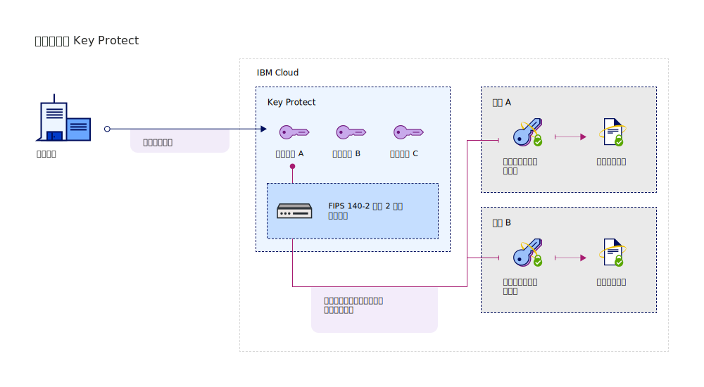

---

copyright:
  years: 2017, 2019
lastupdated: "2019-02-18"

keywords: Key Protect integration, integrate service with Key Protect

subcollection: key-protect

---

{:shortdesc: .shortdesc}
{:codeblock: .codeblock}
{:screen: .screen}
{:new_window: target="_blank"}
{:pre: .pre}
{:tip: .tip}
{:note: .note}
{:important: .important}

# 整合服務
{: #integrate-services}

{{site.data.keyword.keymanagementservicefull}} 與資料及儲存空間解決方案整合，以協助您在雲端攜帶及管理自己的加密。
{: shortdesc}

[在建立服務的實例之後](/docs/services/key-protect?topic=key-protect-provision)，即可整合 {{site.data.keyword.keymanagementserviceshort}} 與下列支援的服務：

<table>
    <tr>
        <th>服務</th>
        <th>說明</th>
    </tr>
    <tr>
        <td>
          
{{site.data.keyword.cos_full_notm}}

        </td>
        <td>
          
使用 {{site.data.keyword.keymanagementserviceshort}}，以將[封套加密](/docs/services/key-protect?topic=key-protect-envelope-encryption)新增至儲存空間儲存區。使用您在 {{site.data.keyword.keymanagementserviceshort}} 中管理的根金鑰，以保護可加密靜置資料的資料加密金鑰。若要進一步瞭解，請參閱[與 {{site.data.keyword.cos_full_notm}} 整合](/docs/services/key-protect?topic=key-protect-integrate-cos)。

        </td>
    </tr>
    <tr>
        <td>
          
{{site.data.keyword.containerlong_notm}}

        </td>
        <td>
          
請使用[封套加密](/docs/services/key-protect?topic=key-protect-envelope-encryption)保護 {{site.data.keyword.containershort_notm}} 叢集裡的密碼。若要進一步瞭解，請參閱[使用 {{site.data.keyword.keymanagementserviceshort}} 加密 Kubernetes 密碼](/docs/containers?topic=containers-encryption#keyprotect)。

        </td>
    </tr>
    <tr>
        <td>
          
{{site.data.keyword.databases-for-postgresql_full_notm}}

        </td>
        <td>
          
建立根金鑰與 {{site.data.keyword.databases-for-postgresql}} 部署的關聯，以保護資料庫。若要進一步瞭解，請參閱 [{{site.data.keyword.databases-for-postgresql}} 文件](/docs/services/databases-for-postgresql?topic=databases-for-postgresql-key-protect)。

        </td>
    </tr>
      <tr>
        <td>
          
{{site.data.keyword.cloudant_short_notm}} for {{site.data.keyword.cloud_notm}}（{{site.data.keyword.cloud_notm}} 專用）

        </td>
        <td>
          
建立根金鑰與「{{site.data.keyword.cloudant_short_notm}} 專用硬體」實例的關聯，以在 REST 策略上強化加密。若要進一步瞭解，請參閱 [{{site.data.keyword.cloudant_short_notm}} 文件](/docs/services/Cloudant/offerings?topic=cloudant-security#secure-access-control)。

        </td>
    </tr>
   <caption style="caption-side:bottom;">表 1. 說明可用於 {{site.data.keyword.keymanagementserviceshort}} 的整合</caption>
</table>

## 瞭解整合 
{: #understand-integration}

當您整合支援的服務與 {{site.data.keyword.keymanagementserviceshort}} 時，請啟用該服務的[封套加密](/docs/services/key-protect?topic=key-protect-envelope-encryption)。這項整合可讓您使用 {{site.data.keyword.keymanagementserviceshort}} 中所儲存的根金鑰，以包裝可加密靜置資料的資料加密金鑰。 

例如，您可以建立根金鑰、在 {{site.data.keyword.keymanagementserviceshort}} 中管理金鑰，以及使用根金鑰來保護不同雲端服務中所儲存的資料。

### {{site.data.keyword.keymanagementserviceshort}} API 方法
{: #envelope-encryption-api-methods}

{{site.data.keyword.keymanagementserviceshort}} API 會在幕後驅動封套加密處理程序。  

下表列出可新增或移除資源上封套加密的 API 方法。

<table>
  <tr>
    <th>方法</th>
    <th>說明</th>
  </tr>
  <tr>
    <td><code>POST /keys/{root_key_ID}?action=wrap</code></td>
    <td><a href="/docs/services/key-protect?topic=key-protect-wrap-keys">包裝（加密）資料加密金鑰</a></td>
  </tr>
  <tr>
    <td><code>POST /keys/{root_key_ID}?action=unwrap</code></td>
    <td><a href="/docs/services/key-protect?topic=key-protect-unwrap-keys">解除包裝（解密）資料加密金鑰</a></td>
  </tr>
  <caption style="caption-side:bottom;">表 2. 說明 {{site.data.keyword.keymanagementserviceshort}} API 方法</caption>
</table>

若要進一步瞭解如何在 {{site.data.keyword.keymanagementserviceshort}} 中以程式設計方式管理您的金鑰，請參閱 [{{site.data.keyword.keymanagementserviceshort}} API 參考資料文件 ](https://{DomainName}/apidocs/key-protect){: new_window}。
{: tip}

## 整合支援的服務
{: #grant-access}

若要新增整合，請使用 {{site.data.keyword.iamlong}} 儀表板來建立服務之間的授權。授權可啟用服務對服務存取原則，因此您可以將雲端資料服務中的資源與在 {{site.data.keyword.keymanagementserviceshort}} 中管理的[根金鑰](/docs/services/key-protect?topic=key-protect-envelope-encryption#key-types)相關聯。

請務必先在相同的地區中佈建兩個服務，再建立授權。若要進一步瞭解服務授權，請參閱[授與服務之間的存取權 ](/docs/iam?topic=iam-serviceauth){: new_window}。
{: note}

當您準備好整合服務時，請使用下列步驟來建立授權：

1. 從功能表中，按一下**管理** &gt; **安全** &gt; **存取 (IAM)**，然後選取**授權**。 
2. 按一下**建立**。
3. 選取授權的來源和目標服務。
 
  針對**來源服務**，選取您要與 {{site.data.keyword.keymanagementserviceshort}} 整合的雲端資料服務。在**目標服務**中，選取 **{{site.data.keyword.keymanagementservicelong_notm}}**。

5. 啟用**讀者**角色。

        使用_讀者_ 許可權，您的來源服務就可以瀏覽指定的 {{site.data.keyword.keymanagementserviceshort}} 實例中所佈建的根金鑰。

6. 按一下**授權**。

## 下一步為何？
{: #integration-next-steps}

在 {{site.data.keyword.keymanagementserviceshort}} 中建立根金鑰，以將進階加密新增至雲端資源。將新的資源新增至支援的雲端資料服務，然後選取您要用於進階加密的根金鑰。

- 若要進一步瞭解如何使用 {{site.data.keyword.keymanagementserviceshort}} 服務建立根金鑰，請參閱[建立根金鑰](/docs/services/key-protect?topic=key-protect-create-root-keys)。
- 若要進一步瞭解如何將您自己的根金鑰攜帶到 {{site.data.keyword.keymanagementserviceshort}} 服務，請參閱[匯入根金鑰](/docs/services/key-protect?topic=key-protect-import-root-keys)。

