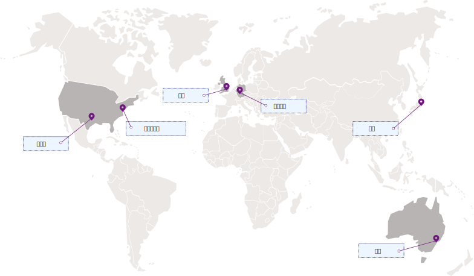

---

copyright:
  years: 2017, 2019
lastupdated: "2019-02-18"

keywords: Key Protect API endpoints, available regions

subcollection: key-protect

---

{:shortdesc: .shortdesc}
{:codeblock: .codeblock}
{:screen: .screen}
{:new_window: target="_blank"}
{:pre: .pre}
{:tip: .tip}
{:note: .note}
{:important: .important}
{:deprecated: .deprecated}

# 地區及位置
{: #regions}

您可以指定地區服務端點，以使用 {{site.data.keyword.keymanagementservicelong}} 服務來連接應用程式。
{: shortdesc}

## 可用的地區
{: #available-regions}

{{site.data.keyword.keymanagementserviceshort}} 可在下列地區及位置中取得：

## 服務端點
{: #service-endpoints}

如果您要以程式設計方式管理 {{site.data.keyword.keymanagementserviceshort}} 資源，請參閱下表，以決定要在連接至 [{{site.data.keyword.keymanagementserviceshort}} API](https://{DomainName}/apidocs/key-protect) 時使用的 API 端點： 

<table>
    <tr>
        <th>位置</th>
        <th>服務 API 端點</th>
    </tr>
    <tr>
        <td>達拉斯</td>
        <td>
            <code>us-south.kms.cloud.ibm.com</code>
        </td>
    </tr>
    <tr>
        <td>華盛頓特區</td>
        <td>
            <code>us-east.kms.cloud.ibm.com</code>
        </td>
    </tr>
    <tr>
        <td>倫敦</td>
        <td>
            <code>eu-gb.kms.cloud.ibm.com</code>
        </td>
    </tr>
    <tr>
        <td>法蘭克福</td>
        <td>
            <code>eu-de.kms.cloud.ibm.com</code>
        </td>
    </tr>
    <tr>
        <td>雪梨</td>
        <td>
            <code>au-syd.kms.cloud.ibm.com</code>
        </td>
    </tr>
    <tr>
        <td>東京</td>
        <td>
            <code>jp-tok.kms.cloud.ibm.com</code>
        </td>
    </tr>
    <caption style="caption-side:bottom;">表 1. 顯示 {{site.data.keyword.keymanagementserviceshort}} API 的可用端點</caption>
</table>

您可以繼續使用 `https://keyprotect.<region>.bluemix.net` 設定作業的目標服務，或者可以更新應用程式以使用新的 `cloud.ibm.com` 端點。
{: tip}

如需向 {{site.data.keyword.keymanagementserviceshort}} 進行鑑別的相關資訊，請參閱[存取 API](/docs/services/key-protect?topic=key-protect-set-up-api)。
