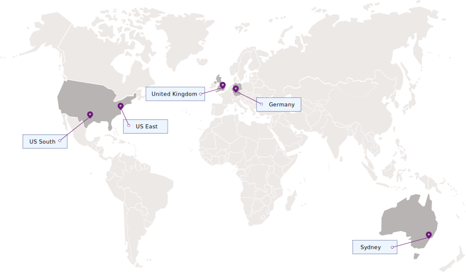

---

copyright:
  years: 2017, 2018
lastupdated: "2018-09-10"

---

{:shortdesc: .shortdesc}
{:codeblock: .codeblock}
{:screen: .screen}
{:new_window: target="_blank"}
{:pre: .pre}
{:tip: .tip}

# Regions and locations
{: #regions}

You can connect your applications with the {{site.data.keyword.keymanagementservicelong_notm}} service by specifying a regional service endpoint.
{: shortdesc}

## Available regions
{: #regions}

{{site.data.keyword.keymanagementserviceshort}} is available in the following regions and locations:

## Service endpoints
{: #endpoints}

If you are managing your {{site.data.keyword.keymanagementserviceshort}} resources programmatically, see the following table to determine the API endpoints to use when you connect to the [{{site.data.keyword.keymanagementserviceshort}} API](https://console.bluemix.net/apidocs/key-protect): 

<table>
    <tr>
        <th>Region name</th>
        <th>Geographic location</th>
        <th>Service API endpoint</th>
    </tr>
    <tr>
        <td>Germany</td>
        <td>Frankfurt, Germany</td>
        <td>
            <code>keyprotect.eu-de.bluemix.net</code>
        </td>
    </tr>
    <tr>
        <td>Sydney</td>
        <td>Sydney, Australia</td>
        <td>
            <code>keyprotect.au-syd.bluemix.net</code>
        </td>
    </tr>
    <tr>
        <td>United Kingdom</td>
        <td>London, England</td>
        <td>
            <code>keyprotect.eu-gb.bluemix.net</code>
        </td>
    </tr>
    <tr>
        <td>US East</td>
        <td>Washington D.C., US</td>
        <td>
            <code>keyprotect.us-east.bluemix.net</code>
        </td>
    </tr>
    <tr>
        <td>US South</td>
        <td>Dallas, US</td>
        <td>
            <code>keyprotect.us-south.bluemix.net</code>
        </td>
    </tr>
    <caption style="caption-side:bottom;">Table 1. Shows the available endpoints for the {{site.data.keyword.keymanagementserviceshort}} API</caption>
</table>

For {{site.data.keyword.keymanagementserviceshort}} service instances that exist within a Cloud Foundry org or space, use the legacy `https://ibm-key-protect.edge.bluemix.net` endpoint to interact with the {{site.data.keyword.keymanagementserviceshort}} API.
{: tip}

For more information about authenticating with {{site.data.keyword.keymanagementserviceshort}}, see [Accessing the API](/docs/services/key-protect/access-api.html).