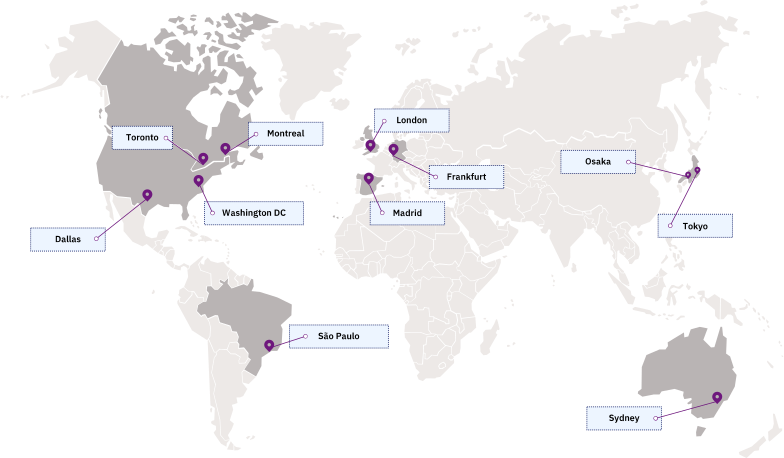

---

copyright:
  years: 2017, 2021
lastupdated: "2021-08-16"

keywords: Key Protect endpoints, available regions, locations

subcollection: key-protect

---

{:shortdesc: .shortdesc}
{:screen: .screen}
{:pre: .pre}
{:table: .aria-labeledby="caption"}
{:external: target="_blank" .external}
{:codeblock: .codeblock}
{:tip: .tip}
{:note: .note}
{:important: .important}
{:deprecated: .deprecated}
{:term: .term}

# Regions and endpoints
{: #regions}

Review region and connectivity options for interacting with
{{site.data.keyword.keymanagementservicelong}}.
{: shortdesc}

## Available regions
{: #available-regions}

{{site.data.keyword.keymanagementserviceshort}} is available in the following
regions:

{: caption="Figure 1. Displays the regions where you can create and manage {{site.data.keyword.keymanagementserviceshort}} resources." caption-side="bottom"}

You can create {{site.data.keyword.keymanagementserviceshort}} resources in one
of the supported {{site.data.keyword.cloud_notm}} regions, which represent the
geographic area where your {{site.data.keyword.keymanagementserviceshort}}
requests are handled and processed. To learn more, see
[Locations, tenancy, and availability](/docs/key-protect?topic=key-protect-ha-dr#availability).

## Connectivity options
{: #connectivity-options}

{{site.data.keyword.keymanagementserviceshort}} offers two connectivity options
for interacting with its service APIs.

### Public endpoints
{: #connectivity-options-public}

By default, you can connect to resources in your account over the
{{site.data.keyword.cloud_notm}} public network. Your data is encrypted in
transit by using the Transport Security Layer (TLS) 1.2 protocol.

### Private endpoints
{: #connectivity-options-private}

For added benefits, you can also enable
[virtual routing and forwarding (VRF) and service endpoints](/docs/account?topic=account-vrf-service-endpoint){: external}
for your infrastructure account.

When you enable VRF for your account, you can connect to
{{site.data.keyword.keymanagementserviceshort}} by using a private IP that is
accessible only through the {{site.data.keyword.cloud_notm}} private network.

To learn more about VRF, see
[Virtual routing and forwarding on {{site.data.keyword.cloud_notm}}](/docs/dl?topic=dl-overview-of-virtual-routing-and-forwarding-vrf-on-ibm-cloud){: external}.

To learn how to connect to {{site.data.keyword.keymanagementserviceshort}}
by using a private endpoint, see
[Using private endpoints](/docs/key-protect?topic=key-protect-private-endpoints).

## Service endpoints
{: #service-endpoints}

If you are managing your {{site.data.keyword.keymanagementserviceshort}}
resources programmatically, see the following table to determine the API
endpoints to use when you connect to the
[{{site.data.keyword.keymanagementserviceshort}} API](/apidocs/key-protect){: external}.

| Region        | Public endpoints             |
| ------------- | ---------------------------- |
| Dallas        | `us-south.kms.cloud.ibm.com` |
| Washington DC | `us-east.kms.cloud.ibm.com`  |
| London        | `eu-gb.kms.cloud.ibm.com`    |
| Frankfurt     | `eu-de.kms.cloud.ibm.com`    |
| Sydney        | `au-syd.kms.cloud.ibm.com`   |
| Tokyo         | `jp-tok.kms.cloud.ibm.com`   |
| Osaka         | `jp-osa.kms.cloud.ibm.com`   |
| Toronto       | `ca-tor.kms.cloud.ibm.com`   |
{: caption="Table 1. Lists public endpoints for interacting with {{site.data.keyword.keymanagementserviceshort}} APIs over IBM Cloud's public network" caption-side="top"}
{: #table-1}
{: tab-title="Public"}
{: class="comparison-tab-table"}
{: row-headers}

| Region        | Private endpoints                            |
| ------------- | -------------------------------------------- |
| Dallas        | `private.us-south.kms.cloud.ibm.com`         |
| Washington DC | `private.us-east.kms.cloud.ibm.com`          |
| London        | `private.eu-gb.kms.cloud.ibm.com`            |
| Frankfurt     | `private.eu-de.kms.cloud.ibm.com`            |
| Sydney        | `private.au-syd.kms.cloud.ibm.com`           |
| Tokyo         | `private.jp-tok.kms.cloud.ibm.com`           |
| Osaka         | `private.jp-osa.kms.cloud.ibm.com`           |
| Toronto       | `private.ca-tor.kms.cloud.ibm.com`           |
{: caption="Table 2. Lists private endpoints for interacting with {{site.data.keyword.keymanagementserviceshort}} APIs over IBM Cloud's private network" caption-side="top"}
{: #table-2}
{: tab-title="Private"}
{: class="comparison-tab-table"}
{: row-headers}

For more information about authenticating with
{{site.data.keyword.keymanagementserviceshort}}, see
[Accessing the API](/docs/key-protect?topic=key-protect-set-up-api).

