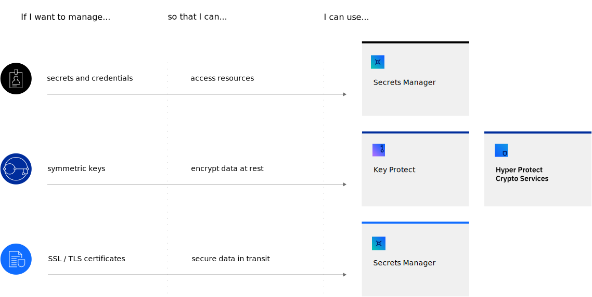

---

copyright:
  years: 2023
lastupdated: "2024-10-09"

keywords: key management in IBM Cloud, differences between Secrets Manager and Key Protect, when to use Secrets Manager, HPCS, Key Protect use cases, single tenant, multi-tenant

subcollection: key-protect

---

{:codeblock: .codeblock}
{:screen: .screen}
{:download: .download}
{:external: target="_blank" .external}
{:faq: data-hd-content-type='faq'}
{:gif: data-image-type='gif'}
{:important: .important}
{:note: .note}
{:pre: .pre}
{:tip: .tip}
{:preview: .preview}
{:deprecated: .deprecated}
{:beta: .beta}
{:term: .term}
{:shortdesc: .shortdesc}
{:script: data-hd-video='script'}
{:support: data-reuse='support'}
{:table: .aria-labeledby="caption"}
{:troubleshoot: data-hd-content-type='troubleshoot'}
{:help: data-hd-content-type='help'}
{:tsCauses: .tsCauses}
{:tsResolve: .tsResolve}
{:tsSymptoms: .tsSymptoms}
{:video: .video}
{:step: data-tutorial-type='step'}
{:tutorial: data-hd-content-type='tutorial'}
{:api: .ph data-hd-interface='api'}
{:cli: .ph data-hd-interface='cli'}
{:ui: .ph data-hd-interface='ui'}
{:terraform: .ph data-hd-interface="terraform"}
{:curl: .ph data-hd-programlang='curl'}
{:java: .ph data-hd-programlang='java'}
{:ruby: .ph data-hd-programlang='ruby'}
{:c#: .ph data-hd-programlang='c#'}
{:objectc: .ph data-hd-programlang='Objective C'}
{:python: .ph data-hd-programlang='python'}
{:javascript: .ph data-hd-programlang='javascript'}
{:php: .ph data-hd-programlang='PHP'}
{:swift: .ph data-hd-programlang='swift'}
{:curl: .ph data-hd-programlang='curl'}
{:dotnet-standard: .ph data-hd-programlang='dotnet-standard'}
{:go: .ph data-hd-programlang='go'}
{:unity: .ph data-hd-programlang='unity'}
{:release-note: data-hd-content-type='release-note'}

# Which data security service is best for me?
{: #manage-secrets-ibm-cloud}

With {{site.data.keyword.cloud_notm}}, you can choose from various secrets management and data protection offerings that help you to protect your sensitive data and centralize your secrets.
{: shortdesc}

For example, consider the following scenarios and how they map to secrets management offerings and data protection offerings in {{site.data.keyword.cloud_notm}}.

{: caption="Secrets management use cases" caption-side="bottom"}

## Use cases
{: #which-data-protection-service}

The following table lists the different offerings that you can use with {{site.data.keyword.cloud_notm}} to protect your data.

| Scenario | What to use |
| --- | --- |
| You need to create and manage encryption keys that are backed by FIPS 140-2 Level 3 validated hardware. | You can use **{{site.data.keyword.keymanagementserviceshort}}** to generate and import encryption keys by using a multi-tenant service with shared hardware. |
| You need to be able to create and manage keys in a Satellite location. | You can use **{{site.data.keyword.keymanagementserviceshort}}** to create and manage keys in either {{site.data.keyword.cloud_notm}} or in Satellite. |
| As a DevOps team contributor, you need to create, lease, and manage API keys, credentials, database configurations, and other secrets for your services and applications. | With **[{{site.data.keyword.secrets-manager_short}}](/docs/secrets-manager)**, you can manage secrets of various types in a dedicated instance. |
| You need to generate, renew, and manage SSL/TLS certificates for your deployments. | You can also manage your SSL/TLS certificates and private keys in dedicated instance of **[{{site.data.keyword.secrets-manager_short}}](/docs/secrets-manager)**. |
| The data you want to protect with encryption keys is highly valuable for your company or you need to comply to certain data protection regulations. To do so you want to have the full and exclusive control over your keys & even exclude access from the {{site.data.keyword.cloud_notm}} admin to the master key. Therefore you want to leverage a dedicated key management service running within a secure enclave as well as a dedicated FIPS 140-2 Level 4 hardware security module as a service that underlies your full control. | With **[{{site.data.keyword.hscrypto}}](/docs/hs-crypto)**, you have the full control to manage encryption keys in a single-tenant service with dedicated hardware for own your own key (KYOK). |
| You have a multi-cloud architecture and want to enhance the data security posture across all your clouds efficiently and securely. | **[{{site.data.keyword.hscrypto}} with Unified Key Orchestrator](/docs/hs-crypto?topic=hs-crypto-uko-overview)** allows you to manage your keys across {{site.data.keyword.cloud_notm}} (BYOK and KYOK), AWS (BYOK), GCP (BYOK) and Azure (BYOK) in a unified and highly secure way. |
{: caption="Secrets management and data protection scenarios" caption-side="top"}

## What are key features for each data protection service?
{: #key-features}

As you plan your data protection strategy, some differences between services to consider include the level of data isolation that your workload requires.

For a higher level of security and control, your business might benefit from the data isolation that a single-tenant offering provides, such as {{site.data.keyword.secrets-manager_short}} or {{site.data.keyword.hscrypto}}. You might also decide that the reduced cost and scalability benefits of a multi-tenant service, such as {{site.data.keyword.keymanagementserviceshort}}, are better suited to your needs. The following table lists key features for each service.

|                                         | **{{site.data.keyword.keymanagementserviceshort}}** | **{{site.data.keyword.secrets-manager_short}}**   | **{{site.data.keyword.hscrypto}}**                |
|-----------------------------------------|-----------------------------------------------------|---------------------------------------------------|---------------------------------------------------|
| Secret types                            | Symmetric encryption keys                           | Arbitrary secrets  \n IAM credentials  \n Key-value secrets  \n SSL/TLS certificates  \n User credentials | Symmetric encryption keys                         |
| Multi-tenant[^multi-tenant]             |    |                                                   |                                                   |
| Single-tenant[^single-tenant]           |                                                     |  |  |
| HSM backed[^hsm]                        |    |                                                   |  |
| Available on Satellite                  |    |                                                   |                                                   |
| Runs in secure enclave[^secure-enclave] |                                                     |                                                   |  |
| Client initialised and controlled HSM   |                                                     |                                                   |  |
{: caption="Key features for {{site.data.keyword.cloud_notm}} data protection services" caption-side="top"}
{: summary="The table compares features across {{site.data.keyword.secrets-manager_short}}, {{site.data.keyword.cloudcerts_short}}, {{site.data.keyword.keymanagementserviceshort}}, and {{site.data.keyword.hscrypto}}. The first column lists features. The first row features the names of the services in the table, followed by a row listing the types of secrets that are supported by each service. The third row uses checkmarks to indicate whether a service is multi-tenant. The fourth row uses checkmarks to indicate whether a service is single-tenant. The fifth row uses checkmarks to indicate whether a service is backed by a hardware security module (HSM). The sixth row uses checkmarks to indicate whether a service is available on Satellite. The seventh row uses checkmarks to indicate whether the service runs in a secure enclave. The eigth row uses checkmarks to indicate whether the service uses a client initialized and controlled HSM."}
{: class="comparison-table"}

[^multi-tenant]: A multi-tenant service uses a single instance of its software (and its underlying database and hardware) to serve multiple tenants. [Learn more](https://www.ibm.com/topics/multi-tenant){: external}.

[^single-tenant]: A single-tenant service creates a dedicated instance of its software (and its underlying database and hardware) for each individual tenant.

[^hsm]: A service that is backed by a hardware security module (HSM) uses tamper-resistant, FIPS-validated physical hardware as its root of trust for cryptographic storage and processing of encryption keys.

[^secure-enclave]: Mitigates internal as well as external attack vectors to gain unauthorised access to keys.

## How do I get started?
{: #get-started-data-protection}

Each service supports either a Lite plan or a free trial that you can use to try its service capabilities for free. Get started by creating an instance of a service from the {{site.data.keyword.cloud_notm}} catalog.

- [{{site.data.keyword.keymanagementserviceshort}}](/catalog/services/key-protect){: external}
- [{{site.data.keyword.hscrypto}}](/catalog/services/hs-crypto){: external}
- [{{site.data.keyword.secrets-manager_short}}](/catalog/services/secrets-manager){: external}
